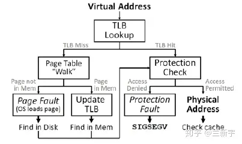
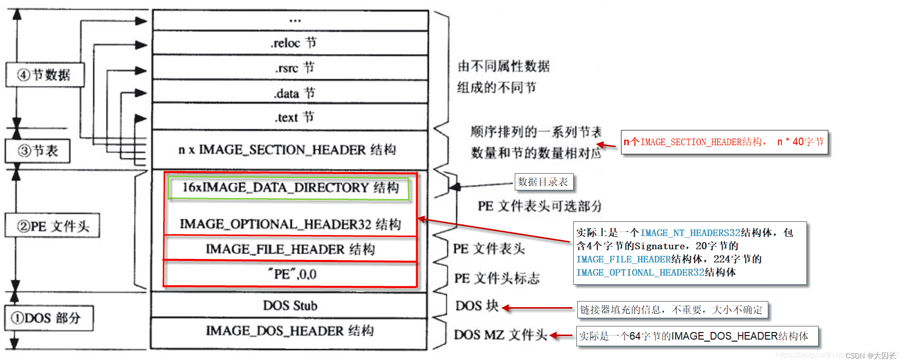

### 内核态和用户态

windows操作系统的计算机又两种不同的模式： **用户模式**和**内核模式**。

根据处理器上运行的代码的类型， 处理器会在两个模式之间切换。 核心操作系统的组件在内核模式工作， 多数驱动程序在内核态工作，某些驱动程序也可以在用户模式工作。

 

##### **用户模式**  

- 启动用户模式的进程时， windows会为应用程序创建单独的进程。进程为程序提供单独的 **虚拟地址空间** 和 **专用的句柄表**。
- 虚拟地址空间是专用的，因此一个程序无法修改另一个程序的数据，即应用程序之间时隔离的
- 虚拟地址空间童同样也受限制， 用户模式下运行的程序无法访问为操作系统保留的虚拟地址空间。

**内核模式**

- 内核模式下所有程序共享单个虚拟地址空间。 内核模式的驱动程序之间和操作系统程序组件并不隔离。


### 虚拟地址空间

windows操作系统中处理器会使用虚拟地址来索引物理地址， 虚拟地址有很多优势：

- 程序可以使用一系列连续的虚拟虚拟地址来访问物理内存中不连续的大内存缓冲区。
- 程序可以使用一系列的虚拟地址来访问大于物理内存的内存缓冲区。 当可用的物理内存不够时，内存管理器可以将物理内存页(4KB)保存到磁盘文件。 数据或代码会根据需要在物理内存和磁盘之间移动。
- 不同的进程可以使用各自的虚拟地址，实现彼此之间的隔离。

 


在32位的操作系统上， 可用的虚拟地址空间为 2^32字节（4GB）。 通常较低的2GB用于用户空间， 较高的2GB用于内核空间。 在启动时可以增加用户空间的大小，但是会减少系统空间的， 命令为 `bcdedit /set increaseuserva`. ==这是什么意思?==

在64位的windows操作系统中， 虚拟地址空间的位128TB。

#### 用户态进程

在 windows系统中， 每一个用户进程都有自己的虚拟地址，对于32位的进程，虚拟地址覆盖了从0x00000000到0xFFFFFFFF的4GB范围之内的任何一个值。 但是并不意味着每个用户进程都会占用4GB的物理RAM。 每个进程的虚拟地址空间内有各种区(area), 地址从低到高分别是：

- **程序代码和数据区**  代码是从同一固定地址开始，紧接着的是和C全局变量相对应的数据区。
- **堆**  代码和数据区后面是 运行时堆区。 调用C语言的malloc和free标准库函数，堆可以在运行时动态的扩展和收缩。
- **共享库**  该区域用来存放c的标准库数学库这样的恭喜库的代码和数据
- **栈**   位于用户虚拟地址空间的顶部， 编译器用它来实现函数调用。 每一个函数返回时，栈就会收缩。
- **内核虚拟地址空间**    虚拟地址空间的顶部二分之一*(好像可以改)*是为内核预留的， 用户程序无法访问， 操作系统的代码内核对象在这里。


#### 虚拟地址转换的实现

将虚拟地址转换成物理地址的过程，需要MMU(Memory Management Unit)和页表(table page)的共同参与

##### MMU

MMU是处理器/核的一个硬件单元， 通常每一个核都有一个MMU。 MMU又有两部分组成： **TLB** 和 **table walk unit**。 

##### page table

page table是每个进程独有的， 是软件实现的， 是存储在main memory(比如DDR)中的。


##### 虚拟地址的转换



访问内存中的页表相对耗时(尤其是现在很多使用的多级页表)。 cpu会首先在它的硬件缓存**TLB**中寻找, TLB是集成进CPU的几乎可以以CPU的速度运行。

1. 如果在TLB中找到了含有该虚拟地址的entry (TLB hit), 可以从改entry中直接获取对应的物理地址。
2. 如果TLB miss了， 就需要去查当前进程的page table， 此时就需要使用 **table walk unit**。
3. 使用**table walk unit**硬件单元来查找page table的方式被称为**hardware TLB miss handling**, 通常被CISC架构的处理器采用(IA-32). 如果在page table中还是找不到， 即发生了**page fault**，则会由操作系统处理
4. 与之相对的通常被RISC架构的处理器（比如Alpha）采用的software TLB miss handling，TLB miss后CPU就不再参与了，由操作系统通过软件的方式来查找page table。使用硬件的方式更快，而使用软件的方式灵活性更强。IA-64提供了一种混合模式，可以兼顾两者的优点。
5. 如果在**page table**中找到了对应虚拟地址的entry， 说明对应虚拟地址的物理内存页面驻留在内存当中，也就是**page hit**. 此时会进行两个操作：
   - 更新TLB
   - 进行权限检测， 包括可读/可写/可执行权限，user/supervisor模式权限等。如果没有正确的权限，将触发SIGSEGV（Segmantation Fault）
6. 如果对应的entry的p位是0， 则触发 **page fault**， 可能是如下情况：
   - 这个虚拟地址被分配后还从来没有被access过（比如malloc之后还没有操作分配到的空间，则不会真正分配物理内存）。触发page fault后分配物理内存，也就是demand paging，有了确定的demand了之后才分，然后将p位置1。
   - 对应的这个物理页面的内容被换出到外部的disk/flash了，这个时候page table entry里存的是换出页面在外部swap area里暂存的位置，可以将其换回物理内存，再次建立映射，然后将p位置1。

[地址转化的过程](https://zhuanlan.zhihu.com/p/65298260?utm_source=wechat_session)


### windows内存

#### 虚拟内存概念

**虚拟内存**区别于上面的**虚拟地址空间**， windows操作系统允许将 磁盘上的页文件(pagefile)作为物理RAM的一种拓展。 如果计算机上有2GB的物理RAM， 2GB的pagefile，那么理论上可以认为计算机拥有4GB的RAM。

实际上并不是真正拥有2GB的RAM（微软不准备砸内存厂商的饭碗）。它的大致原理是将进程在物理内存中的各个部分保存到页文件中，当运行的应用程序需要时，再将页文件的各个部分重新加载到RAM中。举例：某进程试图访问的数据是在RAM中。在这种情况下，CPU将数据的虚拟地址映射到内存的物理地址中，然后执行需要的访问。线程试图访问的数据不在RAM中，而是存放在pagefile中的某个地方。这时，试图访问就称为页错误（page fault），CPU将把试图进行的访问通知操作系统。这时操作系统就寻找RAM中的一个内存空页。如果找不到空页，系统必须释放一个空页。如果一个页面尚未被修改，系统就可以释放该页面。但是，如果系统需要释放一个已经修改的页面，那么它必须首先将该页面从RAM拷贝到页交换文件中，然后系统进入该页文件，找出需要访问的数据块，并将数据加载到空闲的内存页面。然后，操作系统更新它的用于指明数据的虚拟内存地址现在已经映射到RAM中的相应的物理存储器地址中的表。这时CPU重新运行生成初始页面失效的指令，但是这次CPU能够将虚拟内存地址映射到一个物理RAM地址，并访问该数据块。

#### windows内存概念

##### 分配内存的概念

- **预定空间地址 reserve**   从4GB的进程虚拟地址空间中保留一段空间， 可以通过`VirtualAlloc`完成。 这段空间的开始地址必须是系统分配粒度的整数倍， 大小必须是系统页面大小的整数倍。
- **提交内存空间 commit** 将虚拟地址空间中已经保留的空间映射到机器的内存， 这里的机器内存并不是物理RAM而是pagefile。 也由`VirtualAlloc`这个API来完成。 这段空间的开始地址和大小都必须是页面大小的整数倍。 
- **将内存空间映射到主存**  操作系统总是在进程提交的pagefile需要被访问时才将相应的pagefile加载到主存中去， 同时修改进程中对应的虚拟地址空间中的空间映射关系。 这样就实现了进程中虚拟地址空间中对应区域和机器物理主存的关联。

##### windows中内存指标的概念

- **工作集working set**   该指标实际上记录了进程虚拟地址空间中映射到物理内存RAM的大小*(task manager中的mem  usage)*。 实际上包括了用户态分区和内核态分区的RAM部分。
- **提交大小 private bytes ** 该指标记录了进程中用户态虚拟地址空间中提交的总空间大小。
- **虚拟大小 virtual bytes**    该指标记录了当前进程申请成功的其虚拟地址空间的总的空间大小，包括DLL/EXE占用的地址和通过VirtualAlloc API Reserve（即不管有没有commit）的Memory Space数量。


##### 遗留

两个进程访问同一个DLL， 内存如何管理， 写呢  写时拷贝？

系统分配粒度， 系统页面大小


#### 分页内存和非分页内存

- **分页内存**  指可以被转换成pagefile存储在磁盘的内存区域。 在需要时可以将pagefile文件导入物理RAM。 在用户态进程中所使用的内存应该都是分页内存。

- **非分页内存 ** 非分页内存就是实际使用中驻留在RAM中的,不会转化为pagefile。 可以用做程序共享数据，但也由于RAM是有限的，所以非分页内存是一种稀少的资源，要谨慎使用。非分页内存则是各个中段级别的例程都可以使用。

  Windows NT把内核模式地址空间分成分页内存池和非分页内存池， 当irql>=dispatch_level时，程序只能使用非分页内存。


### windows的中断


### IRQL （interrupt request level）

[irql](https://learn.microsoft.com/zh-cn/windows-hardware/drivers/kernel/managing-hardware-priorities)

中断请求 (IRQ)一般有两种， 一种是外部中断即硬件产生的中断。 另一种是软件指令产生的中断。 windows则提出了一个中断请求级的概念，一共规定了32个请求级别， 0-2级是软件中断， 3-31是硬件中断。 *对于驱动开发， 一般只需要考虑0-2级中断就可以了。*

##### PASSIVE_LEVEL 0

IRQL的最低等级， 无法屏蔽其他的中断。  在这个级别上，线程执行用户模式， 可以访问分页内存， 可以使用 `KeGetCurrentIrql()`可以知道系统当前的IRQL 。 驱动程序的 `DriverEntry` 	 `AddDevice`	 `Reinitiabize`	`Unload` 	`大多数的派遣函数`   `驱动创建的线程`    `工作线程的回调函数` 都运行在这个IRQL上。


##### APC_LEVEL 1

在这个级别上， 只有处于APC级别的中断会被屏蔽， 可以访问分页内存。

驱动的绝大部分dispatch函数都运行在 IRQL = PASSIVE_LEVEL上，但是如下的例外：

 [看不懂](https://learn.microsoft.com/zh-cn/windows-hardware/drivers/kernel/dispatch-routines-and-irqls) 

##### DISPATCH_LEVEL 2

APC和DISPATCH级别的中断会被屏蔽， 可能会发生设备，时钟和电源故障中断。 只能访问非分页内存。


### IRP请求

应用程序会向计算机设备发送各种 I/O请求， 这些请求包*I/O request package(IRP)*  在内核开发中被封装成`IRP`结构体. 由于IRP是响应上层应用的，常见的文件相关的IRP列表

| IRP类型                        | 描述                     | 应用层调用者                                      |
| ------------------------------ | ------------------------ | ------------------------------------------------- |
| IRP_MJ_CREATE                  | 获取文件句柄             | 对应User下的CreateFile                            |
| IRP_MJ_CLOSE                   | 关闭文件句柄             | 对应User下的CloseHandle                           |
| IRP_MJ_READ                    | 从设备得到数据           | 对应ReadFile                                      |
| IRP_MJ_WRITE                   | 传送数据到设备           | 对应WriteFile                                     |
| IRP_MJ_DEVICE_CONTROL          | 控制操作(利用IOCTL宏)    | 对应DeviceIoControl，即可读又可写                 |
| IRP_MJ_INTERNAL_DEVICE_CONTROL | 控制操作(只能被内核调用) | 和IRP_MJ_DEVICE_CONTROL差不多，但是只有Kernel可用 |

分发例程必须保存在驱动对象的MajorFunction里面，且需要对应和驱动的连接状态：

#### IRP数据结构详解

IRP结构体在 `wdm.h`头文件中定义, 其中几个重要的成员变量的意义：

- ##### MdlAddress

  是一个MDL的指针， 当内核层和用户层采用共享内存的结构传递数据时， 这个时候MDL就会代表共享的内存数据(共享物理内存， 通过MDL映射)

- ##### AssociatedIrp

  这个成员是联合体

  

### 事件

内核中的事件是一个数据结构， **事件**一般用于多个线程之间的同步。 如果一个线程需要等到另一个线程完成一个任务后再执行， 就可以使用事件。数据结构是**`KEVENT`**, 定义在 `wdm.h` 头文件中。 
[[驱动开发记录#事件处理]]

```c
KeInitializeEvent(
        IN PRKEVENT  Event,
        IN EVENT_TYPE  Type,
        IN BOOLEAN  State
);
```

事件结构一般使用上面的函数进行初始化。第一个参数是要初始化的事件， 

第二个参数表示事件的类型，**NotificationEvent** 或者 **SynchronizationEvent**。 

- SynchronizationEvent 表示该事件为同步事件，同步事件会**自动重设**，如果这个事件被设置，那么只有一个线程的`KeWaitForSingleObject()`可以通过， 通过之后会被自动重设，其他线程只能继续等待。

- NotificationEvent，表示该事件为通知事件， 如果这个事件被设置， 那么所有等待这个事件的线程都会通过。如果要重新使用这个事件，就需要使用函数 `KeSetEvent()`手动重设

第三个参数表示初始化后事件的状态， TRUE表示设置状态， 一般设置为False。 当事件为设置状态，等待这个事件的地方才会被通过。

==事件对象不需要销毁。 不太确定==。


### 线程

在内核中使用线程可能是一些任务过于耗时，开发者不想让当前系统停止下来等待 又或者是用来执行长期不断的任务，如日志的写入。在驱动中的生成的线程一般是系统线程， 系统线程所在的进程名为 **System**

```c
NTSTATUS PsCreateSystemThread(
  [out]           PHANDLE            ThreadHandle,
  [in]            ULONG              DesiredAccess,
  [in, optional]  POBJECT_ATTRIBUTES ObjectAttributes,
  [in, optional]  HANDLE             ProcessHandle,
  [out, optional] PCLIENT_ID         ClientId,
  [in]            PKSTART_ROUTINE    StartRoutine,
  [in, optional]  PVOID              StartContext
);
```

使用这个内核API来创建系统线程, 其中

- 第一个参数 ThreadHandle用来返回句柄，传入一个句柄指针即可。
- 第二个参数 DesiredAccess，总是传入0
- 第三四五个参数都传入NULL
- 第六个参数 StartRoutine， 传入一个线程要执行的函数
- 第七个参数 StartContext， 传入改函数的参数。


### PE文件

[博客园](https://www.cnblogs.com/cuixianglijian/p/16100267.html)

##### 可执行文件

PE文件是 portable file format(可移植文件)的简写， 例如DLL，exe文件都是可移植文件。 在windows64平台上 PE文件的结构叫做PE32+。

> executable file是指可以由操作系统加载执行的文件。 linux平台的可执行文件是ELF(Executable and Linking Format)文件结构， windows平台是portable executable文件结构。二者都是由COFF发展而来的格式。

#### pe文件结构

PE文件使用的是一个平面地址空间， 所有的代码和数据都被组织到一起。 文件的内容会分割为不同的区块(section),  **section包含代码数据**，  **每个section按页边界来对齐** ， **section没有大小限制且是一个连续的结构**，  **每个section都有自己的属性，比如是否可读可写等**。

一个PE文件并不是作为单一的一个内存映射文件被装入的内存的。



[[PE文件结构详解]]


