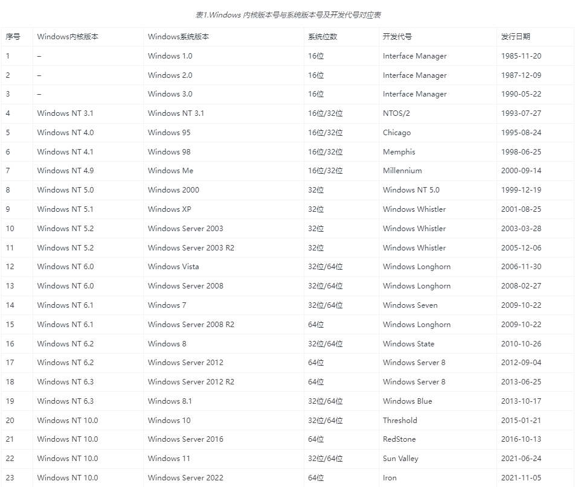

 

 

http://go.microsoft.com/fwlink/?prd=12546&pver=10&plcid=0x409&clcid=0x409&ar=Redstone&sar=HLK&o1=10.0.22621.0

http://go.microsoft.com/fwlink/?prd=12546&pver=10&plcid=0x409&clcid=0x409&ar=Redstone&sar=HLK&o1=10.0.22621.0

http://go.microsoft.com/fwlink/?prd=12546&pver=10&plcid=0x409&clcid=0x409&ar=Redstone&sar=HLK&o1=10.0.22621.0

 Session begin, registration key: SOFTWARE\Microsoft\Windows\CurrentVersion\Uninstall\{9a822440-a2c9-412a-8a68-38c6f449c391}, options: 0x7, disable resume: No
[10DC:10E8][2023-05-16T14:29:20]i000: Caching bundle from: 'C:\Users\DELL\AppData\Local\Temp\{DE8DC7B2-5F5C-4304-BDEA-8D438B3B24EB}\.be\HLKSetup.exe' to: 'C:\ProgramData\Package Cache\{9a822440-a2c9-412a-8a68-38c6f449c391}\HLKSetup.exe'
[10DC:10E8][2023-05-16T14:29:20]i320: Registering bundle dependency provider: {9a822440-a2c9-412a-8a68-38c6f449c391}, version: 10.1.22621.1
[10DC:10E8][2023-05-16T14:29:20]i371: Updating session, registration key: SOFTWARE\Microsoft\Windows\CurrentVersion\Uninstall\{9a822440-a2c9-412a-8a68-38c6f449c391}, resume: Active, restart initiated: No, disable resume: No
[13C8:0ED8][2023-05-16T14:29:20]w343: Prompt for source of package: package_.Net_Framework_4.7.1, payload: package_.Net_Framework_4.7.1, path: C:\Users\DELL\Desktop\Installers\NDP471-KB4033342-x86-x64-AllOS-ENU.exe
[13C8:0ED8][2023-05-16T14:29:20]i000: package_.Net_Framework_4.7.1
[13C8:0ED8][2023-05-16T14:29:20]i000: Resolving download root for: http://go.microsoft.com/fwlink/?prd=12546&pver=10&plcid=0x409&clcid=0x409&ar=Redstone&sar=HLK&o1=10.0.22621.0
[13C8:0ED8][2023-05-16T14:29:21]i000: HTTP status code: 302

Redirected URL: https://download.microsoft.com/download/2/1/a/21a57dc8-3e21-4fd6-82c5-047e11260188/hlk

[2240:15D8][2023-05-19T02:08:59]i370: Session begin, registration key: SOFTWARE\Microsoft\Windows\CurrentVersion\Uninstall\{9a822440-a2c9-412a-8a68-38c6f449c391}, options: 0x7, disable resume: No
[2240:15D8][2023-05-19T02:08:59]i000: Caching bundle from: 'C:\Windows\Temp\{74F7CD70-2FED-44AB-97D0-3D73D92BA396}\.be\HLKSetup.exe' to: 'C:\ProgramData\Package Cache\{9a822440-a2c9-412a-8a68-38c6f449c391}\HLKSetup.exe'
[2240:15D8][2023-05-19T02:08:59]i320: Registering bundle dependency provider: {9a822440-a2c9-412a-8a68-38c6f449c391}, version: 10.1.22621.1
[2240:15D8][2023-05-19T02:08:59]i371: Updating session, registration key: SOFTWARE\Microsoft\Windows\CurrentVersion\Uninstall\{9a822440-a2c9-412a-8a68-38c6f449c391}, resume: Active, restart initiated: No, disable resume: No
[19FC:09B8][2023-05-19T02:08:59]w343: Prompt for source of package: package_HLKStrongNamePreConditionCheck_x86_en_us, payload: package_HLKStrongNamePreConditionCheck_x86_en_us, path: C:\Users\Administrator.HILLSTONEHLK\Downloads\Installers\HLK Strong Name PreCondition Check-x86_en-us.msi
[19FC:09B8][2023-05-19T02:08:59]i000: package_HLKStrongNamePreConditionCheck_x86_en_us
[19FC:09B8][2023-05-19T02:08:59]i000: Resolving download root for: http://go.microsoft.com/fwlink/?prd=12546&pver=10&plcid=0x409&clcid=0x409&ar=Redstone&sar=HLK&o1=10.0.22621.0
[19FC:09B8][2023-05-19T02:09:20]e000: ERROR: Failed calling HttpSendRequest(). Win32 Error Code: -2147467259
[19FC:09B8][2023-05-19T02:09:35]i000: Resolving download root for: http://go.microsoft.com/fwlink/?prd=12546&pver=10&plcid=0x409&clcid=0x409&ar=Redstone&sar=HLK&o1=10.0.22621.0

