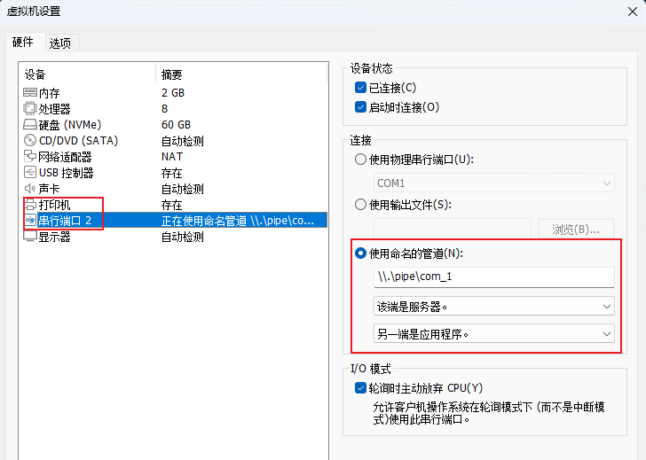
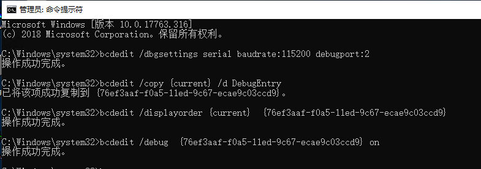

### 设置双机调试

#### 软件下载

#### 虚拟机配置

1. 进入虚拟机设置， 选择添加硬盘添加串行端口。  *由于打印机是占用串口的，所以新增的串口设备号为 2， 在配置调试机的时候需要注意。*
2. 设置 **使用命名的管道**， com_1管道的名字，可以修改。 选择 **该端是服务器** 和 **另一端是应用程序**。

  

#### 配置被调试机管道串口

1. 以管理员权限运行 CMD， 运行 `bcdedit /dbgsettings serial baudrate:115200 debugport:2` , 设置端口,  baudrate为 115200 。*注意这里的debugport和我们新增的串口设备对应。*
2. 输入`bcdedit /copy {current} /d DebugEntry` 来复制一个开机选项, 以进入OS的debug模式，记住此时的**ID号**。
3. 输入`bcdedit /displayorder {current} {e8a0ccf0-9748-11eb-950a-ce6045b926ac}` 在引导菜单中增加一个新的选项。
4. 输入`bcdedit /debug {e8a0ccf0-9748-11eb-950a-ce6045b926ac} ON` 来激活debug。

  

#### 配置windbg的调试串口