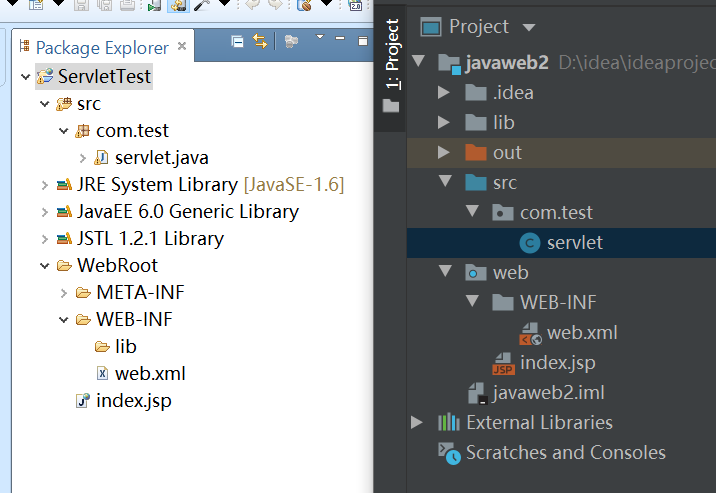
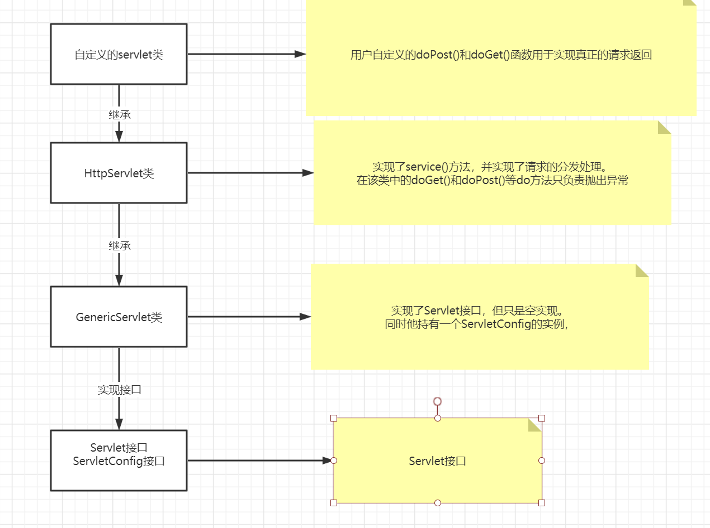
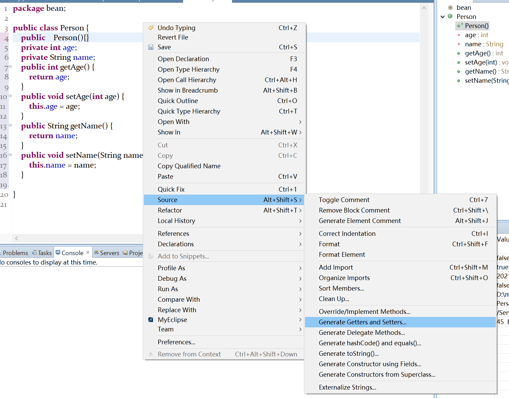

## Servlet使用

https://blog.csdn.net/zj12352123/article/details/80576748

##### 介绍

是用Java编写的服务器端程序。其主要功能在于交互式地浏览和修改数据，生成动态Web内容。狭义的Servlet是指Java语言实现的一个接口，广义的Servlet是指任何实现了这个Servlet接口的类，一般情况下，人们将Servlet理解为后者。

用户若想用发一个动态web资源(即开发一个Java程序向浏览器输出数据)，需要完成以下2个步骤：
　　1. 编写一个Java类，实现servlet接口。
        　　2. 把开发好的Java类部署到web服务器中。
      按照一种约定俗成的称呼习惯，通常我们也把实现了servlet接口的java程序，称之为Servlet

##### 在myeclipse或idea等IDE中如何编写Servlet

  如图是项目在两个IDE中的结构。

对与servlet程序的配置内容在WEB-INF文件夹下的web.xml里

```xml
<?xml version="1.0" encoding="UTF-8"?>
<web-app xmlns="http://xmlns.jcp.org/xml/ns/javaee"
         xmlns:xsi="http://www.w3.org/2001/XMLSchema-instance"
         xsi:schemaLocation="http://xmlns.jcp.org/xml/ns/javaee http://xmlns.jcp.org/xml/ns/javaee/web-app_3_1.xsd"
         version="3.1">
<context-param>
    <param-name>userInServletContext</param-name>
    <param-value>xiao-jie</param-value>
</context-param>
<servlet>
    <servlet-name>com.test.servlet</servlet-name>
    <servlet-class>com.test.servlet</servlet-class>
    <init-param>
        <param-name>user</param-name>
        <param-value>xiao-jie</param-value>
    </init-param>
</servlet>
<servlet-mapping>
    <servlet-name>com.test.servlet</servlet-name>
    <url-pattern>/hello1</url-pattern>
</servlet-mapping>
</web-app>
```

###### 在编写servlet类时需要重写的内容

我们自己完成servlet类时一般继承HttpServlet这个类，并重写实现它的一些方法

```java
package com.test;
import javax.servlet.ServletException;
import javax.servlet.http.HttpServlet;
import javax.servlet.http.HttpServletRequest;
import javax.servlet.http.HttpServletResponse;

public class servlet extends HttpServlet {
    //其中doPost和doGet方法是必须要重写的。
    protected void doPost(HttpServletRequest request, HttpServletResponse response) throws ServletException{
        System.out.println("post");
    }
    protected void doGet(HttpServletRequest request, HttpServletResponse response) throws ServletException {
        System.out.println("get");
    }
}
```

##### servlet的接口如何实现

我们一般将servlet程序类继承HttpServlet类，而HttpServlet类又是继承的GenericServlet，GenericServlet则是实现了Servlet, ServletConfig, Serializable  这三个接口。

  

##### 刚刚提到的ServletConfig接口实现了什么有什么作用

```java
		//可以在自己定义的servlet程序中使用。
		ServletConfig servletConfig = getServletConfig();
        //1.可以获取servlet程序的别名，这里的别名指的是在web.xml里设置的<servlet-name>键值
        System.out.println(servletConfig.getServletName());
        //打印得到的是 aaa

        //2.可以获得在web.xml里配置的初始化的值
        System.out.println(servletConfig.getInitParameter("user"));
        //打印得到值为xiao-jie

        //3.可以获取ServletContext对象
        ServletContext servletContext = servletConfig.getServletContext();
```

###### 使用的注意点

要使用ServletConfig,必须保证 HttpServlet类中的Init（）函数运行。如果我们在自己编写的servlet程序中要重写Init()函数，保证加上

`super.Init();`

##### 什么是ServletContext对象有什么作用

1. 他是一个接口，他表示的是Servlet的上下文
2. 一个web工程只有一个ServletContext对象实例
3. ServletContext是一个域对象
4. 他只在web工程启动的时候创建，工程停止的时候销毁。

```java
 		ServletContext servletContext = servletConfig.getServletContext();
        //1.获取web.xml文件中配置的<context-param>的值
        System.out.println(servletContext.getInitParameter("userInServletContext"));

        //2获取当前工程的路径
        System.out.println(servletContext.getContextPath());

        //3.获取工程被部署在服务器上的绝对路径
        System.out.println(servletContext.getRealPath("/"));
		//4.可以像jsp里的session等一样存储数据
        servletContext.setAttribute("xiao-jie", "handsome");
        System.out.println(servletContext.getAttribute("xiao-jie"));
```

##### servlet类与普通的java类的区别

##### 

## javaBean的使用

JavaBean是使用Java语言开发的一个可重用的组件，在开发中可以使用JavaBean减少重复代码，使整个代码的开发更简洁。

javaBean本身是一个公共的类，但在编写时必须遵守一些规范：

1. javaBean类必须是一个公共类
2. javaBean内必须有一个空的构造函数
3. 类内的变量必须全部为private
4. 每一个属性都有一组读写方法（setXXX和getXXX），但如果该属性的操作字段为Boolean则getXxx()方法为isXxx()方法

setXxx()和getXxx的命名问题：

1. 一般属性名全部小写如name，那么getter和setter函数设为 getName()和setName()

2. 当属性名的第二个字母大写时如sName，那么直接接在get或set后面。即 getsName()
3. 属性名全部打写时，也是直接在后面。
4. 属性名首字母最好不要大写。

get和set函数可以通过IDE帮助生成

 


