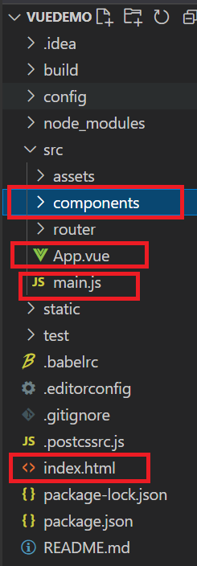

# Vue-cli 脚手架学习

[[vue框架#axios库]]
[[vue-cli项目中使用markdown编辑器]]
[[vuex]]
[[element-ui]]
#### 遇到的问题并解决

##### 页面刷新，vue中data和vuex中state都会重置

解决思路：监听页面重载的事件，每次页面重载之前都将要保留的页面数据保存在本地 sessionStorage 中；每次页面加载后都给data或state赋值（如果sessionStorage中有相关的数据）。[[前端浏览器的存储技术#WebStorage中的 sessionStorage]]

在组件中的created部分：

```js
created() {
      //any code should run to init data() in this compoent
    
      // 如果 seesionStorage中有对应 key值，赋值给data
      if (sessionStorage.getItem('data')) {
          Object.assign(this.$data, JSON.parse(sessionStorage.getItem('data')))
      }
       //监听事件 beforeunload， 在页面重载之前把data存入 sessionStorage
       window.addEventListener("beforeunload",()=>{
            console.log('before reloaded')
    	    sessionStorage.setItem("data",JSON.stringify(this.$data));
    });
  },
```


### Vue-cli脚手架形成原理

暂不分析 


### 脚手架的使用

##### 初步分析vue-cli的项目结构

 main.js 是项目的主入口，它将 App.vue组件的内容渲染到index.html页面的 id='app' 的标签处。这样我们只需要区编写更多的组件，并将编写的组件渲染到 App.vue组件上即可。我们所写的组件一般放在 components文文件夹里。


注意 *由于一切的内容都是 渲染到index.html 页面的一个标签值显示，要设置一个页面的 \<body> \<haeder\> 等标签的css值，都应该直接在index.html页面中完成*。


router文件夹里是Vue-cli项目的路由设置，那个路径对于渲染哪一个页面和设置路由导航守卫。


#### 在vue-cli中自定义校验规则

在`data(){}`内,  `data(){ return{    }}`范围外定义自定义的校验规则,推荐使用lamda表达式,可以保留this关键字的指向.

```vue
<script>
data() {
    let repassword =  (rule, value, callback) => {
        if (value != this.formData.password) {
            callback(
                new Error('两次密码输入不一致')
            )
        }
        callback()
    }
    return {
        formData: {
            name: 'zs',
            phonenum: '15153266878',
            password: '',
            password2: '',
            email: 'hahah@qq.com'
        },
        rules: {
            password: [
                {required: true, min: 6, max: 20, message: '请输入6~20位的密码', trigger: 'blur'}
            ],
            password2: [
                {required: true, message: '请输入您的确认密码', trigger: 'blur'},
                {validator: repassword, trigger: 'blur'},
            ],
     }
    }
</script>
```


