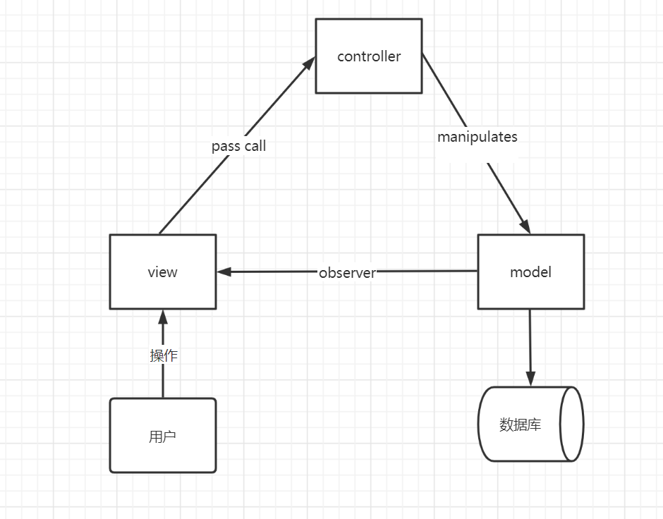
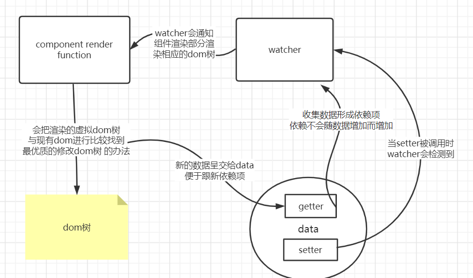
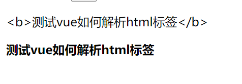
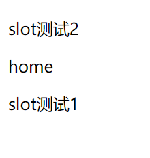

#       	   Vue框架学习

#### 了解MVC&MVP&MVV

##### mvc    model(模型)-view(试图)-controller(控制器)

用户会对view进行操作，view捕获到这个操作把处理的去哪里发给controller，controller会决定调用 model的哪个接口处理数据，model变更后会通过observer返回给view层。这里的view模块是高度依赖model层的，因此view无法组件化，代码无法复用。

 

##### mvp   model-view-presenter

view不在依赖的model层，独立出来。但presenter部分手动同步逻辑麻烦，维护困难。

 

##### mvvp  model-view-view-model

### vue的实现方法简记

vue的数据模型都是简单的js对象，但是当数据发生改变时，视图也会随之发生改变，成为非侵入式的深度响应。

把一个普通的js对象传入vue实例作为data的一个选项时，vue将此对象所有的property遍历，并使用Object.defineProperty()把这些property全部转换为`getter()`和`setter()`。*不同的浏览器打印的`getter`和`setter`信息会有不一样的。*

在渲染页面时，凡是被用到的数据property会被视为依赖项，每个data选项会有一个watcher。每当依赖项被修改时即依赖项调用了`setter()` ，watcher会检测到，并使相关的dom树重新渲染。具体见下图：

 、

需要注意的是，依赖项不会随便增加，这也就是说直接给data里的js对象增加新的属性，其依赖项不会随之添加。有固定实现方法

##### 对于对象

Vue.set(vm.someObj,  'b' , 2);

```js
var vm = new Vue({
  data:{
    obj:{
		a = true,
	}
  }
})
//其中vm.obj.a是有依赖项的
vm.obj.b = false;
//此时，obj内是由b的但没有添加依赖项，b无法在dom树中被用于渲染。
Vue.set(vm.obj, 'b', 2);//正确的添加依赖项的方式。
```

##### 对于数组

1. 当利用索引直接设置一个数组项时不是响应式的，可以用Vue.set(vm.items, indexOfItem, newValue)
2. 当我改变数组长度时不是响应式的，可以用vm.items.splice(newLength)

### vue的语法模板

##### 基本语法

```html
<!DOCTYPE html>
<html lang="en">
<head>
    <meta charset="UTF-8">
    <meta name="viewport" content="width=device-width, initial-scale=1.0">
    <title>Document</title>
    <!-- //这里引入vue.js文件，有多种引入方式，这里引入外部网站的 -->
    <script src="https://cdn.jsdelivr.net/npm/vue/dist/vue.js"></script>
</head>
<style>
    .red{
        background-color: red;
    }
    .yellow{
        background-color: yellow;
    }
    .a{
        background-color: blue;
    }
    .b{
        font-size: 20px;

    }
    .c{
        border: solid red 1px;
    }
</style>
<body>
    <div class="box">
        <!-- //vue的变量或者表达式写在两个双括号中 -->
        {{ 10+20 }}
        {{ 20>10 ? myname:'无名氏' }}
        <!-- vue的绑定事件的方式，可以推广到的其他事件。 -->
        <button @click='handleClick()'>修改昵称</button>
        <!-- v-XXX是vue内的指令，可以视为js里的属性 -->
        <div v-show="isSHow">这里是要隐藏的内容，用来测试v-show指令</div>
        <div>
            <!-- v-bind的使用，以及在指令里也可以使用表达式。 -->
            <button v-bind:class=" isHidden ? 'red':'yellow' " @click='handleClick2()'>hide</button>
        </div>

        <input type="text" v-on:input='inputHandle'> 
        <button v-on:click='addHandle'>add</button>
        <ul>
            <!-- v-for指令的使用，index是索引，item是数组内的值-->
            <li v-for="item,index in datalist">
                {{index}}---{{item}}
                <button v-on:click='delHandle(index)'>del</button>
            </li>
        </ul>
        <div v-bind:class="classobj">动态切换对象的测试</div>
    </div>
</body>
<script>
    //定义vue语法管理的范围
    let vm = new Vue({
        //css选择器选择dom树中的节点
        el:".box",
        //vue定义状态的部分，其实就是变量，在vue里称呼为状态。
        data:{
            myname:'xiaojie',
            isSHow:true,
            isHidden:false,
            list_to_add:"",
            datalist:["a", "b", "c", "d"],
            classobj:{
                a:true,
                b:true,
                c:true,
            }
        },
        //在vue内定义方法的地方
        methods:{
            //handleClick(){   CODE  }
            handleClick:function(){
                this.myname = 'xiao-jie';
            },
            handleClick2:function(){
                this.isSHow = !this.isSHow
                this.isHidden = !this.isHidden
            },
            addHandle:function(){
                this.datalist.push(this.list_to_add);
            },
            delHandle:function(index){
                this.datalist.splice(index,1);
            },
            inputHandle:function(e) {
                this.list_to_add = e.target.value;
            }
        }
    })
</script>
</html>
```

##### 语法小记

###### {{}}内部的内容

{{}}内部的内容里有标签不会被解析，而是直接输出。要想解析html标签可用 v-html

###### vue实例中 computed和methods的区别

1. computed： 在编写computed内的方法时必须要有一个return值，且computed内的方法是响应式的，并且有缓存，这意味着只有在，组件内内容相关的依赖项有所改变时，computed的方法才会自动的调用。
2. methods： 在methods内的方法必须作为函数来使用，且它是非响应式的，没有缓存的。
3. 总结来说，computed更多的适合用于将数据合理转换显示，而methods应该处理内部的逻辑变化。但两者其实相互弥补。

###### mixins

混入的用法，可以在全局写一个对象，在vue实例中混入该对象，就可以使用该对象内的一些methods和computed

```

```

###### mouted（）生命周期函数

在dom节点创建之后会自动调用。

###### vue中的 `$on`和`$emit`

这两个函数的使用对象必须是一个vue实例，且配合使用时必须是同一个。

- this.emit('自定义的事件名'，'要传递的参数')。该语句触发时，自定义的事件意为着触发，并将要传递的数据发送给监听器。
- this.$on('事件名'，'callback(参数)')  。上面自定义的事件触发后传递的参数交给这里的回调函数来处理。

后面有用这两个函数来实现组件之间通信的学习。

##### 指令合集

- v-show : 是否显示dom节点

- v-if : 是否创建dom节点

- v-else :和v-if配合使用，必须放在两个相邻的标签内，v-if在前面。

- v-elseif： 

- v-bind：动态绑定属性，可以将原js里的所有属性绑定为vue里的指令，必须是在vue的管理范围内。

  用法  `v-bind:class  = ""` 。

- v-on:   动态绑定事件 使用`v-on:click` 

  

- v-for:遍历指令，可以将数组信息遍历放入dom

  ```html
  <ul>
      <!--datalist是定义在vue数据处的一个的数组 第一个是数组内的内容，第二个就是索引-->
      <li v-for="item,index in datalist">{{index}}---{{item}}</li>
  </ul>
  ```

- v-html: 用于帮助vue解析含有html标签的内容但不安全，不建议用在用户输入的内容之上。

  ```html
  <p>
    {{myHtml}}
  </p>
  <p v-html="myHtml">
  </p>
  <script>
      let vm = new Vue({
          el:".box",
          data:{
              myHtml:"<b>测试vue如何解析html标签</b>",
          }
  </script>
  ```

  效果: 
  
- v-model:  v-model本质上是一个语法糖。可以在标签和vue实例上建立双向的实时绑定，其实现可以理解为

  ```html
   <input v-bind:value="message" v-on:input="message = $event.target.value" />
   <!--message是在vue实例中定义的状态-->
  ```

  注意这种绑定是双向的，在dom中修改message会影响vue实例，直接修改vue实例也会影响dom的渲染显示。非适合用在单选框，下拉框或复选框处。

  ```html
  //复选框处的应用
  <div class="box">
     <input type="checkbox" v-model="lans" value="c++">c++
     <input type="checkbox" v-model="lans" value="java">java
     <input type="checkbox" v-model="lans" value="php">php
  </div>
  <script>
      let vm = new Vue({
          el:".box",
          data:{
              lans:[],
          }
      })
  </script>
  ```

-   


##### 特殊attribute

- key    可以通过:key在html标签处指定key的值，key用来在虚拟dom树与dom树相比时对照节点。

- ref     Vue提供的一种帮助我们获取原生dom节点的方法

  ```html
  <body>
      <div class="box">
          <p @click="Func2()" ref="test">aa</p>
      </div>
  </body>
  <script>
      Vue.component('newBar', {
          template:`
              <div style="backgorund-color:red">
                  test
              </div>
          `,
          data:function(){
              return {
                  num:194,
                  num2:213
              }
          },
          methods:{}
      })
      let vm = new Vue({
          el:".box",
          data:{
          },
          methods:{
              Func2:function(num,num2){
                  console.log("ss",this.$refs.test);
              }
          },
      })
  </script>
  ```

  直接获取关于ref="test"的原生dom节点，可以随意修改读取属性，所以并不安全，谨慎使用。

##### 事件处理方式

###### 在html标签处绑定

```html
<div v-on:click="clickHandle($event data)">
</div>
<!--$evebt意为传递事件对象-->
```

###### 学习vue事件里的修饰符

-  .lazy:在输入框中，v-model 默认是同步数据，使用 .lazy 会转变为在 change 事件中同步 ， 也就是在失去焦点 或者 按下回车键时才更新。和v-model配合使用。
-  .number:  如果输入框中输入内容为纯数字，将String类型转变为Number类型.配合v-model使用
-  .trim   : 去除输入的内容的前后空格。


### Vue的组件

组件系统是Vue.js其中一个重要的概念，它提供了一种抽象，让我们可以使用独立可复用的小组件来构建大型应用，任意类型的应用界面都可以抽象为一个组件树。提高了代码复用性。

#### 全局注册的方式

注意：

1. 在全局注册的组件data项目中，必须是以函数的形式返回值。
2. template: 的模板中必须有一个根元素。
3. 在名字命名上，命名中有驼峰命名法的在标签使用时全部改为分隔符。
4. css元素只能写在行内

```js
	Vue.component('newBar', {
        template:`
            <div style="backgorund-color:red">
                NewBar
            </div>
        `,
        methods:{
        },
        computed:{
        }
        data：function(){
        	return num:0,
        }
    })
```

全局注册的组件可以在其他全局注册的组件中使用，也可以在`new Vue`创建的根组件范围内使用，也可以在`new Vue`实例内部定义的新的组件中使用。注意我每一个`new Vue`实例的范围，其实就是一个根组件的范围。在全局注册的组件可以被根组件的范围内使用，也可以被在 `new Vue`内定义的新的组件使用。

需要注意的是不同组件之间的方法内容状态不可以被随意的互相访问。

#### 局部组件注册

```js
Vue.component('newBar', {
        template:`
            <div style="backgorund-color:red">
                NewBar
            </div>
        `,
        methods:{
        },
        components:{
        	"newBar-son":{
        		template:`
        		`,
        	}
        }
        data：function(){
        	return num:0,
        }
    })
```

这样定义的局部组件`newBar-son`只能被它的父组件`newBar`使用。 但是子组件可以使用父组件的方法。 并不推荐内部写很多子组件，会使得代码结构变复杂。

#### props属性    

借助props来实现复用组件时，给组件传递参数。

```js
<body>
    <div class="box">
        <new-bar context="s1" :ifshow="false"></new-bar>
    </div>
</body>
<script>
    Vue.component('newBar', {
        template:`
            <div style="backgorund-color:red" v-show="ifshow">
                {{context}}
            </div>
        `,
        //props:["context", "ifshow"]  外部传来的属性在这里接收
        props:{
            context:{
            	type:String,
                default:"默认内容"
            },
            ifshow:{
            	type:Boolean,
            	default:true
        	},
            //属性验证，在这里获取属性类型不匹配时会报错。并添加默认值
        }
    })
    let vm = new Vue({
        el:".box",
        data:{
        },
        methods:{
            Func2:function(){
                console.log("2")
            }
        },
    
    })
</script>
```

注意在传递非String类型的属性时，html标签处应将属性名绑定为Vue的属性

#### 实现组件向他的父标签传递参数

借此方法可以实现让两个在同一个父标签下的组件实现通信。称为兄弟通信。    

```html
<body>
    <div class="box">
        <!--在组件使用处绑定一个事件，事件在组件内部定义。事件的处理函数在外部定义处理函数可以获取组件内部的值-->
        <new-bar @new-event="Func2"></new-bar>
    </div>
</body>
<script>
    Vue.component('newBar', {
        template:`
            <div style="backgorund-color:red">
                <button @click="handleClick">click</button>
            </div>
        `,
        data:function(){
            return {
                num:194,
                num2:213
            }
        },
        methods:{
            //当按钮被点击时，会有$emit触发new-event事件，并将内部的值传递出去。
            handleClick:function(){
                console.log("inner",this.num);
                this.$emit("new-event",this.num,this.num2);
            }
        }
    })
    let vm = new Vue({
        el:".box",
        data:{
        },
        methods:{
            //new-event事件触发后调用此函数，此函数会收到$emit()中传递出来的多个数据。
            Func2:function(num,num2){
                console.log("outter",num,num2);
            }
        },
    
    })
</script>
```

 #### ref获取组件
 [[vue框架#特殊attribute]]  。ref属性同样适用于自己定义的组件

#### bus通信

利用一个新建的空的vue实例来取名为bus，在bus上添加监听事件和处理方式，分别放在两个需要传值的组件内，借此作为媒介。此方法可以使两个相隔甚远的组件之间实现通信。

```html
<body>
    <div class="box">
        <new-bar></new-bar>
        <new-bar2></new-bar2>
    </div>
</body>
<script>
    let bus = new Vue();
    Vue.component('newBar', {
        template:`
            <div @click="handleClick()">
                test
            </div>
        `,
        data:function(){
            return {
                num:194,
                num2:213
            }
        },
        methods:{
            handleClick: function(){
                console.log("clicked1");
                bus.$emit("bus-communicate",this.num);
            }
        }
    });
    Vue.component('newBar2',{
        data:function(){
            return{
                num:11,
            }
        },
        template:
        `
            <div @click="handleClick()">
                {{num}}
            </div>
        `,
        mounted(){
            bus.$on("bus-communicate",(d)=>{
                this.num = d;
            })
        },
        methods:{}
    })
    let vm = new Vue({
        el:".box",
        data:{
        },
        methods:{
        },
    
    })
</script>
```

注意关于newBar2组件中关于`$on()` 内回调函数的写法。如果不使用箭头函数，回调函数的内部this就会指向bus这个Vue实例了。还有一种解决办法，把回调函数换成在methods中定义的自己的方法。

#### 利用v-model语法糖实现的组件通信


#### 动态组件

```html
<component is="home"></component>
<!--这时该标签会显示为名为 home的组件-->	
<component :is="componentname"></component>
<!--这样使is的值与vue的状态值绑定，随意修改-->
```

#### slot 插槽

slot基本用法

```html
<body >
    <div class="box">
        <component is="home">
            <p slot="slot2">slot测试1</p>
            <p slot="slot1">slot测试2</p>
        </component>
    </div>
</body>
<script>
    let vm = new Vue({
        el:".box",
        data:{

        },
        components:{
            "home":{
                template:`
                    <div>
                        <slot name="slot1"></slot>
                        home
                        <slot name="slot2"></slot>
                    </div>
                `,
            }
        }
    })
</script>
<!--如不使用slot，外部使用时，组件内的标签不会被解析，利用slot插槽可以嵌入这些标签，并利用name和slot属性匹配。
```

 

#### transition过渡效果 动画效果

```html
<style>
   .xiaojie-enter-active{
       animation: test 1.5s ;
   }
   .xiaojie-leave-active{
       animation: test 1.5s reverse;
   }
   @keyframes test{
       from{
           opacity: 0;
           transform: translateX(100px);
       }
       to{
           opacity: 1;
           transform: translateX(0px);
       }
   }
</style>
<transition name="xiaojie" >
    <div v-show="ishow">1111</div>
</transition>
```

使用transition组件包裹其他标签，当被包裹的标签v-show属性发生变化时，该标签的class值也会变化。借此简化了原生js中手动改变class来实现动画重复出现的效果。具体体现为当`ishow`由`false`变为`true`的时候,内部标签class添加`xiaojie-enter-active`的类名，当`ishow`由`true`变为`false`的时候，内部标签class添加`xiaojie-leave-active`的类名。其中xiaojie这个内容是由`transition`的属性`name`决定的。

补充，`name-enter-active` 和`name-leave-active`还可以继续细分，但其实这种划分可以用css的animation动画代替。

v-enter：定义上半场过渡的初始状态；在过渡开始前被添加，在过渡开始时会被移除
v-enter-to：定义上半场过渡的结束状态；在过渡开始时被添加，在过渡完成时会被移除
v-enter-active：这里包含了上面的v-enter、v-enter-to两个时间段，在这里可以对上半场过渡定义过渡时间、曲线等
v-leave：定义下半场过渡的初始状态；在过渡开始前被添加，在过渡开始时会被移除
v-leave-to：定义下半场过渡的结束状态；在过渡开始时被添加，在过渡完成时会被移除
v-leave-active：这里包含了上面的v-leave、v-leave-to两个时间段，在这里可以对下半场过渡定义过渡时间、曲线等。

##### transition组件内部有多个标签过度时的注意

正常一个transition组件对应一个内部标签 *可以用一个标签将需要应用过度的标签包裹*。 如果有多个时，只会显示应用第一个。

特殊情况是标签内使用 v-if v-else v-elseif 的指令。这里面注意使用不同标签和使用相同标签时的区别，不在赘述。

##### transition可以与动态组件`component`组合使用

##### transition-group与  列表标签组合使用

### Vue内的生命周期概念


### fetch

### axios库

[axios中文官网](http://www.axios-js.com/zh-cn/docs/#axios-API) 

axios是一个基于 promise的HTTP库，可以在浏览器的nodejs环境中的使用；他的一些特性：

- 从浏览器中创建 [XMLHttpRequests](https://developer.mozilla.org/en-US/docs/Web/API/XMLHttpRequest)
- 从 node.js 创建 [http](http://nodejs.org/api/http.html) 请求
- 支持 [Promise](https://developer.mozilla.org/en-US/docs/Web/JavaScript/Reference/Global_Objects/Promise) API
- 拦截请求和响应
- 转换请求数据和响应数据
- 取消请求
- 自动转换 JSON 数据
- 客户端支持防御 [XSRF](http://en.wikipedia.org/wiki/Cross-site_request_forgery)

##### 基本用法

###### 在npm引入的情况下导入axios库，配置baseURL

```js
import axios from 'axios'
axios.defaults.baseURL = 'http://127.0.0.1:8888/'
```

###### 发送 get请求

```js
 // 为给定 ID 的 user 创建请求
axios.get('/user?ID=12345')
 .then(function (response) {
    console.log(response);
  })
  .catch(function (error) {
    console.log(error);
  });
// 上面的请求也可以这样做
axios.get('/user', {
    params: {
      ID: 12345
    }
  })
  .then(function (response) {
    console.log(response);
  })
  .catch(function (error) {
    console.log(error);
  });
```

###### 发送 post请求

```js
axios.post('/user', {
    username: 'FEIZZER',
    passowrd: '123456'
  })
  .then(function (response) {
    console.log(response);
  })
  .catch(function (error) {
    console.log(error);
  });

```

###### 并发执行多个请求

```js
function getUserAccount() {
  return axios.get('/user/12345');
}

function getUserPermissions() {
  return axios.get('/user/12345/permissions');
}

axios.all([getUserAccount(), getUserPermissions()])
  .then(axios.spread(function (acct, perms) {
    // 两个请求现在都执行完成
  }));
```

###### axios创建请求的API是非常多样的详见 axios官网

##### 返回得到的响应体结构

就是我们在 `.then()` 函数中处理的数据response ，后端应该规范返回的数据，尽量包含以下的信息

```js
{
  // `data` 由服务器提供的响应
  data: {},

  // `status` 来自服务器响应的 HTTP 状态码
  status: 200,

  // `statusText` 来自服务器响应的 HTTP 状态信息
  statusText: 'OK',

  // `headers` 服务器响应的头
  headers: {},

   // `config` 是为请求提供的配置信息
  config: {},
 // 'request'
  // `request` is the request that generated this response
  // It is the last ClientRequest instance in node.js (in redirects)
  // and an XMLHttpRequest instance the browser
  request: {}
}
```

