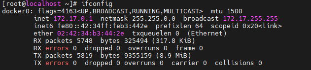
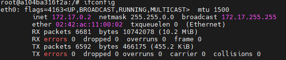
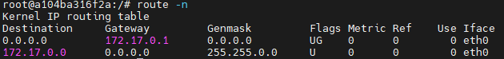
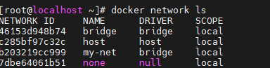
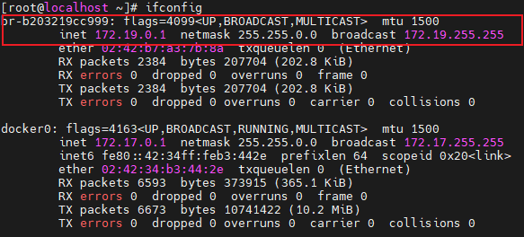

### docker的网络模式
linux虚拟网络设备的前置知识 [[liunx虚拟网络设备]]
#### Bridge模式（默认模式）

当docker进程在宿主机上启动时，会创建一个docker0的虚拟网桥，该虚拟会获得一个`172.17.0.1`的地址（路由模式）。使用bridge网络启动的容器会连接到这个虚拟网桥上，虚拟网桥的工作方式和路由器类似，这样主机上的所有容器就通过交换机连在了一个二层网络中。从  docker0地址的  子网中分配一个 IP 给容器使用，并设置 docker0 的 IP 地址为容器的**默认网关**

###### docker0虚拟网桥信息

 

###### 容器内的网卡和路由表

 

 


###### 端口转发的设置

当使用`docker run -p` 指定容器到宿主机的端口映射时， 实际就是使用iptables做了DNAT的转发。

==以后有待深入学习== 

##### 建立自己的bridge网络并使用

```shell
docker network create -d bridge my-net
```

-d  可以指定网络类型； 可选的类型有 `bridge` `macvlan`和  `overlay`  其中 overlay 网络类型用于 Swarm mode。

--subnet 172.19.0.0/24   指定网段

--gateway  172.19.0.1	指定网关    省略则自动分配

###### 查看可以得到一个新的虚拟bridge

 

  

```shell
 docker run -it -d -p 9004:80 --net=my-net  nginx
```

此时运行的容器就会连接在my-net `172.19.0.1/16`的子网下了

###### docker network  常用命令

- docker network create
- docker network connect
- docker network ls
- docker network rm
- docker network disconnect
- docker network inspect

#### Host模式

如果启动容器的时候使用`host`模式，那么这个容器将不会获得一个独立的`Network Namespace`，而是和宿主机共用一个 Network Namespace。容器将不会虚拟出自己的网卡，配置自己的 IP 等，而是使用宿主机的 IP 和端口。但是，容器的其他方面，如文件系统、进程列表等还是和宿主机隔离的。

在容器外和容器内使用 ifconfig 命令查看本机网卡信息都是一致的。

#### Container模式

这个模式指定新创建的容器和已经存在的一个容器共享一个 Network Namespace，而不是和宿主机共享。新创建的容器不会创建自己的网卡，配置自己的 IP，而是和一个指定的容器共享 IP、端口范围等。同样，两个容器除了网络方面，其他的如文件系统、进程列表等还是隔离的。两个容器的进程可以通过 lo 网卡设备通信。

#### None模式

该容器有自己的network namespace 但是没有进行任何网络配置。也就是说，这个 Docker 容器没有网卡、IP、路由等信息。
