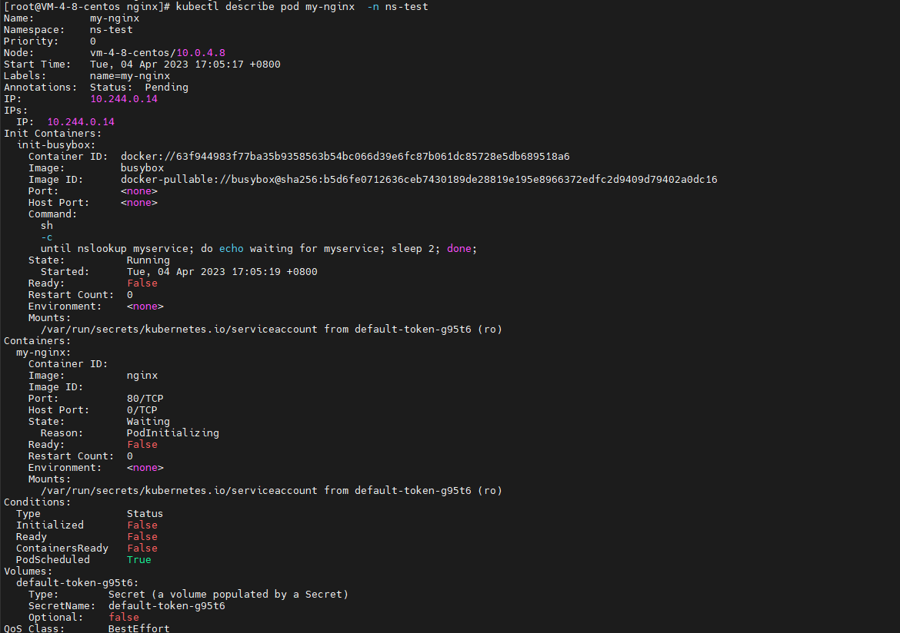

### Pod

pod是我们在kubernetes中你可以创建的和部署的最小的最简单的单位。

在k8s集群中pod可以只运行一个容器。 在这种使用方式中，你可以把 Pod 想象成是单个容器的封装，kuberentes 管理的是 Pod 而不是直接管理容器。

**一个pod中允许同时运行多个容器**。一个 Pod 中也可以同时封装几个需要紧密耦合互相协作的容器，它们之间共享资源。这些在同一个 Pod 中的容器可以互相协作成为一个 service 单位。Pod 将这些容器的存储资源作为一个实体来管理。

#### pod的使用

##### 网络

每个 Pod 都会被分配一个唯一的 IP 地址。Pod 中的所有容器共享网络空间，包括 IP 地址和端口。Pod 内部的容器可以使用 `localhost` 互相通信。Pod 中的容器与外界通信时，必须分配共享网络资源（例如使用宿主机的端口映射）。

##### 存储

可以为一个 Pod 指定多个共享的 Volume。Pod 中的所有容器都可以访问共享的 volume。Volume 也可以用来持久化 Pod 中的存储资源，以防容器重启后文件丢失。

pod中的容器都会共享这两个资源。

你很少会直接在 kubernetes 中创建单个 Pod。因为 Pod 的生命周期是短暂的，用后即焚的实体。当 Pod 被创建后（不论是由你直接创建还是被其他 Controller），都会被 Kubernetes 调度到集群的 Node 上。直到 Pod 的进程终止、被删掉、因为缺少资源而被驱逐、或者 Node 故障之前这个 Pod 都会一直保持在那个 Node 上。

> 注意：重启 Pod 中的容器跟重启 Pod 不是一回事。Pod 只提供容器的运行环境并保持容器的运行状态，重启容器不会造成 Pod 重启。

Pod 不会自愈。如果 Pod 运行的 Node 故障，或者是调度器本身故障，这个 Pod 就会被删除。同样的，如果 Pod 所在 Node 缺少资源或者 Pod 处于维护状态，Pod 也会被驱逐。Kubernetes 使用更高级的称为 Controller 的抽象层，来管理 Pod 实例。虽然可以直接使用 Pod，但是在 Kubernetes 中通常是使用 Controller 来管理 Pod 的。

#### Init容器

这是一种专用的容器，在应用程序容器启动之前运行，用来包含一些应用镜像中不存在的实用工具或安装脚本。

- 一个pod可能存在一个或多个init容器
- init容器一定是顺序执行的， 一个init容器执行完成后再执行下一个
- init容器总是执行到成功为止

init容器可以在 yaml文件中的`spec.initContainers`字段中声明, 如下

```yaml
apiVersion: v1
kind: Pod
metadata:
  namespace: ns-test
  name: my-nginx
  labels:
    name: my-nginx
spec:
  containers:
  - name: my-nginx
    image: nginx
    ports:
    - containerPort: 80
  initContainers:
  - name: init-busybox
    image: busybox
    command: ['sh', '-c', 'until nslookup myservice; do echo waiting for myservice; sleep 2; done;']
```

执行`kubectl apply -f *.yaml`   ,    `kubectl describe pod my-nginx -n ns-test`检查该pod的启动信息可以看到

 


##### 具体行为

在 Pod 启动过程中，Init 容器会按顺序在网络和数据卷初始化之后启动。每个容器必须在下一个容器启动之前成功退出。如果由于运行时或失败退出，将导致容器启动失败，它会根据 Pod 的 `restartPolicy` 指定的策略进行重试。然而，如果 Pod 的 `restartPolicy` 设置为 Always，Init 容器失败时会使用 `RestartPolicy` 策略。

在所有的 Init 容器没有成功之前，Pod 将不会变成 `Ready` 状态。Init 容器的端口将不会在 Service 中进行聚集。 正在初始化中的 Pod 处于 `Pending` 状态，但应该会将 `Initializing` 状态设置为 true。

如果 Pod [重启](https://kubernetes.io/docs/concepts/workloads/pods/init-containers/#pod-restart-reasons)，所有 Init 容器必须重新执行。

对 Init 容器 spec 的修改被限制在容器 image 字段，修改其他字段都不会生效。更改 Init 容器的 image 字段，等价于重启该 Pod。

因为 Init 容器可能会被重启、重试或者重新执行，所以 Init 容器的代码应该是幂等的。特别地当写到 `EmptyDirs` 文件中的代码，应该对输出文件可能已经存在做好准备。

Init 容器具有应用容器的所有字段。除了 `readinessProbe`，因为 Init 容器无法定义不同于完成（completion）的就绪（readiness）之外的其他状态。这会在验证过程中强制执行。

在 Pod 上使用 `activeDeadlineSeconds`，在容器上使用 `livenessProbe`，这样能够避免 Init 容器一直失败。 这就为 Init 容器活跃设置了一个期限。

在 Pod 中的每个 app 和 Init 容器的名称必须唯一；与任何其它容器共享同一个名称，会在验证时抛出错误。


#### Pause容器

pause容器又叫infra容器， 是为实现一个pod中多个容器的之间高效的共享进程网络资源。 在k8s中它默认是由 [pause容器](https://github.com/kubernetes/kubernetes/tree/master/build/pause)这个容器来实现，pause容器的镜像非常小，永远处于暂停的状态。

pause容器就相当于是一个中间容器， 在pod中它必须第一个启动， 并且它的声明周期是等同于pod的生周期的。 当pause容器启动后， 其他容器会加入到它的network中，实现网络的共享。


#### Pod的生命周期


#### pod安全策略

`PodSecurityPolicy` 类型的对象能够控制，是否可以向 Pod 发送请求，该 Pod 能够影响被应用到 Pod 和容器的 `SecurityContext`。

*Pod 安全策略* 是集群级别的资源，它能够控制 Pod 运行的行为，以及它具有访问什么的能力。 `PodSecurityPolicy`对象定义了一组条件，指示 Pod 必须按系统所能接受的顺序运行。 它们允许管理员控制如下方面：

