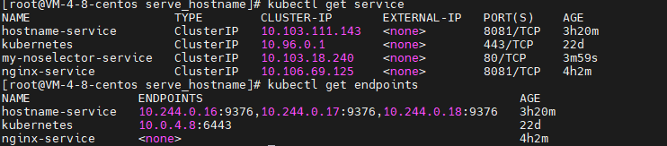

### Service对象

由于k8s中的pod是非持久的， pod被摧毁重建会获得不同的ip， 因此直接使用pod ip来发现服务是不稳定。 同时需要在多个副本之间实现负载均衡。 因此出现了Service这种资源类型。

> service是pod的逻辑分组， 一种可以访问它们的策略, 通过 `spec.selector`字段通过pod的label来过滤。

-  service通过label关联对应的Pod
-  service和pod的生命周期不绑定，，不会因为pod的重启二改变自己的cluster-ip
-  提供了负载均衡的功能，可以转发流量到不同的pod
-  可以对集群外部暴露端口
-  集群内部可以通过服务的名字访问

#### 内部访问服务 使用示例

1. 使用控制器deployment基于serve-hostname镜像， 创建三个pod。  **创建pod带上`label:{app: serve-hostname}`**

   ```yaml
   apiVersion: apps/v1
   kind: Deployment
   metadata:
     name: serve-hostname-deployment
   spec:
     selector:
       matchLabels:
         app: serve-hostname
     replicas: 3
     template:
       metadata:
         labels:
           app: serve-hostname
       spec:
         containers:
         - name: serve-hostname
           image: mirrorgooglecontainers/serve_hostname
           ports:
           - containerPort: 9376
             protocol: TCP
   ```

2. 创建一个service对象

   ```yaml
   apiVersion: v1
   kind: Service
   metadata:
     name: hostname-service
   
   spec:
     selector:
       app: serve-hostname  # selector选择器，对应pod的yaml文件中的labels字段
     ports:
     - name: my-hostname-service
       protocol: TCP	  # 支持tcp和udp， 默认为tcp
       port: 8081        # 对集群内的本服务暴露端口
       targetPort: 9376  # 目标pod中容器使用的端口
   ```

   上述配置将会创建一个名为 hostname-service的service对象，他的作用是将请求代理到 具有标签 "app:serve-hostname" 的pod的9376端口上。

#### service工作原理

当我们创建了一个（带有selector）service对象，控制器也会创建一个endpoints资源， 用来存储pod的ip port等信息到etcd， 这样service只要查看自己名下的endpoints就可以了。

> endpoint资源是暴露一个服务的ip地址和port的列表， 并且endpoints是一个独立的资源并不是serivce的属性， endpoints名称必须和serivce的名称相符。

> qa: 控制器是如何在service创建后自动创建endpoint的， 是通过informer监听service吗。

.png) 

上述的步骤中涉及到路由设置工作 则是**由kube-proxy来实现的**，

> kube-proxy是每个节点运行网路代理，kube-proxy 维护节点上的网络规则。 用于处理单个主机子网的划分和向外部世界公开服务等

 kube-proxy会通过informer得知service和endpoints的创建， 得到相应的CLUSTERIP和PORT， 创建iptable NAT规则做转发或通过ipvs模块创建VS服务器，这样经过CLUSTER-IP的流量都被转发到后端pod。
[[lan/工具/kubernetes/kube-proxy]]

#### 没有selector的service使用场景

当需要用service来抽象 **另一个namespace的pod** 或 **集群外部的pod** 的时候可以创建没有selector的service。

##### **使用无selector service来转发到同集群不同namespace的服务** 使用下面的yaml创建service

```yaml
kind: Service
apiVersion: v1
metadata:
  namespace: ns-test
  name: my-noselector-service
spec:
  ports:
    - protocol: TCP
      port: 80
      targetPort: 9376
```

 

由于这个 `Service` 没有 selector，就不会创建相关的 `Endpoints` 对象。可以手动将 `Service` 映射到指定的 `Endpoints`：

```yaml
kind: Endpoints
apiVersion: v1
metadata:
  namespace: ns-test
  name: my-noselector-service
subsets:
  - addresses:
      - ip: 10.244.0.16
    ports:
      - port: 9376
```

这样就可以将发送到 `10.103.18.240`这个clusterip的请求转发到 `10.244.0.16:9376`  。   注意：Endpoint IP 地址不能是 loopback（127.0.0.0/8）、 link-local（169.254.0.0/16）、或者 link-local 多播（224.0.0.0/24）。

##### 使用无selector service来访问集群外部服务

需要将 `spec.type`字段设置为 ExternalName

```yaml
kind: Service
apiVersion: v1
metadata:
  namespace: ns-test
  name: my-noselector-service
spec:
  type: ExternalName
  externalName: baidu.com
```

 

#### service的服务发现

##### 环境变量

##### DNS

#### 无头服务 Headless Service


#### 发布服务


#### 创建Service的yaml文件记录

```yaml
apiVersion: v1
kind: Service
metadata:
  name: k8s-go-service

spec:
  selector:
    app: go-demo  # selector选择器，对应pod的yaml文件中的labels的app字段
  type: NodePort  # 对外访问的类型
  ports:
  - name: my-service
    protocol: TCP
    port: 8081        # 对集群内的本服务暴露端口
    targetPort: 8080  # 目标pod中容器使用的端口
    nodePort: 30081   # 对外暴露的服务端口， 端口限定范围 30000~32767 

```

- spec.type  表示service的类型 共有四种：
  - ClusterIP 默认值， 自动分配仅在集群内部可以访问的虚拟ip

  - NodePort， 在ClusterIP的基础上为Service在每台机器上绑定一个端口， 允许在集群外部通过 `nodeIP:port` 来访问服务。

  - LoadBalancer， 在NodePort的基础上， 借助 **cloud provider** 创建一个外部分负载均衡器， 并将请求转发到 `nodeIP:port`

  - ExtenernalName, 把集群外部的服务引入到内部来， 在集群内部直接使用。从kubernetes1.7开始支持。

- spec.clusterIP， 该字段用来指定服务自己的ClusterIP，

  - 用户选择的 IP 地址必须合法，并且这个 IP 地址在 `service-cluster-ip-range` CIDR 范围内，这对 API Server 来说是通过一个标识来指定的。 如果 IP 地址不合法，API Server 会返回 HTTP 状态码 422，表示值不合法。

  - spec.clusterIP: none 且 spec.type: ClusterIP 表示这是一个无头服务。

    

- spec.ports:  可以部署一个port也可以多个，多个的时候 name为必须字段。

