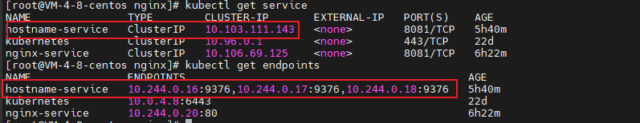
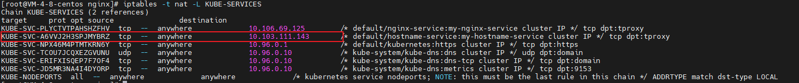
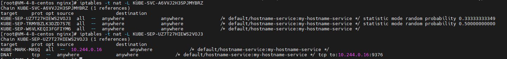
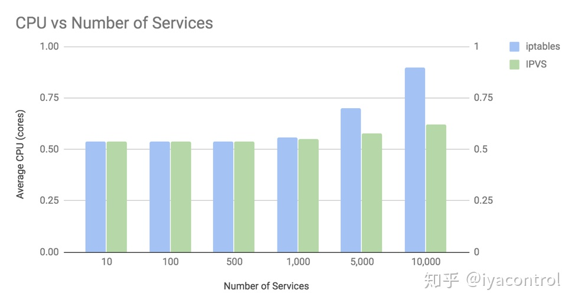

# kubernetes

## kube-proxy

Kube-proxy维护节点上的网络规则，实现了Kubernetes Service 概念的一部分 。它的作用是使发往 Service 的流量（通过ClusterIP和端口）负载均衡到正确的后端Pod。

**工作原理**： kube-proxy 监听 API server 中 资源对象的变化情况，包括以下三种：

- service
- endpoint/endpointslices
- node

然后根据监听资源变化操作代理后端来为服务配置负载均衡。

### kube-proxy代理

在 Kubernetes v1.0 版本，代理完全在 userspace，`Service` 是 “4层”（TCP/UDP over IP）概念。

在 Kubernetes v1.1 版本，新增了 iptables 代理，但并不是默认的运行模式。新增了 `Ingress` API（beta 版），用来表示 “7层”（HTTP）服务。

从 Kubernetes v1.2 起，默认就是 iptables 代理。

在 Kubernetes v1.8.0-beta.0 中，添加了ipvs代理。

#### userspace代理模式

#### iptables代理模式

这种代理模式下， kube-proxy会监听api-server中对 `service`和`endpoints`对象的添加和删除。 对于每组 `serivce`&`endpoints`资源，都会配置iptables此策略。 从而将每个发送给 `service`的 `ClusterIP:port `的请求， 转发到某个后台pod上去。

##### iptable规则链查看

在我的测试环境中以 hostname-service这个`service` &`endpoints`组为例

 

执行`iptables -t nat -L KUBE-SERVICES` 查看iptables nat表中的 **KUBE-SERVICES** 链, 所有目的为`10.103.111.143` 的请求都进入下一条链做处理。

继续往下查看， 最终会随机（相同概率的）选择一个后台pod 转发。

和 userspace 代理类似，网络返回的结果是，任何到达 `Service` 的 IP:Port 的请求，都会被代理到一个合适的 backend，不需要客户端知道关于 Kubernetes、`Service`、或 `Pod` 的任何信息。

这应该比 userspace 代理更快、更可靠。然而，不像 userspace 代理，如果初始选择的 `Pod` 没有响应，iptables 代理不能自动地重试另一个 `Pod`，所以它需要依赖 [readiness probes](https://kubernetes.io/docs/tasks/configure-pod-container/configure-liveness-readiness-probes/#defining-readiness-probes)。

#### ipvs代理模式

IPVS是专门用于负载均衡的Linux内核功能。在IPVS模式下，kube-proxy可以对IPVS负载均衡器进行编程，而不是使用iptables。这非常有效，它还使用了成熟的内核功能，并且IPVS旨在均衡许多服务的负载。它具有优化的API和优化的查找例程，而不是一系列顺序规则。 结果是IPVS模式下kube-proxy的连接处理的计算复杂度为O(1)。换句话说，在大多数情况下，其连接处理性能将保持恒定，而与集群大小无关。

与 iptables 模式下的 kube-proxy 相比，IPVS 模式下的 kube-proxy 重定向通信的延迟要短，并且在同步代理规则时具有更好的性能。 与其他代理模式相比，IPVS 模式还支持更高的网络流量吞吐量。

##### ipvs和iptable模式的性能对比

TIGERA 公司 从`响应时间`和`CPU使用率`两个角度对两种代理模式进行了对比。在专用节点上运行了一个“客户端”微服务Pod，它每秒向Kubernetes服务生成1000个请求，该请求由集群中其他节点上运行的10个“服务器”微服务Pod承载。然后，在iptables和IPVS模式下，使用各种数量的Kubernetes服务（每个服务有10个Pod支持），最多10,000个服务（带有100,000个服务后端）来测量客户端节点上的性能。

 

 

#### kernelspace代理模式

专门用于windows

