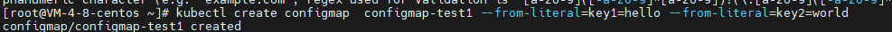
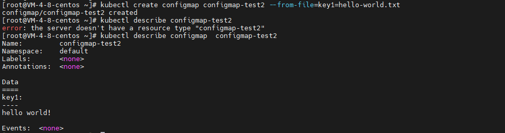
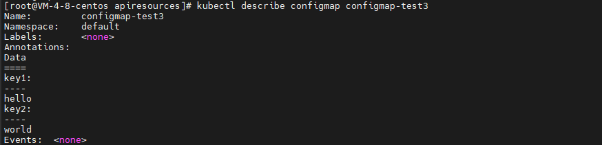
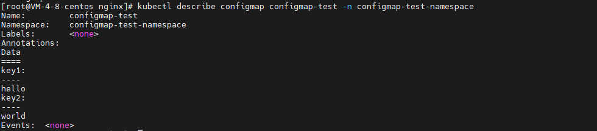
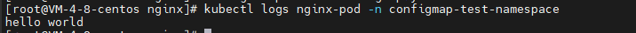
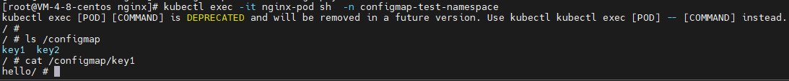

### kubernetes安全机制

#### api请求的安全验证

.png) 

一个api请求到达api-server后需要经过三个模块的处理

- 第一个模块为Authentication(认证)： 对该请求的的身份进行认证， 认证方式包括证书认证， token认证， Basic认证。 [kubernetes身份认证](kubernetes身份认证.md)
- Authorization(授权)： 身份认证通过以后，会对该身份进行授权， 授权方式ABAC(基于属性的授权)， RBAC(基于角色的授权)等
- admission controller(准入控制)： 授权完成后， 对该请求进行进一步的验证， 包括准确性 合法性等。


#### 配置信息configmap

> configmap是k8s众多资源中的一种， pod可以于configmap绑定， 灵活的读取configmap中存储的配置信息。 在configmap中各项配置都是以key-value的形式存在的，这些数据会被保存在etcd数据中。 可以说configmap实现了kubernetes配置管理中心， 让pod中的进程灵活的读取配置。

##### configmap创建

- 通过键值对从创建

   

- 使用文件中的数据

   

- 从yaml文件创建

  ```yaml
  apiVersion: v1
  kind: ConfigMap
  metadata:
    name: configmap-test3
    namespace: default
  data:
    key1: hello
    key2: world
  ```

   

##### 将configmap和pod绑定

###### 通过设置环境变量

在 `namespace: configmap-test-namespace` 下有一个configmap

 

创建如下的yaml创建一个pod

```yaml
apiVersion: v1
kind: Pod                                  # 创建的资源类型为pod
metadata:
 name: nginx-pod  # 创建的pod的名称为my-comfigmap3-pod
 namespace: configmap-test-namespace        # 将my-comfigmap3-pod创建在namespace1命名空间中
spec:
 containers:
  - name: busybox
    image: busybox:latest
    imagePullPolicy: IfNotPresent
    command: [ "/bin/sh","-c","echo $(KEY1) $(KEY2)"]      # 设置容器命令，在容器启动的时候输出环境变量 KEY1 KEY2
    env:                               # 设置环境变量
    - name: KEY1              # 设置环境变量的名称为KEY1
      valueFrom:                 # 设置环境变量的来源
       configMapKeyRef:       # 指明环境变量的来源是configmap
        name: configmap-test  # 指明configmap的名称为my-configmap3
        key: key1                        # 指明环境变量KEY1的取值是来自于my-configmap3中的key1
    - name: KEY2
      valueFrom:
       configMapKeyRef:
        name: configmap-test
        key: key2
 restartPolicy: Never
```

pod中的进程可以通过环境变量 访问到configmap中的值， 查看该pod的log日志。

 

###### 通过挂载实现

使用如下yaml创建pod

```yaml
apiVersion: v1
kind: Pod                                  # 创建的资源类型为pod
metadata:
  name: nginx-pod  # 创建的pod的名称为my-comfigmap3-pod
  namespace: configmap-test-namespace        # 将my-comfigmap3-pod创建在namespace1命名空间中
spec:
  containers:
  - name: busybox
    image: busybox:latest
    imagePullPolicy: IfNotPresent
    command:
    - sleep
    - "86400"
    volumeMounts:                        # 容器的数据卷挂载
    - name: configmap-volume     # 容器的数据卷挂载的名称
      mountPath: "/configmap"     # 容器的挂载目录
  volumes:                                   # 容器的外部挂载的名称
  - name: configmap-volume      # 容器的外部挂载的名称
    configMap:                            # 指明要挂载的资源类型是configmap
      name: configmap-test      # 指明configmap的名称
```

进入该pod 检查/configmap目录

 


#### 加密配置信息secret

> 事实上secret和configmap都属于包含配置信息的资源， 只不过configmap中的信息是明文的，而secret中包含的是需要加密的密码、token、密钥、证书等敏感信息，在使用方式上，二者基本一致。

##### secret分类

- **Qpaque：**  base64编码格式的secret， 用来存储密码密钥等；
- **dockerconfigjson：** 用来存储私有docker registry (奖项仓库)的认证信息
- **service account token：** 用来访问kubernetes api， 由kubeernetes自动创建， 并且最自动挂载到pod的 `/var/run/secrets/kubernetes.io/serviceaccount` 目录

