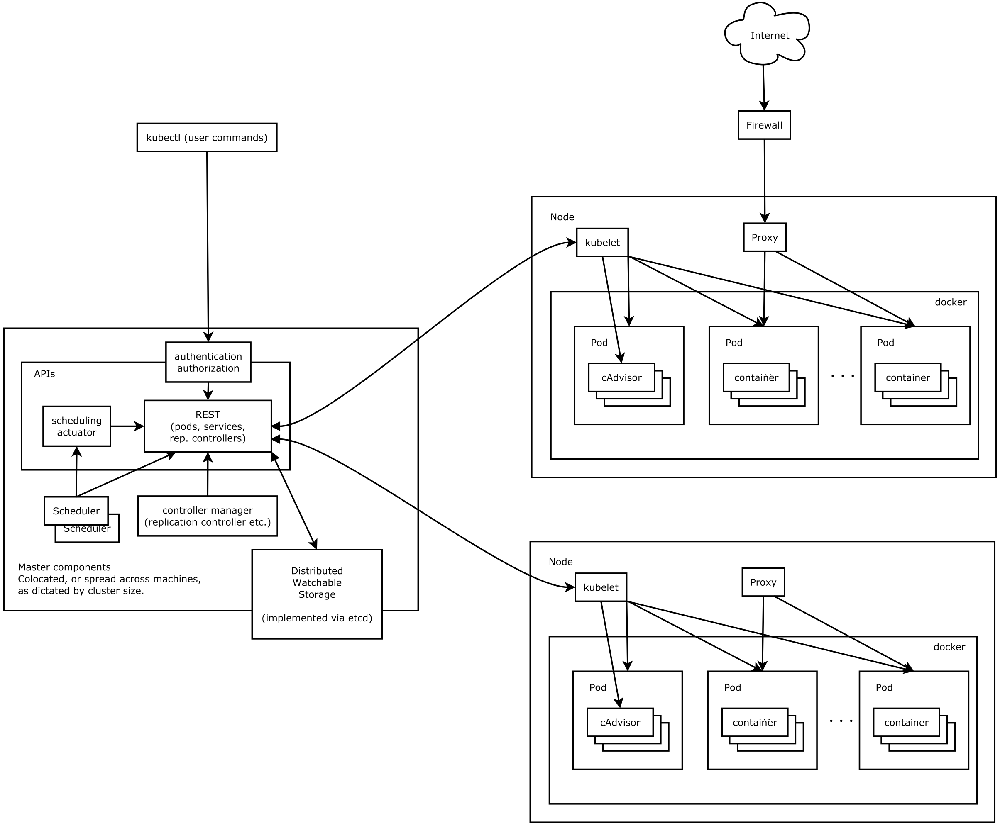

# Kubernetes

[Kubernetes 基础教程 | 云原生资料库 (jimmysong.io)](https://lib.jimmysong.io/kubernetes-handbook/)

kubernetes是Google基于Borg开源的一个容器编排系统。 k8s作为CNCF（Cloud Native Computing Foundation）最重要的组件，

#### kubernetes的设计理念

kubernetes的设计理念和功能实际就是一个类似linux的**分层架构**

 

- **核心层：** kubernetes最核心的功能， 对外提供API构建高层应用， 对内提供插件式应用执行环境。

- **应用层：**部署包括 无状态应用，有状态应用，批处理任务， 集群应用等；  路由包括 服务发现，DNS解析等

- **管理层：** 系统度量（如基础设施 容器 网络的度量）；  自动化（自动拓展 动态Provision）； 策略管理（RBAC Quota PSP NetworkPolicy等） 

- **接口层：** kubectl命令行工具；   客户端SDK； 集权联邦；

- **生态系统：** 在接口层之上的庞大容器集群管理调度的生态系统， 可以划分为两个

  - Kubernetes外部： 日志 监控 配置管理 CI CD Workflow Faas OTS应用 chatOps等
  - Kubernets内部： CRI; CNI; CVI; 镜像仓库; Cloud Provider; 集群自身配置和管理等。

   

##### k8s中API的设计原则

对于云计算系统，系统 API 实际上处于系统设计的统领地位，正如本文前面所说，Kubernetes 集群系统每支持一项新功能，引入一项新技术，一定会新引入对应的 API 对象，支持对该功能的管理操作。

- **API应该是声明式的。** 声明式的操作相比于命令式的操作， 在重复操作的情况下更加稳定，这对于容易出现数据丢失或重复的分布式环境来说是很重要的。
- **API 对象状态不能依赖于网络连接状态**。由于众所周知，在分布式环境下，网络连接断开是经常发生的事情，因此要保证 API 对象状态能应对网络的不稳定，API 对象的状态就不能依赖于网络连接状态。
- **尽量避免让操作机制依赖于全局状态，因为在分布式系统中要保证全局状态的同步是非常困难的**。

##### k8s中控制机制的设计原则

#### k8s设计架构

kubernetes主要有一下几个核心组件组成：

- **etcd**     持久化保存整个集群的状态
- **apiserver** 提供了资源操作的唯一入口， 包括认证，授权， 访问控制， api注册， 发现等机制
- **controller manager** 负责维护集群的状态， 比如故障检测， 自动拓展， 滚动机制等
- **scheduler**   负责资源的调度， 按照预定的调度策略将pod调度到相应的node上
- **kubectl**       负责维护容器的生命周期， 同时也负责 Volume（CSI）和网络（CNI）的管理；
- **Container runtime**   负责管理镜像的管理以及pod和容器的正真运行（cri）
- **kube-proxy** 同时也负责 Volume（CSI）和网络（CNI）的管理；

出了核心组件还有一些推荐组件， 有的已经称为CNCF的托管项项目

- CoreDNS 负责为整个集群提供 DNS 服务
- Ingress Controller 为服务提供外网入口
- Prometheus 提供资源监控
- Dashboard 提供 GUI
- Federation 提供跨可用区的集群

整体架构图

