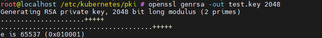
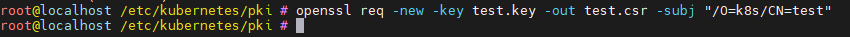
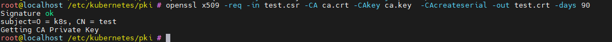
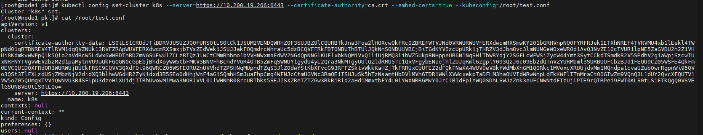
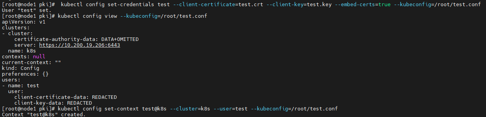
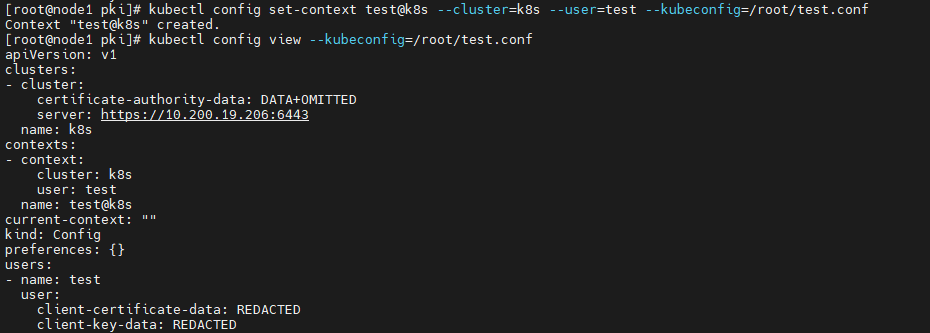
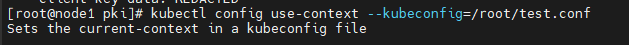

### kubernetes中的身份与权限认证

在k8s集群中发起请求， 与资源进行交互时， 便然要经过apiserver。 每一个请求都需要经过apiserver的检查。 包括 **身份认证**  **鉴权**  **准入控制** 

#### 认证Authentication

##### k8s中有两套账户系统 serviceAccount和 userAccount

- userAccount是给**用户**用的，  serviceAccount是给Pod里的进程用的。 *所谓的用户是指可以通过 kubectl 命令、或通过REST请求访问 API的客户端，**但是请注意K8s不提供普通用户管理的资源对象**）*
- userAccount是全局的， 而serviceAccount是属于一个namespace
- User账号是与后端的用户数据库同步的，创建一个新用户通常要走一套复杂的业务流程才能实现，Service Account的创建则需要极轻量级的实现方式，集群管理员可以很容易地为某些特定任务创建一个Service Account

#### userAccount认证

##### 通过certificate认证的userAccount

1. ###### 创建一个user证书

   1. 使用openssl， 创建user私钥

       

   2. 创建一个证书签署请求。 其中/O是组织名  /CN是用户名。

       

   3. 使用k8s集群中的ca.crt签署证书， 得到test.crt证书文件

      

   4. 将test.crt证书文件放到想要访问集群的机器上。

2. ###### 在需要访问k8s集群的机器上创建配置文件

   需要  创建集群配置； 用户配置； context配置；  切换context

   1. 创建集群配置

       

      其中 --certificate-authority=ca.crt 指定的就是要访问的集群中ca.crt

      --embed-certs=true   用来设置不在配置文件中显示证书信息

      --kubeconfig=/root/test.conf    用于创建新的配置文件，如果不加此选项,则内容会添加到家目录下.kube/config文件中，可以使用use-context来切换不同的用户管理k8s集群

   2. 创建用户配置

       

   3. 创建context配置

       

   4. 切换当前使用的context

       

   5. 使用配置的 /root/test.conf 文件请求k8s集群

       

      已经可以连接集群了， 但是没有获取资源的权限

#### serviceAccount认证

pod中的进程也需要和apiserver进行交互。 在创建pod时通过 `spec.serviceAccount` 字段来设置使用那个serviceAccount。

serviceAccount的作用域限制在namespace中， 每创建一个namespace， 都会从创建一个默认的serviceaccount并绑定默认的secret(*service account token类型*)。

认证通过之后只是允许请求进入集群内部， 请求是否具有相应的权限还要通过 RBAC来实现。

#### 基于角色的访问控制（RBAC）

