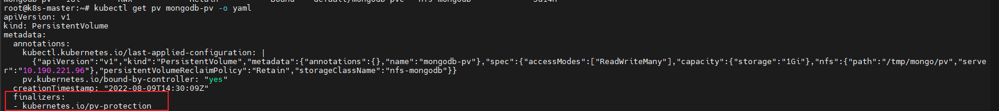

#### pv和pvc无法直接删除的原因

 

kubernetes.io/pv-protection 用来保护PV，当PV绑定了PVC时无法删除

kubernetes.io/pvc-protection 用来保护PVC，当PVC绑定了pod时无法删除

K8s的一些原生资源对象会自动被加上一些finalizers。由于这些对象的控制器也是原生的，在不做扩展的情况下，这些原生的finalizers都是被定义好的，不应随意添加不被原生控制器识别的finalizers，避免无法删除对象的问题

用户在使用自定义的控制器时，可以创建自定义的finalizer来优化资源回收