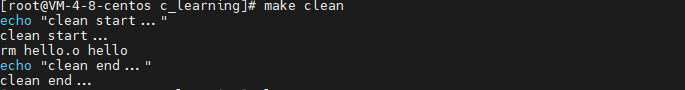

# makefile工具使用

makefile主要用来处理c或c++的编译工作， 但是其不仅能处理c或c++。 所有编译器/解释器可以在命令行终端运行的的编程语言*(java python golang)* 都可以用makefile处理。 makefile也不仅能用来处理编程语言， 所有需要基于一些文件去生成更新目标的工程都可以使用makefile来实现。

##### 最简单打的makefile

有如下的hello.c文件 

```c
#include "stdio.h"
#define YEAR 2023
int main() {
    printf("the year is %d\n", YEAR);
    return 0;
}
```

在hello.c 的同级目录下新建文件 makefile,  添加如下的内容

```makefile
hello: hello.c
	gcc hello.c -o hello
```

使用makefile文件成功编译 hello.c 源码

 


#### makefile文件的语法规则

makefile由一条条规则实现， 大致如下。 target表示目标文件， prerequisites 表示生成目标文件需要的依赖文件， recipe表示生成目标文件的方法。

```makefile
target ... : prerequisites ...
	recipe
	...
```

makefile文件一般会将编译链接分开写， 上面最简单的makefile文件可以改写为：

```makefile
hello: hello.o
	gcc hello.o -o hello
hello.o: hello.c
	gcc -c hello.c
```

##### makefile各个组成部分

- 显示规则 *explicit rules*。 显示的指示如何生成目标文件
- 隐式规则 *implicit rules*。 根据文件自动推导如何从依赖文件生成或更新目标文件
- 变量定义 *variable definition*。 定义变量并指定值， 值都是字符串。 类似于C语言中的宏定义(#define) ,在使用时将值展开到引用的位置。
- 指令 *directives*    make读取Makefile文件过程中的一些特殊操作， 包括：
  - 包含引入另一个makefile文件， 类似于c语言中 （#include)
  - 确定是否使用或略过makefile文件中的一部分内容，类似于（#if)
  - 定义多行变量
- 注释 *comments*    # xxxx


##### 文件搜寻

在一些大型项目中，会有非常多的源文件存放在不同的目录中， 虽然可以在文件前面加上文件目录前缀， 但是又更好的办法。 使用makefile文件中的特殊变量VPATH， 如果makefile在当前目录找不到相应的依赖文件， 就会去VPATH中指定的目录下去寻找依赖文件。

```makefile
VPATH=src:../headers
```

上面的定义指定两个目录，“/src”和“../headers”，make会按照这个顺序进行搜索。目录由“冒号”分隔。*（但是，当前目录永远是最高优先搜索的地方）*


也可以使用 vpath关键字， *他是全小写的 是makefile的一种关键字*。 vpath关键字更为灵活， 它可以指定在不同目录下搜索不同格式的文件， 如下:

```makefile
vpath %.h include
```

- `vpath  <pattern>  <directories>`   为符合模式\<pattern\>的文件指定搜索目录\<directories\>。
- `vpath  <pattern>`                                  清除符合模式\<pattern\>的文件的搜索目录。
- `vpath `                                                         清除所有已被设置好了的文件搜索目录。

*推荐使用vpath关键字， 更灵活。* 

##### 伪目标

makefile文件中存在一种伪目标*执行这个target不会生成文件*， 可以使用一个特殊标记 `.PHONY `来显示指明一个target是一个伪目标。 比如我们常用的clean目标， 可以写成这样

```makefile
.PHONY : clean
clean:
    echo "clean start..."
    rm hello.o hello
    echo "clean end..."
```

#### makefile文件中的变量

makefile的变量在声明的时候需要给予初值。 而在使用时，需要给在变量前加上 `$` 符号， 建议使用`()` 或`{}`把变量给包裹起来。 *如要使用真实的`$`符号， 可以使用`$$`*.

##### 变量的定义

makefile文件中有多种方式定义和使用变量， makefile会将变量进行替换展开。

- 直接使用 `=` , 允许将等号右侧的值变量放到后面来定义。 

- `:=`  用来赋值的变量只能是前面已经定义的
- `?=`  操作符， `value ?= haha`, 这条语句表明若value变量先前没有被定义则赋值为 haha， 若已经定义则什么也不做。

- `+= `  用来给比变量追加变量值。
- override指令的变量。 有一些变量通常由make命令行工具携带， 此时在文件中指定该变量可能会无效， 可以在前面加上override指令。
- `define`  指令的使用
- 目标变量的使用
- 模式变量

#### 条件判断语法

使用条件判断，可以让make根据运行时的不同情况选择不同的执行分支。条件表达式可以是比较变量的值，或是比较变量和常量的值。

#### 函数的使用


#### makefile命令行工具


- `make`   命令默认会去当前目录下寻找makefile或Makefile文件， 然后只执行当前makefile文件中第一个target和其需要的依赖文件

  - `make + [target]`  也可以指定执行makefile文件中具体的某一个target。 比如这个makefile文件 `make clean ` 只会执行下面的内容

     

- `make -f [filepath]` 或 `make --file=[filepath]`   可以指定要执行的文件*（可以有多个makefile文件）* 

## 检查规则[¶](https://seisman.github.io/how-to-write-makefile/invoke.html#id3)

有时候，我们不想让我们的makefile中的规则执行起来，我们只想检查一下我们的命令，或是执行的序列。于是我们可以使用make命令的下述参数：

- `-n`, `--just-print`, `--dry-run`, `--recon`

  不执行参数，这些参数只是打印命令，不管目标是否更新，把规则和连带规则下的命令打印出来，但不执行，这些参数对于我们调试makefile很有用处。

- `-t`, `--touch`

  这个参数的意思就是把目标文件的时间更新，但不更改目标文件。也就是说，make假装编译目标，但不是真正的编译目标，只是把目标变成已编译过的状态。

- `-q`, `--question`

  这个参数的行为是找目标的意思，也就是说，如果目标存在，那么其什么也不会输出，当然也不会执行编译，如果目标不存在，其会打印出一条出错信息。

- `-W <file>`, `--what-if=<file>`, `--assume-new=<file>`, `--new-file=<file>`

  这个参数需要指定一个文件。一般是是源文件（或依赖文件），Make会根据规则推导来运行依赖于这个文件的命令，一般来说，可以和“-n”参数一同使用，来查看这个依赖文件所发生的规则命令。

另外一个很有意思的用法是结合 `-p` 和 `-v` 来输出makefile被执行时的信息（这个将在后面讲述）。

## make的参数[¶](https://seisman.github.io/how-to-write-makefile/invoke.html#id4)

下面列举了所有GNU make 3.80版的参数定义。其它版本和产商的make大同小异，不过其它产商的make的具体参数还是请参考各自的产品文档。

- `-b`, `-m`

  这两个参数的作用是忽略和其它版本make的兼容性。

- `-B`, `--always-make`

  认为所有的目标都需要更新（重编译）。

- `-C` *<dir>*, `--directory`=*<dir>*

  指定读取makefile的目录。如果有多个“-C”参数，make的解释是后面的路径以前面的作为相对路径，并以最后的目录作为被指定目录。如：“make -C ~hchen/test -C prog”等价于“make -C ~hchen/test/prog”。

- `-debug`[=*<options>*]

  输出make的调试信息。它有几种不同的级别可供选择，如果没有参数，那就是输出最简单的调试信息。下面是<options>的取值：a: 也就是all，输出所有的调试信息。（会非常的多）b: 也就是basic，只输出简单的调试信息。即输出不需要重编译的目标。v: 也就是verbose，在b选项的级别之上。输出的信息包括哪个makefile被解析，不需要被重编译的依赖文件（或是依赖目标）等。i: 也就是implicit，输出所有的隐含规则。j: 也就是jobs，输出执行规则中命令的详细信息，如命令的PID、返回码等。m: 也就是makefile，输出make读取makefile，更新makefile，执行makefile的信息。

- `-d`

  相当于“–debug=a”。

- `-e`, `--environment-overrides`

  指明环境变量的值覆盖makefile中定义的变量的值。

- `-f`=*<file>*, `--file`=*<file>*, `--makefile`=*<file>*

  指定需要执行的makefile。

- `-h`, `--help`

  显示帮助信息。

- `-i` , `--ignore-errors`

  在执行时忽略所有的错误。

- `-I` *<dir>*, `--include-dir`=*<dir>*

  指定一个被包含makefile的搜索目标。可以使用多个“-I”参数来指定多个目录。

- `-j` [*<jobsnum>*], `--jobs`[=*<jobsnum>*]

  指同时运行命令的个数。如果没有这个参数，make运行命令时能运行多少就运行多少。如果有一个以上的“-j”参数，那么仅最后一个“-j”才是有效的。（注意这个参数在MS-DOS中是无用的）

- `-k`, `--keep-going`

  出错也不停止运行。如果生成一个目标失败了，那么依赖于其上的目标就不会被执行了。

- `-l` *<load>*, `--load-average`[=*<load>*], `-max-load`[=*<load>*]

  指定make运行命令的负载。

- `-n`, `--just-print`, `--dry-run`, `--recon`

  仅输出执行过程中的命令序列，但并不执行。

- `-o` *<file>*, `--old-file`=*<file>*, `--assume-old`=*<file>*

  不重新生成的指定的<file>，即使这个目标的依赖文件新于它。

- `-p`, `--print-data-base`

  输出makefile中的所有数据，包括所有的规则和变量。这个参数会让一个简单的makefile都会输出一堆信息。如果你只是想输出信息而不想执行makefile，你可以使用“make -qp”命令。如果你想查看执行makefile前的预设变量和规则，你可以使用 “make –p –f /dev/null”。这个参数输出的信息会包含着你的makefile文件的文件名和行号，所以，用这个参数来调试你的 makefile会是很有用的，特别是当你的环境变量很复杂的时候。

- `-q`, `--question`

  不运行命令，也不输出。仅仅是检查所指定的目标是否需要更新。如果是0则说明要更新，如果是2则说明有错误发生。

- `-r`, `--no-builtin-rules`

  禁止make使用任何隐含规则。

- `-R`, `--no-builtin-variabes`

  禁止make使用任何作用于变量上的隐含规则。

- `-s`, `--silent`, `--quiet`

  在命令运行时不输出命令的输出。

- `-S`, `--no-keep-going`, `--stop`

  取消“-k”选项的作用。因为有些时候，make的选项是从环境变量“MAKEFLAGS”中继承下来的。所以你可以在命令行中使用这个参数来让环境变量中的“-k”选项失效。

- `-t`, `--touch`

  相当于UNIX的touch命令，只是把目标的修改日期变成最新的，也就是阻止生成目标的命令运行。

- `-v`, `--version`

  输出make程序的版本、版权等关于make的信息。

- `-w`, `--print-directory`

  输出运行makefile之前和之后的信息。这个参数对于跟踪嵌套式调用make时很有用。

- `--no-print-directory`

  禁止“-w”选项。

- `-W` *<file>*, `--what-if`=*<file>*, `--new-file`=*<file>*, `--assume-file`=*<file>*

  假定目标<file>;需要更新，如果和“-n”选项使用，那么这个参数会输出该目标更新时的运行动作。如果没有“-n”那么就像运行UNIX的“touch”命令一样，使得<file>;的修改时间为当前时间。

- `--warn-undefined-variables`

  只要make发现有未定义的变量，那么就输出警告信息。