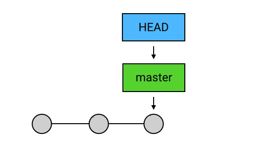
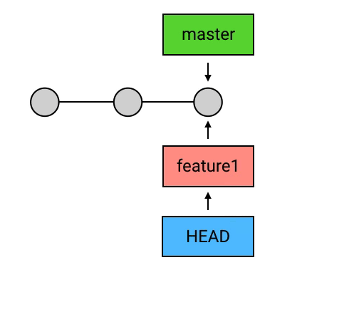
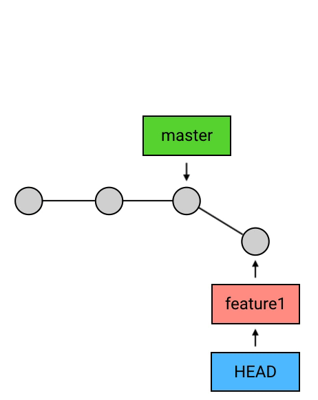

#  git 记录
.gitignore文件规则及常见模板[[gitignore]]
## git使用过程遇见的问题及解决

- ##### 修改远程仓库的地址

  ###### 查看当前 remote仓库 地址

  ```
  git remote -v  
  ```

  ```
  git remote show origin2  //查看指定仓库，同时显示更多信息
  ```

  ######  设置 remote仓库

  ```
  git remote set-url origin [url]   //设置 remote仓库
  git remote rm origin              //删除
  git remote add origin [url]       //添加
  ```

  ###### 修改默认的pull和push分支

  ```
  git branch --set-upstream-to=origin/develop    //develop是新的分支名称
  ```

- ##### failed to push some refs to [host]  提示:Updates were rejected because the tip of your current branch is behind

   

  原因是由于：你的本地仓库落后于远程仓库，就是当前远程仓库有你本地仓库没有的新文件。可能是由于你的同事先于你提交了代码。

  解决只需要先将 远程仓库更新的代码 pull进本地仓库，git会把远程代码和本地代码 合并merge，生成新的commit。这时再执行去

  `git push` 指令即可。

- ##### 记Git报错-refusing to merge unrelated histories

   

  出现这个问题的最主要原因还是在于本地仓库和远程仓库实际上是独立的两个仓库。假如我之前是直接clone的方式在本地建立起远程github仓库的克隆本地仓库就不会有这问题了。

  解决：以在pull命令后紧接着使用`--allow-unrelated-histories`选项来解决问题

  ```
  git pull origin master --allow-unrelated-histories
  ```
  
- ##### 合并时出现的分支冲突问题

  注意这时，git仓库正处于 处理冲突的状态中，可以通过`git merge --abort` 命令退出该状态。

  

  打开冲突的文件可以看到，git对文件做了一些处理，分别表示这两个分支中造成冲突的内容，由你自己修改

  

  修改完成后我们还需要自己进行手动 add 和commit。

  

##### VCS(Version Control System) 版本控制系统

版本控制系统（VCS）最基本的功能是版本控制。所谓版本控制，意思就是在文件的修改历程中保留修改历史，让你可以方便地撤销之前对文件的修改操作。 vcs的情况就是由中央代码库 管理保存所有的代码和代码历史记录。

##### DVCS(Distribute Version Control System)。 git是第一个DVCS

分布式 VCS （Distributed VCS / DVCS）和中央式的区别在于，分布式 VCS 除了中央仓库之外，还有本地仓库：团队中每一个成员的机器上都有一份本地仓库，这个仓库里包含了所有的版本历史，或者换句话说，每个人在自己的机器上就可以提交代码、查看历史，而无需联网和中央仓库交互——当然，取而代之的，你需要和本地仓库交互。

中央式 VCS 的中央仓库有两个主要功能：**保存版本历史**、**同步团队代码**。而在分布式 VCS 中，保存版本历史的工作转交到了每个团队成员的本地仓库中，中央仓库就只剩下了同步团队代码这一个主要任务。它的中央仓库依然也保存了历史版本，但这份历史版本更多的是作为团队间的同步中转站。


### git工作模式

#### git 的四个区域

Working directory（工作目录），stage index（暂存区），local repositiry（本地代码库）是放在本地的。 remote （远程代码库）则是各类平台，github，gitee等等。

使用 `git clone` 拉取项目后 项目路径下会有一个 .git 隐藏的文件，这就是我们的本地仓库。

 

#### 命令的使用以及他

###### git push

- `git push`  把本地仓库更新的代码提交远到程仓库

- `git push origin feature1` 当需要把代码提交进一个远程项目的某一个分支时，需要使用。

###### branch相关

- `git branch`  查看本地仓库有哪些分支，当前分支上会有 *
- `git branch feature1`  新建一个名为feature1的分支
- `git checkout feature1` 切换分支
- `git branch -d feature1` 删除这个分支，注意一个分支只是一个commit串的引用，删除引用后，commit还在，但是对于那些没有引用的野生commit，git会在一段时间后销毁。且不能删除 HEAD正在指向的branch

#### 进阶的一些功能

##### HEAD /  master和branch

通过 `git log` 来查看 commit 记录

 

其中 HEAD表示当前所在分支 的引用，而master其实也就是一个 branch，不过他是默认的。HEAD其实是通过 指向 branch间接的指向一个个commit。master是一个默认的branch，在初始化一个git项目时是没有commit的，在我们创建第一个commit后，把 `master` 指向它，并把 `HEAD` 指向 `master`。如果我继续创建一个 commit，那么 HEAD 会带着 master 一起移动到最新的 commit。本质上 master与其他branch 没有区别，但一般把master分支作为主分支。

   

创建一个新分支，并切换到新分支后的示意图：

    

当在这个新分支上 有新的 commit时就会：

 

而这个时候，如果你再切换到 `master` 去 `commit`，就会真正地出现分叉了：

 

##### push的本质

实质上，push做的事是：把当前 branch 的位置（即它指向哪个 commit）上传到远端仓库，并把它的路径上的 commits 一并上传。


##### 使用merge

`merge` 的意思是「合并」，它做的事也是合并：指定一个 `commit`，把它合并到当前的 `commit` 来。具体来讲，`merge` 做的事是：

从目标 `commit` 和当前 `commit` （即 `HEAD` 所指向的 `commit`）分叉的位置起，把目标 `commit` 的路径上的所有 `commit` 的内容一并应用到当前 `commit`，然后自动生成一个新的 `commit`。比如执行 `git merge branch1`,如图


##### 处理冲突 

`merge` 在做合并的时候，是有一定的自动合并能力的：如果一个分支改了 A 文件，另一个分支改了 B 文件，那么合并后就是既改 A 也改 B，这个动作会自动完成；如果两个分支都改了同一个文件，但一个改的是第 1 行，另一个改的是第 2 行，那么合并后就是第 1 行和第 2 行都改，也是自动完成。但，如果两个分支修改了同一部分内容，`merge` 的自动算法就搞不定了。这种情况 Git 称之为：冲突（Conflict）。[[git小记#git使用过程遇见的问题及解决]]

##### 使用merge的其他状况，合并的两个分支并不是 分叉的

1. ###### master 领先于 branch1

   这时候git什么都不会做

2. ###### master落后于 branch1

   这时那么 Git 会直接把 `HEAD`（以及它所指向的 `branch`，如果有的话）移动到目标 `commit`。这种情形其实很常见，因为这其实是 `pull` 操作的一种经典情形：本地的 `master` 没有新提交，而远端仓库中有同事提交了新内容到 `master`.那么这时如果在本地执行一次 `pull` 操作，就会由于 `HEAD` 落后于目标 `commit` （也就是远端的 `master`）而造成 “fast-forward”：

   

   


#### git版本回退

##### git reset 将HEAD重新指向我们希望的commit上去

-  `git reset --soft + commit的版本号`  会将HEAD指向我们指定的commit版本， 但是会保留新commit中对文件做出的修改。

  1. 通过`git log` 查看commit记录， 找到我i们希望回退到的版本id复制

     

  2. 这里我们回退到 init版本的commit， 复制它的commit id。使用命令 `git reset --soft 7221`

  3. 再次查看 `git log` , 发现 无效commit 已经抹去，但是该过程中对文件做出的修改保留了。

     

- `git reset --mixed + commit版本号` 文件修改内容会保留，但是add操作会抹去

- `git reset --hard + commit版本号` 会将文件修改的内容抹去，使用时要谨慎。

##### git revert 

设想这样一种情况， 我写了一段多余的代码希望将这次修改完全抹去。这时可以使用前面提到的 `git reset --hard` 重置HEAD指向。但是如果我已经将此次修改push到了远端，那么使用`git reset --hard`会使得本地代码落后于远端，那么下次push时只能强制push（需要权限）。这时可以考虑用 `git revert` 来代替。

- `git revert + commit版本号` ==这里是将要覆盖的commit版本号加到后面， 理论上只能覆盖当前HEAD指向的commit==。

  

  使用 ` git revert 53e79cf2cfe3d6b98510e882189c00e33716c346`后再次查看log

  

  可以看到 `git revert` 是在我们要覆盖的commit后再添加一个之前的commit，避免让本地代码落后于远端代码，同时也保留了这个无效commit，以防以后有需要。


#### commit和分支合并

##### git rebase 有两种用法

###### 在同一分支内对多个commit进行合并操作， 使用步骤：

1. git log 查看当前commit信息， 选择要压缩合并的commit。这里我们将 c b 合并到commit a中。

   

2. 使用命令 `git rebase -i HEAD~3`   其中3表示我一共要操作3个commit。进入如下vim界面

   

   注释有很多解释信息， 其中pick表示要保留的commit， squash表示要压缩进被pick的commit。所以将 bc commit的前置命令修改为 squash 退出vim界面即可

3. 进入信息确认的vim界面， 可以将  *1st commit message* 修改为你想要的commit信息。退出即可。

   

4. 随后查看 log信息， 并且 a b c 三次commit的内容都保留了。

   

###### 重新定基一个分支

**使用场景： ** 实际开发过程中， 我们从远程拉取最新代码放到main分支上，开出一个dev分支进行我们个人工作的开发。如果这个过程中有新的commit提交到远程main分支，这时候再想将dev分支合并到main分支该怎么办：

传统方法当然是 先把main分支上新代码拉取下来， 再将dev与main分支merge合并（可能需要解决冲突）。这种方法的缺点就是会使：dev分支与main分支合并的记录保留下来（即是删除dev分支 也会保留）， 最后git路线会很混乱复杂。

想要简化项目中分支合并路线的话可以使用 `git rebase` 代替： 在dev分支使用命令 `git rebase main` 会将main分支与dev分支分叉的commit点 重新定基到main分支的最新commit（可能有冲突需要解决），如下图所示 


这时候 main分支的HEAD点在 蓝色的D_commit处， dev分支的HEAD点在绿色的F_commit点。可以使用先切换到main分支 在使用`git rebase dev` 将HEAD移到最新处 *这时候dev和main两个分支其实已经是一样的了， 删除dev分支的话会真正的删除， 有点是简化， 缺点也是简化了一些信息*。

