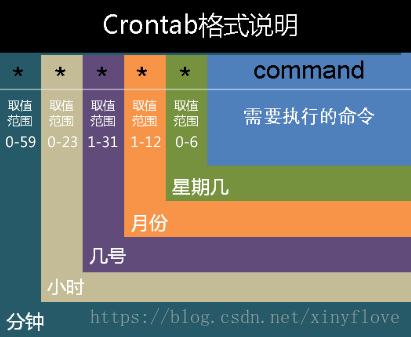

### Cron定时规则

#### Crontab语法规则

##### 五位/六位 cron时间格式

  

| 秒（可选） | 分     | 小时   | 日     | 月     | 星期  |
| ---------- | ------ | ------ | ------ | ------ | ----- |
| 0~59/*     | 0~59/* | 0~23/* | 1~31/* | 1~12/* | 0~6/* |

##### 特殊字符的使用

| 特殊字符 | 代表意义                                                     |
| -------- | ------------------------------------------------------------ |
| *        | 代表任何时刻都接受的意思。举例来说，0 12 * * * command 日、月、周都是*，就代表着不论何月、何日的礼拜几的12：00都执行后续命令的意思。 |
| ，       | 代表分隔时段的意思。举例来说，如果要执行的工作是3：00与6：00时，就会是：0 3,6 * * * command时间还是有五列，不过第二列是 3,6 ，代表3与6都适用 |
| -        | 代表一段时间范围内，举例来说，8点到12点之间的每小时的20分都进行一项工作：20 8-12 * * * command仔细看到第二列变成8-12.代表 8,9,10,11,12 都适用的意思 |
| /n       | 那个n代表数字，即是每隔n单位间隔的意思，例如每五分钟进行一次，则：*/5 * * * * command用*与/5来搭配，也可以写成0-59/5，意思相同 |

##### 示例

0 0 1 * * ? #每天 1 点触发 

0 10 1 ? * * #每天 1:10 触发 

*/5 * * * * ? #每隔 5 秒执行一次 

0 */1 * * * ? #每隔 1 分钟执行一次 

0 0 2 1 * ? * #每月 1 日的凌晨 2 点执行一次 

0 0 1 * * ? #每天 23 点执行一次 

0 0 1 * * ? #每天凌晨 1 点执行一次 

0 0 1 1 ? * #每月 1 日凌晨 1 点执行一次 

0 26,29,33 * * * ? #在 26 分、29 分、33 分执行一次 

0 0 0,13,18,21 * * ? #每天的 0 点、13 点、18 点、21 点都执行一次 

0 0 10,14,16 * * ? #每天上午 10 点，下午 2 点，4 点执行一次 

0 0/30 9-17 * * ? #每天朝九晚五工作时间内每半小时执行一次 

0 * 14 * * ? #每天下午 2 点到 2:59 期间的每 1 分钟触发 

0 */5 14 * * ? #每天下午 2 点到 2:55 期间的每 5 分钟触发 

0 */5 14,18 * * ? #每天下午 2 点到 2:55 期间和下午 6 点到 6:55 期间的每 5 分钟触发 

0 0-5 14 * * ? #每天下午 2 点到 2:05 期间的每 1 分钟触发 

0 15 10 15 ？ * #每月 15 日上午 10:15 触发 