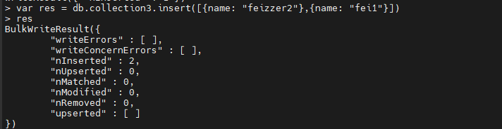
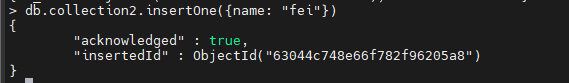

mongo中文官网](https://mongodb.net.cn/)

### mongo基础

##### mongo概念

mongodb数据库是一个nosql数据库。由c++实现的分布式文件存储数据库系统

#### mongodb配置操作

##### 配置文件

在`/etc/mongodb.conf`目录下  [[mongo配置文件]]

##### 用户和权限配置

###### 创建一个管理员用户

```shell
db.createUser(
   {user: "admin", pwd: "1234",
    roles: [{role: "root", db: "admin"}]
   }
)
```

user和pwd分别指定用户名和密码。。 roles中的role指定该用户是一个管理员用户，db表示用户信息存储在admin表中。

==此时mongo数据虽然有用户信息， 但是登录仍然不需要认证。 需要修改配置文件中的auth字段为true==

###### 创建普通用户

mongodb用户管理较为复杂，这里先不做深入了解了

> 1. 数据库用户角色：read、readWrite；
> 2. 数据库管理角色：dbAdmin、dbOwner、userAdmin;
> 3. 集群管理角色：clusterAdmin、clusterManager、4. clusterMonitor、hostManage；
> 4. 备份恢复角色：backup、restore；
> 5. 所有数据库角色：readAnyDatabase、readWriteAnyDatabase、userAdminAnyDatabase、dbAdminAnyDatabase
> 6. 超级用户角色：root
> 7. 内部角色：__system

> 1. Read：允许用户读取指定数据库
> 2. readWrite：允许用户读写指定数据库
> 3. dbAdmin：允许用户在指定数据库中执行管理函数，如索引创建、删除，查看统计或访问system.profile
> 4. userAdmin：允许用户向system.users集合写入，可以在指定数据库里创建、删除和管理用户
> 5. clusterAdmin：只在admin数据库中可用，赋予用户所有分片和复制集相关函数的管理权限。
> 6. readAnyDatabase：只在admin数据库中可用，赋予用户所有数据库的读权限
> 7. readWriteAnyDatabase：只在admin数据库中可用，赋予用户所有数据库的读写权限
> 8. userAdminAnyDatabase：只在admin数据库中可用，赋予用户所有数据库的userAdmin权限
> 9. dbAdminAnyDatabase：只在admin数据库中可用，赋予用户所有数据库的dbAdmin权限。
> 10. root：只在admin数据库中可用。超级账号，超级权限

#### 基本CRUD操作

##### 数据库创建删除

- `use db_name` 创建数据库并切换进入该数据库
- `show dbs`  查看当前所有的数据库 *如果数据库中没有数据，那么不会显示*
- `db.dropDatabase()`  切换进入该数据库后执行此命令，删除数据库
- `db.stats()` 查看数据库信息

##### 集合创建删除

在插入数据时， 如果集合不存在，mongodb会自动创建集合的。

- `db.createCollection(name, options)`   创建集合其中 name必须， option可选。option的字段：

  - capped:bool ;   指定该集合的存储大小有上限，当达到最大值时会自动覆盖最早的文档数据。 **该值为true时， size必须指定**
  - size: int  ;   指定集合存储上限
  - max:int  ;   指定固定集合中包含文档的最大数量  **只有指定集合为固定集合才会生效，达到最大值会自动覆盖最早的文档数据**
  - autoIndexId:bool  ;  如果为true， 则自动在主键 _id 上创建索引

  ```shell
  # 创建集合
  db.createCollection("collection4", {max: 1, capped: true, size: 1600})
  ```

- `db.collection_name.stats()`  查看集合状态信息

- `db.collection_name.drop()`   删除指定集合

##### 插入数据

- `db.collection_name.insert({})` 或 `db.collection.insert([{}, {}])`   插入一个或多个文档，并返回一个写结果`WriteResult`对象。*方法似乎不推荐使用*

   

  ==什么是写结果对象， 有什么用？==

- `db.collection_name.insertOne({})` 插入一个集合 并返回一个文档，文档结构如下图：

   

- `db.collection_name.insertMany([{}, {}])` 插入多个集合，返回文档

##### 数据更新

- `db.collection_name.update(query, update, {upsert:bool, multi:bool, writeConcern})`  参数
  - query； update的查询条件
  - update；  更新的操作符和需要更新的对象数据
  - upsert ； 为true 则如果集合中没有该数据就创建一条数据
  - multi ； 为true则更新找到的所有数据
- `db.collection_name.updateOne()`
- `db.collection_name.updateMany()`

###### 更新操作符


##### 查询数据


##### 删除数据

- `db.collection_name.deleteMany({name: "feizzer"})`  删除集合中所有name字段为feizzer的数据，传入一个空{} 会删除集合中所有数据
- `db.collection_name.deleteOne({name: "feizzer"})`    仅删除一条匹配的数据


#### **聚合操作**

##### 聚合管道

- \$project：修改输入文档的结构。可以用来重命名、增加或删除域，也可以用于创建计算结果以及嵌套文档。
- \$match：用于过滤数据，只输出符合条件的文档。\$match使用MongoDB的标准查询操作。
- \$limit：用来限制MongoDB聚合管道返回的文档数。
- \$skip：在聚合管道中跳过指定数量的文档，并返回余下的文档。
- \$unwind：将文档中的某一个数组类型字段拆分成多条，每条包含数组中的一个值。
- \$group：将集合中的文档分组，可用于统计结果。
- \$sort：将输入文档排序后输出。
- \$geoNear：输出接近某一地理位置的有序文档。

###### 多表查询


##### map-reduce


##### 单一聚合

- `db.collection_name.count()` 
- `db.collection_name.distinct()` 

#### mongo的索引

- 索引是存储引擎级别的概念，建立在集合之上。
- 基于 B-tree的数据结构
- 能够帮助更快的检索数据
- 存储特定的字段或字段值，并按照一定的顺序排序。默认在id字段建立唯一索引。
- 在建立索引时，消耗计算资源和存储资源。 插入文档时，会引起索引顺序的重排。

###### db.collection_name.getIndexes() 查看集合索引

###### db.collection_name.IndexSize() 查看索引大小

###### db.collection_name.dropIndexes() 删除集合所有的索引

###### db.collection_name.dropIndex("索引名称")  删除集合的指定索引

##### db.collection_name.createIndex(keys, options)

###### keys字段 为要创建的索引字段

实例：`db.collection_name.createIndex({"colName": 1})` ，为colName字段创建升序索引

- 1： 升序创建索引
- -1： 降序创建索引


###### options可选参数列表


