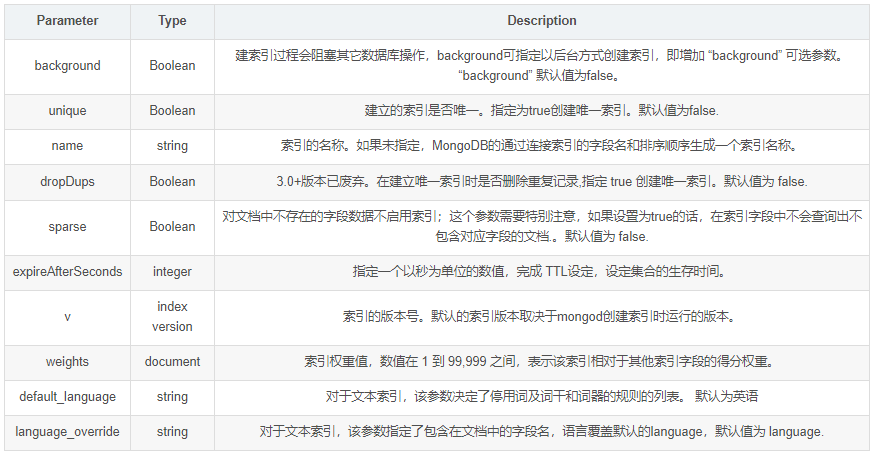

### 索引

> 索引是一种特殊的数据结构， 索引**存储在易于遍历读取的数据集合中**，索引是对数据库中一列多列数据的值进行排序的结构。 由于索引存储在`RAM`中， 所以索引查询比通过直接扫描文本读取数据快的多。

##### 索引的限制

- **额外开销**  每个索引会占据一定的空间。 并且在对数据进行插入更新删除时也需要对索引进行操作。 *所以是优化查询， 削弱写操作的。*
- **内存使用**
- **最大范围**
- **查询限制**

#### 基本使用

##### 创建索引

`db.collection.createIndex(keys, opts)`  或  `db.collection.ensureIndex(keys, opts)`*在mongo3.0.0版本开始使用*

###### 可选的参数列表如下

 

创建唯一索引的命令 `db.collection.ensureIndex({"title":1}, {unique:true})`

##### 查看索引

`db.collection.totalIndexSize()`  查看集合索引的大小

`db.collection.getIndexes()`  查看ji'he的索引

##### 删除索引

删除该集合下所有的索引`db.collection.dropIndexes()`

删除指定的索引 `db.collection.dropIndex("索引名称")`   或  `db.collection.dropIndex(keys)`

