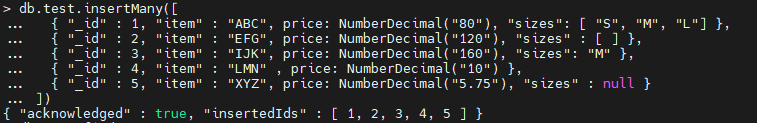
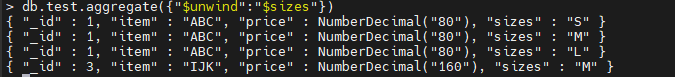
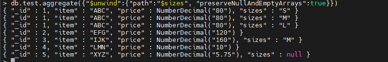

[mongo聚合操作符](https://www.mongodb.com/docs/manual/core/aggregation-pipeline/) 

##### `$group`

#### `$unwind`

将文档中指定的数组字段展开， 将文档数据展开成多条， 每条包含数组中一个值

###### 插入测试数据

 

###### $unwind展开数组

 

 将包含 size 字段的文档展开， 每个文档包含数组内的一个值。 ==如果一个文档的 size 字段是**空数组**或**null**， 则不会显示该文档==

##### $unwind可选的行为选项

| 字段                                                         | 类型   | 描述                                                         |
| ------------------------------------------------------------ | ------ | ------------------------------------------------------------ |
| [path](https://links.jianshu.com/go?to=https%3A%2F%2Fdocs.mongodb.com%2Fmanual%2Freference%2Foperator%2Faggregation%2Funwind%2F%23std-label-unwind-path) | string | 数组字段的字段路径。要指定字段路径，请在字段名称前加上美元符号 $ 并用引号括起来。 |
| [includeArrayIndex](https://links.jianshu.com/go?to=https%3A%2F%2Fdocs.mongodb.com%2Fmanual%2Freference%2Foperator%2Faggregation%2Funwind%2F%23std-label-unwind-includeArrayIndex) | string | 可选的。保存元素数组索引的新字段的名称。名称不能以美元符号 `$` 开头。 |
| [preserveNullAndEmptyArrays](https://links.jianshu.com/go?to=https%3A%2F%2Fdocs.mongodb.com%2Fmanual%2Freference%2Foperator%2Faggregation%2Funwind%2F%23std-label-unwind-preserveNullAndEmptyArrays) | boolen | 可选的。 如果为 `true`，如果路径为空、缺失或空数组，则 `$unwind` 输出文档。 如果为 `false`，如果 `path` 为空、缺失或空数组，则 `$unwind` 不会输出文档。 默认值为`false`。。 |

 

