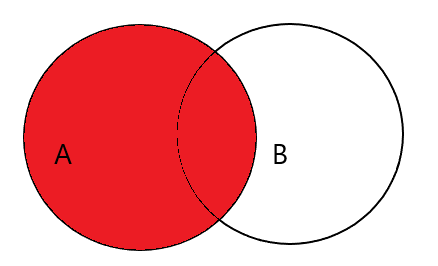
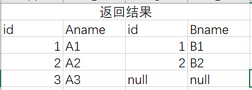

### mysql的如何防止sql注入
在jdbc连接mysql数据库时 使用PreparedStatement[[JDBC API#PreparedStatement prepareStatement String sql]]
mybatis


### mysql索引的使用
[[mysql进阶#mysql的索引原理]]

##### 创建索引

create index 创建，可选项 unique就表明是否为唯一索引。 多个列名就是复合索引

```sql
create [unique] index <索引名> on <表名>(<列名>,.....);
```


alter add 创建

```sql
alter [unique] table <表名> add index <索引名> using btree(<列名>,....);
```


##### 查看索引

```sql
show index from <表名> [ from <数据库名>]
```


##### 删除索引

```sql
alter table <表名> drop index <索引名>;
```


### mysql join的使用

join是将两个表中的行结合起来，基于两个表中的个共同的字段。对下面的两个表数据进行演示几种连接查询的方式


##### 内连接

```sql
select * form A inner join B on A.id = B.id
```

 

内连接是较为常见的连接查询方式，只得到on条件匹配的行。结果：


##### 左连接

```sql
select * form A left join B on A.id = B.id
```

 

LEFT JOIN返回左表的全部行和右表满足ON条件的行，如果左表的行在右表中没有匹配，那么这一行右表中对应据用NULL代替。



##### 右连接

```sql
select * form A right join B on A.id = B.id
```


##### 左连接（右连接）去掉另一个表为null的情况

 

```sql
select * form A left join B on A.id = B.id where B.id != null
```

##### 外连接 

实际上mysql并不支持 outter join这样的外连接语法，但是可以通过配合使用 `union` 字段来实现外连接的效果。因为外连接兼有合并去重的效果。不做过多的展示。

