# Redis

redis不同于我们最开始学习的关系型数据库(mysql, oracle). redis是属于非关系数据库nosql(not only sql) ,它被依赖业务逻辑方式存储数据，而是简单的采用键值对的存储模式，

- 不遵循sql标准
- 不支持acid
- 远超于sql的性能

##### 在linux中安装使用redis

##### windows安装使用redis

[redis官网](https://redis.io/) 下载压缩包解压放在合适的磁盘位置即可。

###### 安装命令 或者说是注册windows服务的命令

```
redis-server.exe --service-install redis.windows.conf --loglevel verbose
```

###### 启动服务的命令

```
redis-server.exe  --service-start
```

###### 关闭服务的命令

```
redis-server.exe  --service-stop
```

###### 作为客户端访问 主机开启的redis服务

```
redis-cli.exe -h 127.0.0.1 -p 6379
```

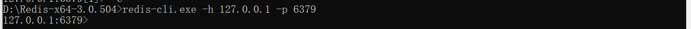

### Redis运行模式

redis采用了==单线程+多路io复用== (epoll策略)的模式 
[[高性能IO模型#多路复用IO（IO Multiplexing）]]
### Redis的基本操作

redis数据中默认有16个库，默认在0号库。可以通过 `select [index]`指令来转化当前的操作库。在库内则通过key-value键值的方式存储数据。

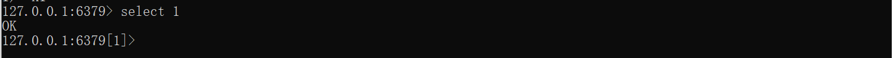

##### 键值对的操作

- `set [key] [value]` 增设键值对

  

- `keys *` 查看当前库里的所有的key

  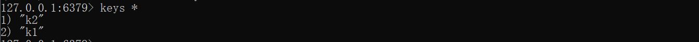

- `exists [key]` 检查该key值是否存在

  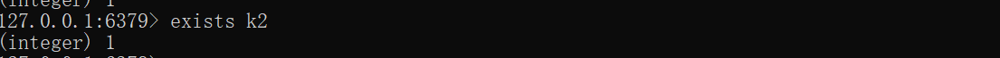

- `type [key]` 返回该 key 的类型是什么

- `del [key]` 立即删除对应的键值对

- `unlink [key]` 异步删除 对应的键值对

- `expire [key] [int]` 给该 key 设置过期时间  *int的单位是秒*

  `ttl [key]` 查看该 key 还有多久过期 。*当key过期后 返回的是-2， 没有设置expire的key返回的-1，表示永不过期* 

  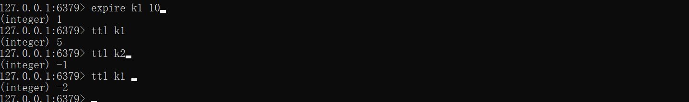

- `dbsize` 返回当前库的key的数量

- `flushdb` 情空当前的库

- `flushall` 清空所有的库

##### 对String类型的value特有的操作

在redis中的string类型的value最大可以存储 512M的数据

- `get [key]` 根据 key值获取value

- `strlen [key]` 获取对应的 value字符串的长度

  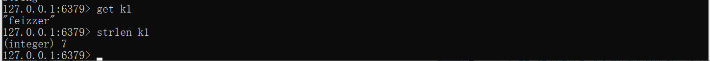

- `incr [key] by [int]` 若对应的value的字符串可以转为数字，则做相加操作

  `decr [key] by [int]` 与上面类似，做相减操作。

- `append [key] [value]` 将value加到 key对应的值后面

  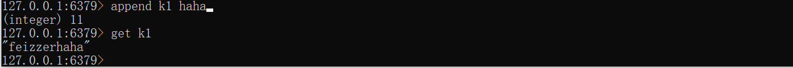

- `setnx [key]`  只有当key值这个键值对不存在时，才会生效

  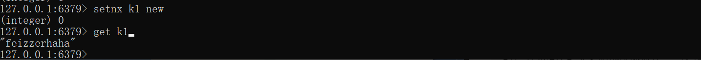

- `mset [key1] [value1] [key2] [value2] ...` 同时设置多个值

- `mget [key1] [key2] ... ` 同时获取多个值

- `msetnx [key1] [value1] [key2] [value2] ...`同时设置多个值，却这些key必须全部不存在，有一个存在，全部不会生效。

- `getrange [key1] [int] [int]` 获取指定范围的值

  `setrange [int] [value]` 从下标[int]开始设置覆盖值

##### value的类型为List

redis中value的List类型可以理解为 单键多值的情况，这些值由一个双向链表连接。

- `lpush [key] [value1] [value2] [value3] ...`从左边插入值

  `rpush [key] [value1] [value2] [value3] ...` 从右边插入值

- `lpop [key] ` 

  `rpop [key]`  pop处一个value，当链表为空时，key也会消失。

- `lrange [key]` 从左边开始显示所有value

  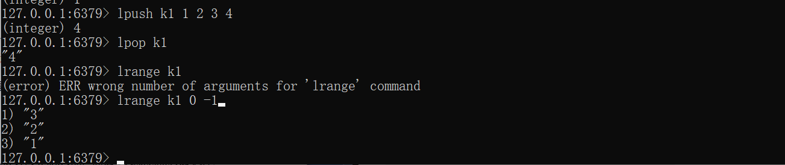

- `lindex [key] [index]`按照索引获取元素

- `llen [key]` 获取list的长度

- `linsert [key] before/after [value] [newvalue]` 在链表中某一个值的前边或后壁那插入一个新值，从左边开始找。

  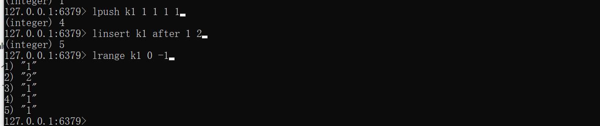

- `lrem [key] [n] [value]` 从左边开始，删除 n个等于value的值

  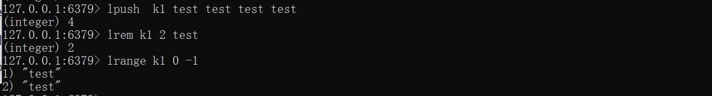

- `lset [key] [index] [value] ` 从左边开始，将下标为index的数据改为 value

##### value的类型为set（集合）

 set集合类型是无序状态，不能出现重复的元素，内部的与java一样也是一个hash表。

- `sadd [key] [value1] [value2] ...`   往key中添加value，如果值重复则不添加。

- `sismember [key] [value]`  判断value是否在 这个key对应的set中

- `smembers [key]` 返回key对应的set的所有元素

  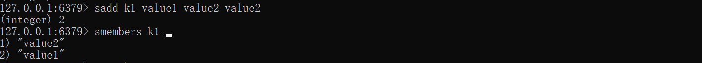

- `scard [key]` key对应的set共有多少元素

- `spop [key]` 随机取出这个set中的一个元素

- `srandmember [key] [n]`  随机取出对应set中的n个值

  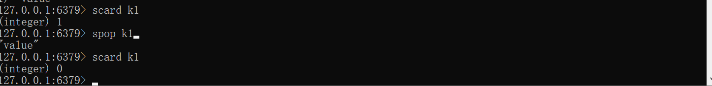

- `smove [source] [dessource] [value]` 将source对应的set中的value值（如果存在的话）移动到 dessource对应的set中

- `sinter [key1] [key2]` 返回两个key的交集

- `sunion [key1] [key2]` 返回两个key的并集

- `sdiff [key1] [key2]`  返回两个key的差集

##### value为hash类型

这里的hash类型可以理解为field-value的映射关系，这种结构非常适合存储json化后的对象。

- `hset [key] [field] [value]` 

- `hget [key] [field]`  取对应field的值

  `hgetall [key] ` 取所有 field-value的值

  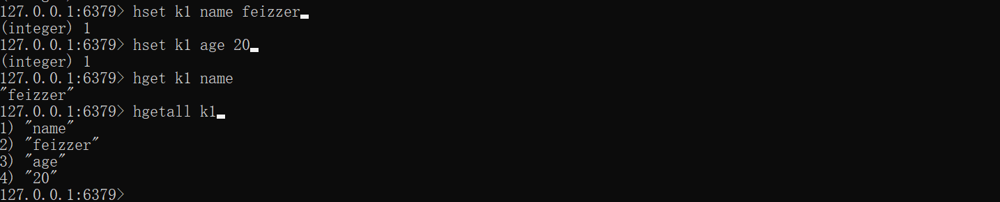

- `hvals [key]` 所有的key中的value

- `hkeys [key]` 所有的key中的 field

##### bitmaps数据类型 redis6新增

##### geospatial数据类型 redis6新增

##### hyperloglog数据类型 redis6新增

#### 发布订阅信息

redis的发布订阅信息实际就是消息的发送通信模式。redis客户端可以订阅任意频道的信息，也可以发布任意频道的信息

这里不做详细展开

#### Jedis包实现 java对redis进行操作
[[java通过Jedis操作redis]]

#### redis中的事务和锁机制

##### 事务的创建与执行

redis中事务是一个我单独的隔离操作，事务所有的指令会序列化，并顺序执行，不会被其他请求打断。但注意redis的事务不是原子性的

- `multi` 进入一个添加指令的状态，这时候添加的指令并不会被执行。

- `exec` 一并顺序执行添加的指令

- `discard` 取消添加指令队列的状态。

  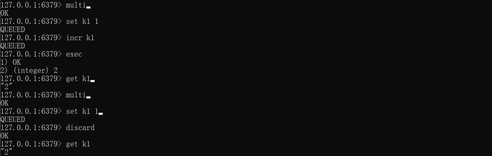

###### 事务过程中出现了错误

在添加指令队列的时候发生了错误，这个事务（指令队列）不会被执行。

在执行这个事务的指令队列时，其中某一个指令发生了错误只有这一个指令不会执行，这也反应了redis事务的非原子性。

###### 事务中使用乐观锁

首先说一下悲观锁(Pessimistic Lock)，就是很悲观的去设想，每次去拿数据进行操作的时候都会有其他操作去取值操作。所以每次在取数据之前加上锁。其他请求想要获取上锁的数据时只能挂起等待。

回到乐观锁，请求A每次取用数据时，设想不会有其他请求获取这个数据，所以不用上锁。当请求A要更新数据时，可以判断一下在这个期间有没有其他请求已经更新了数据。通过version方式实现，一般是在数据表中加上一个数据版本号version字段，表示数据被修改的次数，当数据被修改时，version值会加一。当线程A要更新数据值时，在读取数据的同时也会读取version值，在提交更新时，若刚才读取到的version值为当前数据库中的version值相等时才更新，否则重试更新操作，直到更新成功。

- `watch [key]` 使key对应的处于乐观锁监听下。

  在本地打开两个进程，访问一个redis服务，进行测试：

  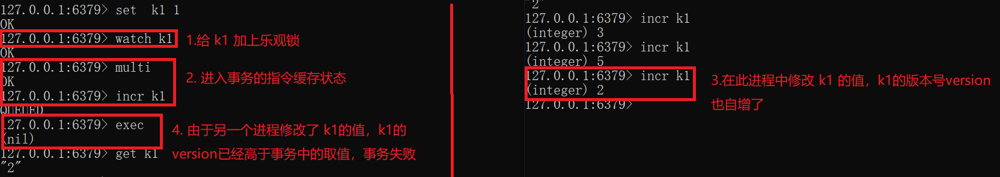

###### 为什么redis是单线程还是要使用乐观锁


###### redis通过悲观锁实现 分布式锁

#### redis的持久化

 redis是在内存中进行数据操作，但是也可以将数据保存进磁盘。这样的操作称为持久化

##### RDB(Redis DataBase) 实现持久化

RDB进行持久化操作 在redis中是默认开启的。在指定的时间里，将内存里的数据库快照 (snapshot) 以二进制的方式写入磁盘，保存在安装路径下的dump.rdb文件加里。在linux中，使用 写时复制机制进行dump.rdb文件的更新。

在redis的安装目录下查看 redis.config文件，找到 SNAPSHOTTING相关的设置：

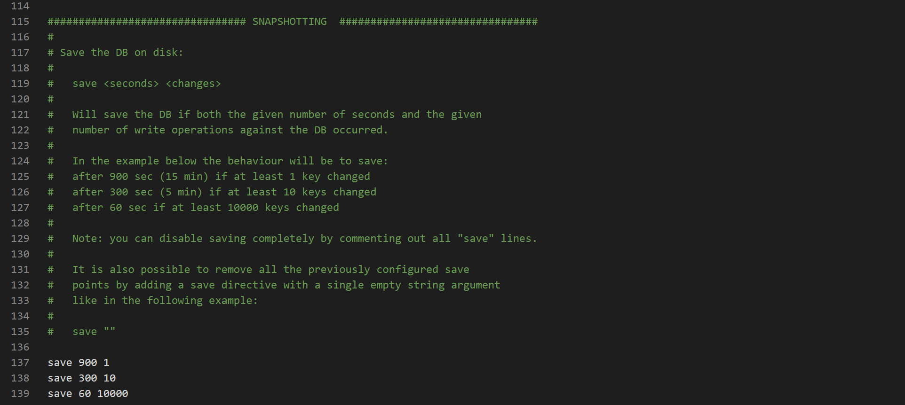

译为：当内存中有 10000个key修改未被保存进磁盘，则60s后保存这10000个key。若有10个，则300s后保存。 只有1个，则900s后。

可以开启 save ""  ；注解掉 save 900 1 这几行 ，来关闭rdb进行持久化的操作。

###### 为什么说 rdb持久化 对数据不敏感

设想这样一种情况，redis库中一次性新增了11个key的值。在300s 后redis数据库会进行rdb持久化操作，将其中前10个key保存进入磁盘，（如果接下都没有新的键值修改）剩下1个key等到900s后才会保存进入磁盘。在最后1个key呆在内存的时间段内，如果数据库发生宕机，他就丢失了。

##### AOF(Append Only File) 

以日志的形式记录每一个写操作，每一次都是追加文件而不是改写文件。redis启动时，会自动读取该文件重新构建数据。文件的保存和rdb一样都是启动路径下，默认名为 appendonly.aof。注意当aof和rdb同时开启时，redis默认只读取aof的日志文件。

###### 开启

将 redis.conf文件中使用 appendonly yes 默认是 no 。 

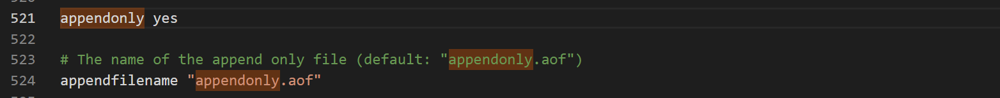

###### 当 appendonly.aof文件出现错误时

可以使用`redis-check-aof.exe --fix [filename]` 指令修复被损坏的appendonly.aof文件

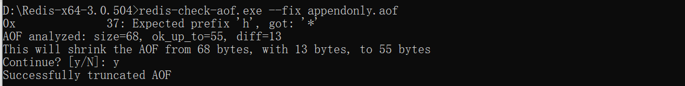

###### aof同步率的设置

同样是在redis.conf文件中，有三种选择：

- appendsync always ：每当一个key有所变动 都会追加记录进日志文件
- appendsync everysec： 每一秒都会记录日志文件
- appendsync no ：自己不会主动记录日志文件。

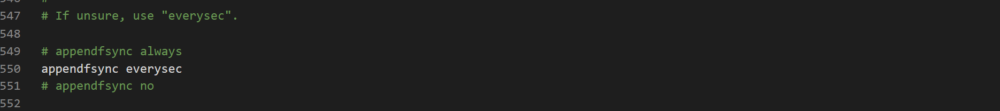

###### 压缩重写的设置

压缩重写就是，redis将  .aof日志文件中记录写操作指令进行重写，以达到减小 .aof文件大小的目的，这时候就不是追加文件了。而是，改写文件，写用到了写时复制策略。

下面的配置截图 表示当 .aof文件达到 64+64*100% = 128mb的时候会执行压缩重写。

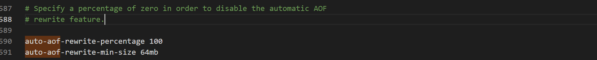 


#### 主从复制


#### 集群

