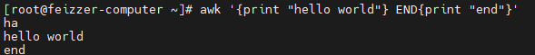
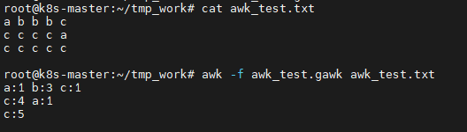
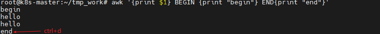

### awk

awk主要用于处理文本文件中的数据。gawk时unix系统中源awk程序的GUN版本。我们现在是哟awk命令和gawk命令其实是一样的。gawk程序让流编辑器迈上了一个台阶，提供了一种编程语言而不仅仅是编辑器命令。

###### awk的命令格式

```shell
gawk option program file
    选项：     描述
    -F fs           指定行中划分数据字段的字段分隔符
    -f file         从指定的文件中读取程序
    -v var=value        定义gawk程序中的一个变量及其默认值
    -mf N           指定要处理的数据文件中的最大字段数
    -mr N           指定数据文件中的最大数据行数
    -W  keyword     指定gawk的兼容模式或警告等级
```

##### 使用gawk命令的样例 

`awk '{print "hello world"} END{print "end"}'`

 

所有的gawk程序**STDIN**接收数据. 运行一个gawk程序时，如果没有指定要输入的文件名，程序会一直等待来自STDIN输入的文本。

用户在bash上的任何输入都得到同样的 hello world 文本输出。

使用`ctrl + d` 组合键会在bash产生一个 **EOF**字符，可以终止gawk命令，并触发END指定的命令段

 

##### 使用数据字段变量

```shell
$0  代表整个文本行
$1  代表文本行的第一个数据段
$n  代表文本行的第n个数据段
NF  代表文本行中一共有几个数据段
```

###### 使用样例

```shell
# 文件后缀是 .gawk
{
           num = 0
           res = ""

           for(i=1;i<=NF;i++){
                   j = i-1
                   if(i==1){ num++; continue;}
                   else if ($i == $j) { num++;}
                   else { res = res  $j  ":"  num  " "; num=1;}
           }
          if (num != 0) {
                  res = res  $NF  ":"  num;
          }
          print res;
  }

```

 

##### 文件数据处理之前和之后执行的代码

 


### sed

sed是 **stream editor**的缩写,简称流编辑器，可以用来处理文件内数据的。sed一次处理一行的内容。处理时把当前处理的行存储在临时缓冲区中，称为**模式空间**。接着处理缓冲区的内容，处理完成后把内容送往品屏幕。这样不断循环知道文件结束。文件的内容不会改变，除非重定向输出内容。

###### 命令格式

```shell
sed [options] '{command}[flags]' [filename]	

[options] 命令选项
-e script 将脚本中指定的命令添加到处理输入时执行的命令中,  多条件，一行中要有多个操作
-f script 将文件中指定的命令添加到处理输入时执行的命令中
-n        抑制自动输出
-i        编辑文件内容
-i.bak    修改时同时创建.bak备份文件。
-r        使用扩展的正则表达式
!         取反 （跟在模式条件后与shell有所区别）

{command} sed常用内部命令
a   在匹配后面添加
i   在匹配前面添加
p   打印
d   删除
s   查找替换
c   更改
y   转换   N D P 

flags
数字             表示新文本替换的模式
g：             表示用新文本替换现有文本的全部实例
p：             表示打印原始的内容
w filename:     将替换的结果写入文件
```


### grep
