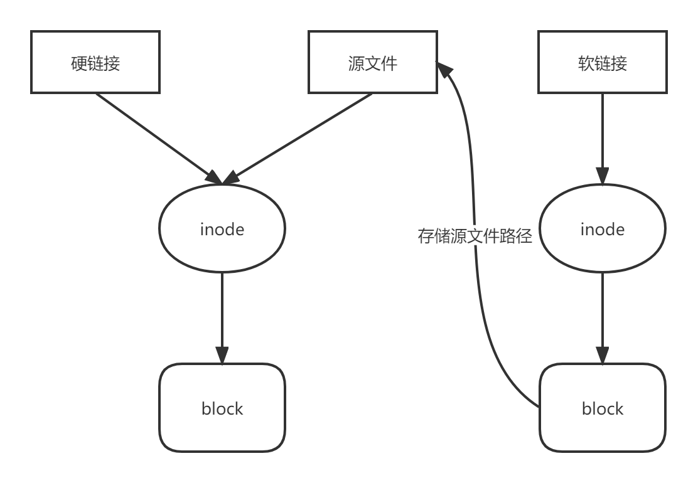

#### 软连接与硬链接

  

##### 软连接

可以使用 `ln -s 源文件  软连接文件` 来创建。类似于win中的快捷方式， 因此软链接文件和源文件属于不同的文件， 软连接文件中存放的是源文件的路径，以此来索引源文件

##### 硬链接

直接 `ln 源文件  硬链接文件`  创建。 硬链接与源文件的inode相同， 代表他们指向存储空间中的同一文件。删除他们任一 一个文件，实体文件依然存在，只有删除所有与之相对的硬链接才会删除实体文件。

#### inode与文件


### linux网络配置相关

##### 网卡信息文件 

文件位置 `/etc/sysconfig/network-scripts/ifcfg-*` 一个设备对应一个文件， 其中常见字段：

- DEVICE 网卡设备名；
- BOOTPROTO  是否使用动态dhcp(动态主机配置协议)，可选值为none static dhcp
- TYPE  网络类型，一般为Ethernet (以太网)

##### 主机名文件

文件位置 `/etc/sysconfig/network`, 常见字段

- NETWORKING   是否启用网络
- HOSTNAME    主机名
- NETWORKING_IPV6   是否支持IPv6

##### DNS配置文件

- nameserver   定义DNS服务器ip地址
- domain     定义本地域名地址
- search  定义域名搜索列表

##### 主机名与ip查询表

文件位置 `/etc/hosts`

```
私有ip   主机名  别名
```

#### linux网络端口配置

##### 使用iptables 工具管理端口

相关配置文件目录 `/etc/iptables`   

-  iptables -L -n    查看当前的的端口开放情况

- -A  INPUT -p tcp -m state --state NEW -m tcp --dport 3306 -j ACCEPT   开放3306端口操作。


