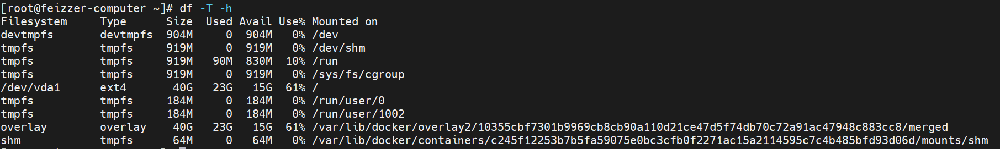

# linux操作系统基础

### linux文件系统

linux支持的文件系统非常多，暂时列出常见的，并加学习

- etx2， etx3，etx4。

  etx2是早期的非日志文件系统，现已经不推荐使用

  etx3是基于etx2发展起来的，很好的兼容了etx2，是一个日志文件系统支持大文件，比etx2更加可靠。

- 其他unix文件系统 XFS， JFS, UFS

- windows文件系统 FAT

- 网络文件系统 NFS

可以执行命令 `df -T -h`来查看本机的文件系统 /dev/sda1就是我们的磁盘系系统。

#### linux的虚拟目录

> 简单理解windows的文件系统，windows会对物理磁盘进行分区，每个分区都会有一个盘符。不同的分区有各自的目录结构，用于访问存储器中的文件。

> 而linux不使用驱动器盘符，linux会将文件存储在名为 **虚拟目录**的单目录结构中。

###### 单目录结构的虚拟目录如何管理多个存储设备

我们将安装在Linux系统的第一块硬盘成为**根驱动器**， 根驱动器存储了虚拟目录的核心，其他的木都是从它开始构建的。

Linux会根驱动器上一些特别的目录作为**挂载点**。挂载点目录是分配其他存储设备的(除根启动器以外的存储设备)。*例如系统文件存放在根驱动器，而用户文件存储在其他驱动器。*

