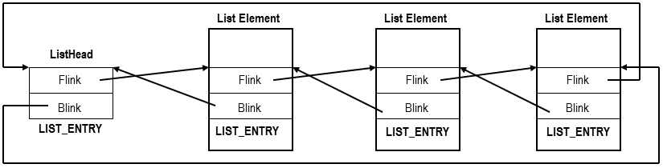

## 常见结构记录

https://mp.weixin.qq.com/s?__biz=MjM5NTc2MDYxMw==&mid=2458292614&idx=1&sn=06c57a56542a073eacf0f6def168265c&chksm=b181a10c86f6281aa0c4f59b32f0191f8d4ea0bf0f01201b4793314d899fa151c4fa00976e0d&scene=27

### 双链表

#### LIST_ENTRY

windows内核中又很多数据都保存在链表中， 其中一直会用到的结构体就是 `LIST_ENTRY`, 定义如下：

```c
typedef struct _LIST_ENTRY {
   struct _LIST_ENTRY *Flink;
   struct _LIST_ENTRY *Blink;
} LIST_ENTRY, *PLIST_ENTRY, *RESTRICTED_POINTER PRLIST_ENTRY;
```


`LIST_ENTRY`并不单独使用，而是在声明一个双链表结构体的时候， 将其作为该结构体的一个成员变量， 例如：

```c
typedef struct _NODE {
	LIST_ENTRY ListEntry;
    int data1; // 数据域1
    int data2; // 数据域2
}NODE;

```


这样通过 `LIST_ENTRY`就可以将我们定义的结构体，连接成为一个双链表： 

   


##### 使用示例

```c
///---节点：文件长度和文件名
typedef struct{
	LIST_ENTRY list_Entry,
	PFILE_OBJECT file_Object,
	UNICODE_STRING file_Name,
	LARGE_INTEGER file_Length
}MY_FILE_INFO, *PMY_FILE_INFO;

///----链表头
LIST_ENTRY my_List_Head;
 
///---链表头初始化，一般地应该在程序入口处调用一下
void MyFileInfoInit()
{
	InitializeListHead(&my_List_Head);
}
 
 
///---追加一条信息。也就是增加一个链表节点，请注意file_name是外面分配的
///---内存由使用者管理，该链表不用管理它
NTSTATUS MyFileInfoAppendNode(
	PFILE_OBJECT file_Object,
	PUNICODE_STRING file_Name,
	PLARGE_INTEGER file_Length )
{
	PMY_FILE_INFO my_File_Info = (PMY_FILE_INFO)ExAllocatePoolWithTag(
	PagePool, sizeof(MY_FILE_INFO), MEM_TAG);
	if (NULL == my_File_Info)
	{
		return STATUS_INSUFFICIENT_RESOURES;
	}
	///----填写数据成员
		my_File_Info->file_Object = file_Object;
		my_File_Info->file_Name = file_Name;
		my_File_Info->file_Length = file_Length;
		
		///---插入到链表尾，请注意这里没有使用任何锁，所以这个函数不是多线程安全的，
		InsertHeadList(&my_List_Head, my_File_Info.list_Entry);
		return STATUS_SUCCESS;
}

// 计算一个 LIST_ENTRY 结构体所在Node的实际地址， 因为我们在insert值的时候，insert的是list_entry这个成员变量。
// CONTAINTING_RECORD是一个宏定义， 实际上就是计算这个成员变量的偏移量， 不再详细记录
for (p = my_List_Head.Flink; p != &my_List_Head.Flink; p = p->Flink)
{
	PMY_FILE_INFO elem = CONTAINTING_RECORD(p, MY_FILE_INFO, list_Entry);
}
```


