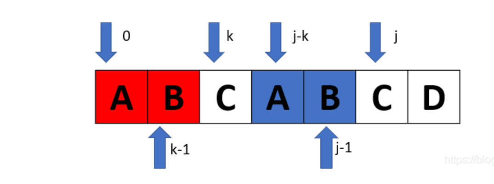
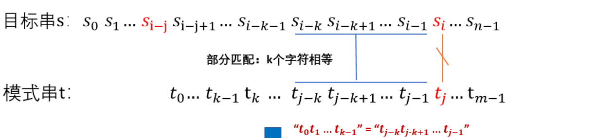
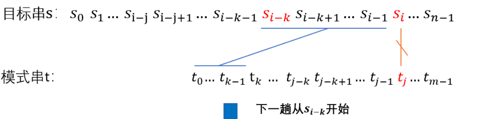

# KMP算法

##### 原理

###### 首先理解next[i]数组，next[i]是用于加速匹配的信息

对于一个字符串s，next[i]的值为字符串s开头的前k个字符 ( s[0],s[1].....s[k-1] ) 和 字符 s[i]前的k个字符 ( s[i-k],s[i-k+1],.....s[i-1] )一一相等

*注意这里的 i-k>0,即s[i-k]至少从s[1]开始*

代码

```c++
void Getnext(int next[],String t)
{
   int j=0,k=-1;
   next[0]=-1;
   while(j<t.length-1)
   {
      if(k == -1 || t[j] == t[k])
      {
         j++;k++;
         next[j] = k;
      }
      else k = next[k];//此语句是这段代码最反人类的地方，反复琢磨
   }
}
```

详看next的求解过程

1. 方便定义和计算，取next[0]=-1;next[1]=0;
2. 对于 t[j] == t[k] 的情况，可以得到next[j+1]=k+1；
3. 对于 t[j] != t[k]的情况，其代码实在难以理解重新理解下标j和k的地位，学会processon补上流程

优化的代码

```c++
void Getnext(int next[],string t)
{
    int j=0,k=-1;
    next[0]=-1;
    while(j<t.length()-1)
    {
        if(k == -1 || t[j] == t[k])
        {
            j++;k++;
            if(t[j]==t[k])//当两个字符相同时，就跳过
                next[j] = next[k];
            else
                next[j] = k;
        }
        else k = next[k];
   }
}
```

###### 再看KMP算法的实现

有两个字符串，目标串s，模式串t。对模式串求next[]数组。



当s[i] != t[j] 时，s重新回到s[i-k]处匹配t[j-k] 



代码

```c++
int KMP(string s,string t) {
    int t_len = t.length();
    int s_len = s.length();
    int s_i=0,t_i=0;
    while(t_i<t_len && s_i<s_len) {
        if(t_i == -1||t[t_i] == s[s_i]) {
            t_i++;
            s_i++;
        }
        else {
            t_i = next[t_i];
        }
    }
    if(t_i == t_len)
        return s_i-t_i;
    else
        return -1;
}
```


