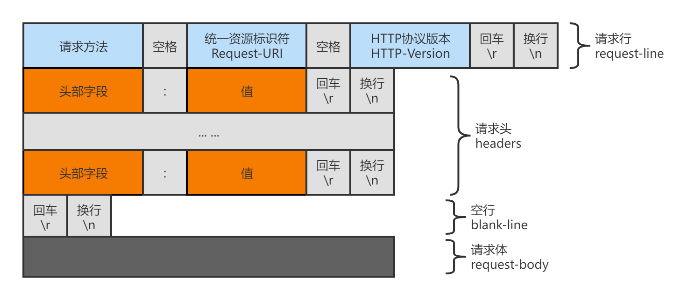
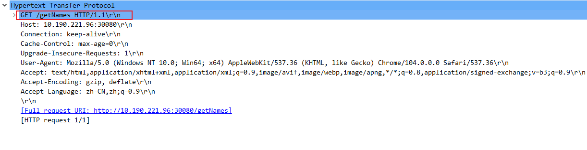
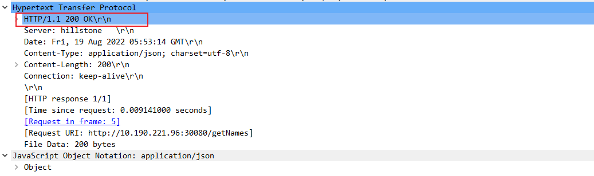

##### http请求报文格式

  

#### 请求行/响应行（起始行）

 

 

报文中请求行格式  **请求方法 URI HTTP协议版本**  。。响应行的格式 **HTTP协议版本 status状态码** 

##### 请求方法

HTTP1.0 定义了三种请求方法： GET, POST 和 HEAD 方法。最早的http/0.9只支持 GET方法。

HTTP1.1 新增了六种请求方法：OPTIONS、PUT、PATCH、DELETE、TRACE 和 CONNECT 方法。

| 序号 | 方法    | 描述                                                         |
| :--- | :------ | :----------------------------------------------------------- |
| 1    | GET     | 请求指定的页面信息，并返回实体主体。                         |
| 2    | HEAD    | 类似于 GET 请求，只不过返回的响应中没有具体的内容，用于获取报头 |
| 3    | POST    | 向指定资源提交数据进行处理请求（例如提交表单或者上传文件）。数据被包含在请求体中。POST 请求可能会导致新的资源的建立和/或已有资源的修改。 |
| 4    | PUT     | 从客户端向服务器传送的数据取代指定的文档的内容。             |
| 5    | DELETE  | 请求服务器删除指定的页面。                                   |
| 6    | CONNECT | HTTP/1.1 协议中预留给能够将连接改为管道方式的代理服务器。    |
| 7    | OPTIONS | 允许客户端查看服务器的性能。                                 |
| 8    | TRACE   | 回显服务器收到的请求，主要用于测试或诊断。                   |
| 9    | PATCH   | 是对 PUT 方法的补充，用来对已知资源进行局部更新 。           |

##### 常见的状态码status

[常见状态码](https://tool.oschina.net/commons?type=5)

#### 请求头部/响应头部中常见的字段

- Accept字段； 是请求头中的字段，表示客户端希望接收的数据类型

- Content-Type字段； 是指定实体数据类型的字段。表示客户端或服务端携带的实体数据的类型

  Accept和Content-Type字段的类型都是MIME类型 [[http协议详解#各种MIME类型]]

- Accept-Encoding字段； 表示浏览器可支持的返回内容的压缩编码格式

- Content-Encoding字段； 表示我携带的数据的压缩编码格式

- Content-length字段；  
- Transfer-Type

- Cookie字段； 浏览器发送请求时携带的cookie信息 [[前端浏览器的存储技术]]
- Set-Cookie； 
- User-Agent;   标准格式为： 浏览器标识（操作系统表示； 加密等级标识； 浏览器语言） 渲染引擎标识  版本信息
- Referer； 来源网页地址； 一般用来统计网站流量来源；
- 

###### 各种MIME类型

[常见MIME类型](https://developer.mozilla.org/zh-CN/docs/Web/HTTP/Basics_of_HTTP/MIME_types/Common_types) 

