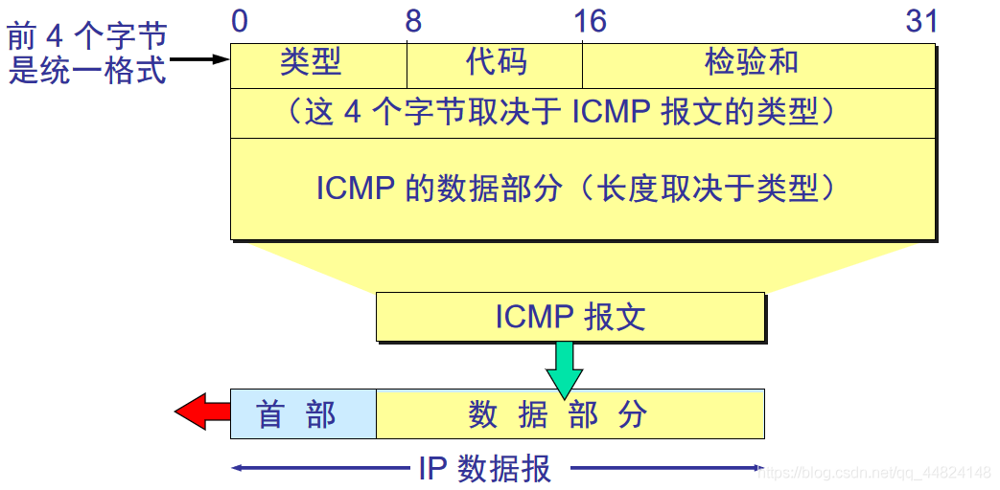

> ICMP（Internet Control Message Protocol）因特网控制报文协议。它是IPv4协议族中的一个子协议，用于IP主机、路由器之间传递控制消息。控制消息是在网络通不通、主机是否可达、路由是否可用等网络本身的消息。这些控制消息虽然不传输用户数据，但是对于用户数据的传递起着重要的作用。
>
> ICMP协议与ARP协议不同，ICMP靠IP协议来完成任务，所以ICMP报文中要封装IP头部。它与传输层协议（如TCP和UDP）的目的不同，==所以他既不属于tcp报文也不属于udp报文，可以认为他是在网络层和传输层之间的一个而协议==一般不用来在端系统之间传送数据，不被用户网络程序直接使用，除了像Ping和Tracert这样的诊断程序。

##### icmp报文结构

所有icmp的报文都是如下的结构：

 

icmp数据报文封装在ip数据包内进行传输。其中icmp包头长为8字节，俄各个字段的含义：

- 类型和代码； 类型字段用于确定报文的类型，代码字段进一步肯定该报文的作用。==ICMPv4和ICMPv6中这两个字段的值不一样==ICMP报文可分为两大类：有关IP数据报传递的ICMP报文(差错报文)和信息采集和配置的ICMP报文(查询或者信息类报文)。信息类报文会由系统自动处理；差错类报文传递给用户进程或传输层。

  ###### ICMPv6 中类型和代码代表

  | 类型 | 代码 |          描述           |
  | :--: | :--: | :---------------------: |
  | 128  |  0   |   回显请求；ping请求    |
  | 129  |  0   | 回显响应； ping应答数据 |

  ###### ICMPv4中类型和代码代表

  | 类型 | 代码 |          描述           |
  | :--: | :--: | :---------------------: |
  |  8   |  0   |   回显请求；ping请求    |
  |  0   |  0   | 回显响应； ping应答数据 |

- 校验和；  16位的校验和

