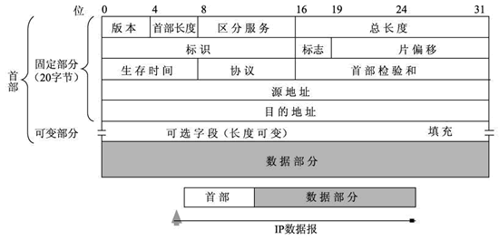
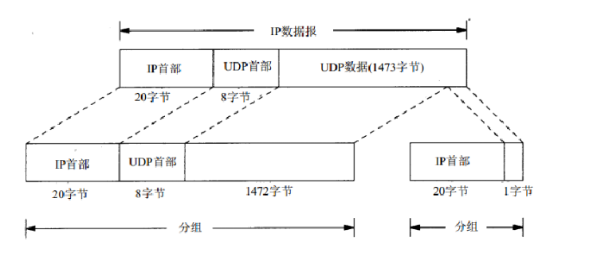
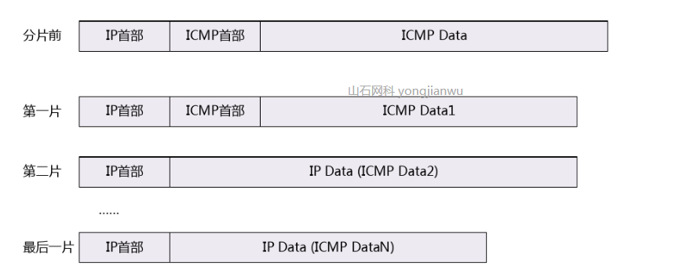

### ip网络协议记录

> IP（Internet Protocol）网际协议，是TCP/IP协议的核心部分，虽然IPV4终将会被IPV6替代，但是目前IPV4仍然是IP协议的主流版本，所以我们重点介绍一下IPV4版本

##### ipv4数据包格式

 

ip报文头的长度最小*即固定部分*为20， 最长为60字节。 各个字段的含义如下

- Version版本； 占4位，在ipv4版本中固定为4
- IHL首部长度； 表示ip数据报报头的长度（包括可选字段），以4字节为单位。
- ToS服务类型； 
- Total Length总长度； 占了16bit。ipv4数据报的长度*包括数据和报文头* 
- Identifier标识； 占了16bits。 每个报文有一个唯一的标识符，网络设备对报文进行分片时，需要保证所有分片的标识符字段与原始报文保持一致，接收端基于标识符进行报文重组
- Flag标志； 占了3bits。 有三个标志位DF(Don’t Fragment)，MF(More Fragment)，还有一个未使用 。 其中DF=0表示可以分片，MF=0表示这是最后一个分片。*如果ip数据包>mtu,需要分片。但是DF=1，那么网络设备会直接丢弃该报。* 
- Fragment Offset分段偏移； 占了13bits。该段分片在原数据中的偏移量以8字节为单位。
- Time To live生存时间； 数据报在网络中存在的最大跳数。
- Protocol协议； 占了8bits，指示IP报文中数据部分承载的协议类型，如ICMP(1)、TCP(6)、UDP(17)。
- Header CheckSum首部校验和； 占了16bits，网络设备转发数据报的时候需要校验该字段，如果失败就丢弃。
- 源ip
- 目的ip
- 可选字段

##### ip数据报分片

前面ip数据报的总长度占了16bit可以表示的最大长度是 *65535* ,但是数据链路层的mtu一般是1500字节。 当传递给数据链路层的ip数据包大于mtu时，网络设备会选择对其进行分片发送。

数据包分片时，所有的分片都需要带有ip首部，因为所有分片的重组需要ip首部中的标识。

  

重组时在网络层，通过ip报头中的**identifier标识符**，**Fragment Offset片偏移**， **Flag标志**来进行重组。

##### 需要避免ip分片

