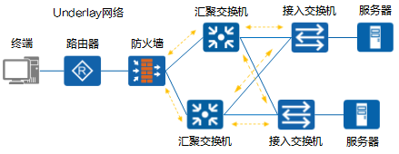
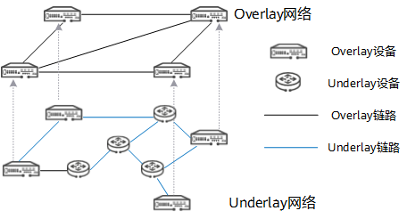
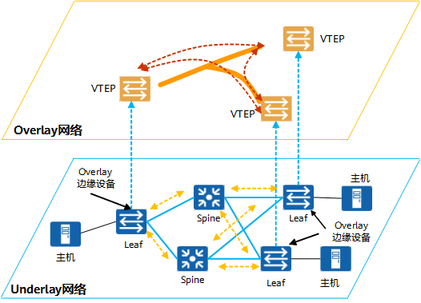
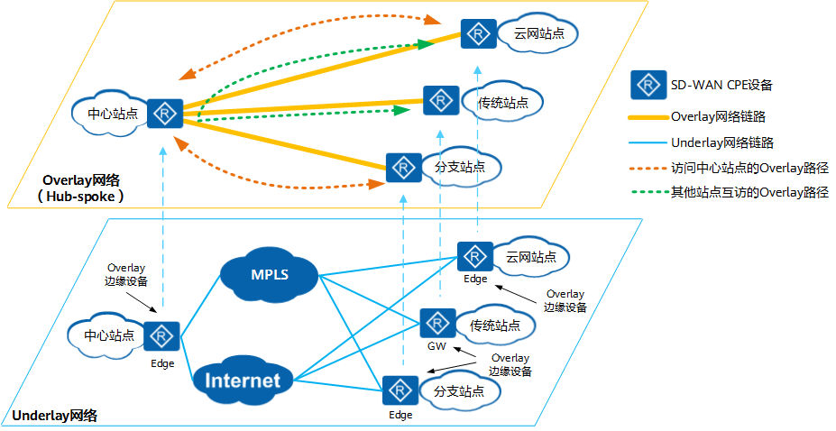

### overlay网络模型

> overlay网络模型（覆盖网络）是指使用网络虚拟化技术， 在同一张underlay网络上构建出一张或多张虚拟的逻辑网络，不同的Overlay网络虽然共享Underlay网络中的设备和线路，但是Overlay网络中的业务与Underlay网络中的物理组网和互联技术相互解耦。

## 为什么需要Overlay网络？

Overlay网络和Underlay网络是一组相对概念，Overlay网络是建立在Underlay网络上的逻辑网络。而为什么需要建立Overlay网络，就要从底层的Underlay网络的概念以及局限讲起。

### Underlay网络

Underlay网络正如其名，是Overlay网络的底层物理基础。

如下图所示，Underlay网络可以是由多个类型设备互联而成的物理网络，负责网络之间的数据包传输。

*典型的Underlay网络*

在Underlay网络中，互联的设备可以是各类型交换机、路由器、负载均衡设备、防火墙等，但网络的各个设备之间必须通过路由协议来确保之间IP的连通性。

Underlay网络可以是二层也可以是三层网络。其中二层网络通常应用于以太网，通过[VLAN](https://info.support.huawei.com/info-finder/encyclopedia/zh/VLAN.html)进行划分。三层网络的典型应用就是互联网，其在同一个自治域使用OSPF、IS-IS等协议进行路由控制，在各个自治域之间则采用BGP等协议进行路由传递与互联。随着技术的进步，也出现了使用[MPLS](https://info.support.huawei.com/info-finder/encyclopedia/zh/MPLS.html)这种介于二三层的WAN技术搭建的Underlay网络。

然而传统的网络设备对数据包的转发都基于硬件，其构建而成的Underlay网络也产生了如下的问题：

- 由于硬件根据目的IP地址进行数据包的转发，所以传输的路径依赖十分严重。
- 新增或变更业务需要对现有底层网络连接进行修改，重新配置耗时严重。
- 互联网不能保证私密通信的安全要求。
- [网络切片](https://info.support.huawei.com/info-finder/encyclopedia/zh/网络切片.html)和网络分段实现复杂，无法做到网络资源的按需分配。
- 多路径转发繁琐，无法融合多个底层网络来实现负载均衡。

### Overlay网络

为了摆脱Underlay网络的种种限制，现在多采用网络虚拟化技术在Underlay网络之上创建虚拟的Overlay网络。

*Overlay网络拓扑*

在Overlay网络中，设备之间可以通过逻辑链路，按照需求完成互联形成Overlay拓扑。

相互连接的Overlay设备之间建立隧道，数据包准备传输出去时，设备为数据包添加新的IP头部和隧道头部，并且被屏蔽掉内层的IP头部，数据包根据新的IP头部进行转发。当数据包传递到另一个设备后，外部的IP报头和隧道头将被丢弃，得到原始的数据包，在这个过程中Overlay网络并不感知Underlay网络。

Overlay网络有着各种网络协议和标准，包括[VXLAN](https://info.support.huawei.com/info-finder/encyclopedia/zh/VXLAN.html)、NVGRE、SST、GRE、NVO3、[EVPN](https://info.support.huawei.com/info-finder/encyclopedia/zh/EVPN.html)等。

随着[SDN](https://info.support.huawei.com/info-finder/encyclopedia/zh/SDN.html)技术的引入，加入了控制器的Overlay网络，有着如下的优点：

- 流量传输不依赖特定线路。Overlay网络使用隧道技术，可以灵活选择不同的底层链路，使用多种方式保证流量的稳定传输。
- Overlay网络可以按照需求建立不同的虚拟拓扑组网，无需对底层网络作出修改。
- 通过加密手段可以解决保护私密流量在互联网上的通信。
- 支持网络切片与网络分段。将不同的业务分割开来，可以实现网络资源的最优分配。
- 支持多路径转发。在Overlay网络中，流量从源传输到目的可通过多条路径，从而实现负载分担，最大化利用线路的带宽。

## Overlay网络有哪些例子？

Overlay网络在[SD-WAN](https://info.support.huawei.com/info-finder/encyclopedia/zh/SD-WAN.html)、数据中心两大解决方案中被广泛应用，由于其底层Underlay网络的架构也不尽相同，使得Overlay网络的拓扑存在不同的形式。

### 数据中心的Overlay网络

随着数据中心架构演进，现在数据中心多采用Spine-Leaf架构构建Underlay网络，通过[VXLAN](https://info.support.huawei.com/info-finder/encyclopedia/zh/VXLAN.html)技术构建互联的Overlay网络，业务报文运行在VXLAN Overlay网络上，与物理承载网络解耦。

*数据中心的Overlay网络*

Leaf与Spine全连接，等价多路径提高了网络的可用性。

Leaf节点作为网络功能接入节点，提供Underlay网络中各种网络设备接入VXLAN网络功能，同时也作为Overlay网络的边缘设备承担VTEP（VXLAN Tunnel EndPoint）的角色。

Spine节点即骨干节点，是数据中心网络的核心节点，提供高速IP转发功能，通过高速接口连接各个功能Leaf节点。

### SD-WAN中的Overlay网络

SD-WAN的Underlay网络基于广域网，通过混合链路的方式达成总部站点、分支站点、云网站点之间的互联。通过搭建Overlay网络的逻辑拓扑，完成不同场景下的互联需求。

**图1-5** SD-WAN的Overlay网络（以Hub-Spoke为例）

SD-WAN的网络主要由CPE设备构成，其中CPE又分为Edge和GW两种类型。

- Edge：是SD-WAN站点的出口设备。
- GW：是联接SD-WAN站点和其他网络（如传统VPN）的网关设备。

根据企业网络规模、中心站点数量、站点间互访需求可以搭建出多个不同类型的Overlay网络。

- Hub-spoke：适用于企业拥有1~2个数据中心，业务主要在总部和数据中心，分支通过WAN集中访问部署在总部或者数据中心的业务。分支之间无或者有少量的互访需求，分支之间通过总部或者数据中心绕行。
- Full-mesh：适用于站点规模不多的小企业，或者在分支之间需要进行协同工作的大企业中部署。大企业的协同业务，如VoIP和视频会议等高价值的应用，对于网络丢包、时延和抖动等网络性能具有很高的要求，因此这类业务更适用于分支站点之间直接进行互访。
- 分层组网：适应于网络站点规模庞大或者站点分散分布在多个国家或地区的大型跨国企业和大企业，网络结构清晰，网络可扩展性好。
- 多Hub组网：适用于有多个数据中心，每个数据中心均部署业务服务器为分支提供业务服务的企业。
- POP组网：当运营商/MSP面向企业提供SD-WAN网络接入服务时，企业一时间不能将全部站点改造为SD-WAN站点，网络中同时存在传统分支站点和SD-WAN站点这两类站点，且这些站点间有流量互通的诉求。一套IWG（Interworking Gateway，互通网关）组网能同时为多个企业租户提供SD-WAN站点和已有的传统[MPLS](https://info.support.huawei.com/info-finder/encyclopedia/zh/MPLS.html) VPN网络的站点连通服务。

## Overlay网络 VS Underlay网络

Overlay网络和Underlay网络的区别如下所示：

**表1-1** Underlay网络 VS Overlay网络

| 对比项       | Underlay网络                                                 | Overlay网络                                                  |
| ------------ | ------------------------------------------------------------ | ------------------------------------------------------------ |
| 数据传输     | 通过网络设备例如路由器、交换机进行传输                       | 沿着节点间的虚拟链路进行传输                                 |
| 包封装和开销 | 发生在网络的二层和三层                                       | 需要跨源和目的封装数据包，产生额外的开销                     |
| 报文控制     | 面向硬件                                                     | 面向软件                                                     |
| 部署时间     | 上线新服务涉及大量配置，耗时多                               | 只需更改虚拟网络中的拓扑结构，可快速部署                     |
| 多路径转发   | 因为可扩展性低，所以需要使用多路径转发，而这会产生更多的开销和网络复杂度 | 支持虚拟网络内的多路径转发                                   |
| 扩展性       | 底层网络一旦搭建好，新增设备较为困难，可扩展性差             | 扩展性强，例如[VLAN](https://info.support.huawei.com/info-finder/encyclopedia/zh/VLAN.html)最多可支持4096个标识符，而[VXLAN](https://info.support.huawei.com/info-finder/encyclopedia/zh/VXLAN.html)则提供多达1600万个标识符 |
| 协议         | 以太网交换、VLAN、路由协议（OSPF、IS-IS、BGP等）             | VXLAN、NVGRE、SST、GRE、NVO3、[EVPN](https://info.support.huawei.com/info-finder/encyclopedia/zh/EVPN.html) |
| 多租户管理   | 需要使用基于[NAT](https://info.support.huawei.com/info-finder/encyclopedia/zh/NAT.html)或者VRF的隔离，这在大型网络中是个巨大的挑战 | 能够管理多个租户之间的重叠IP地址                             |

## overlay网络的实现

### Vxlan

