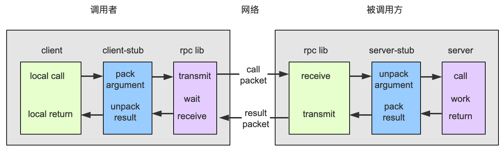

### RPC （Remote Procedure Call）

> rpc远程调用服务，是一种通过网络服务向另一台远程计算机请求服务的解决框架，*实现一个节点请求另一个节点提供的服务*。rpc是一种协议规范，任何基于rpc协议规范实现的框架都可以叫rpc框架。常见的框架Dubbo   Thrift   **gRPC**

 

##### rpc服务和restful api的区别

其实rpc和restful并不是一个对等概念，只不过他们都实现了差不多的目的。

- **rpc**  属于远程服务调用协议，其包括 **序列化协议 **和 **传输协议** 。
  - 不同的rpc框架的传输协议可能不一样， **grpc用的HTTP/2**,   其他用的是tcp ...
  - 序列化协议有基于纯文本的xml和json， 基于二进制编码的protobuf和hessian。**grcp用的是protobuf** 
- **restful api**  REST即表述性状态传递（Representational State Transfer，简称REST），是以一种webservice请求的风格。某种程度上说基于http的请求也是rpc协议的一种可选方案。

