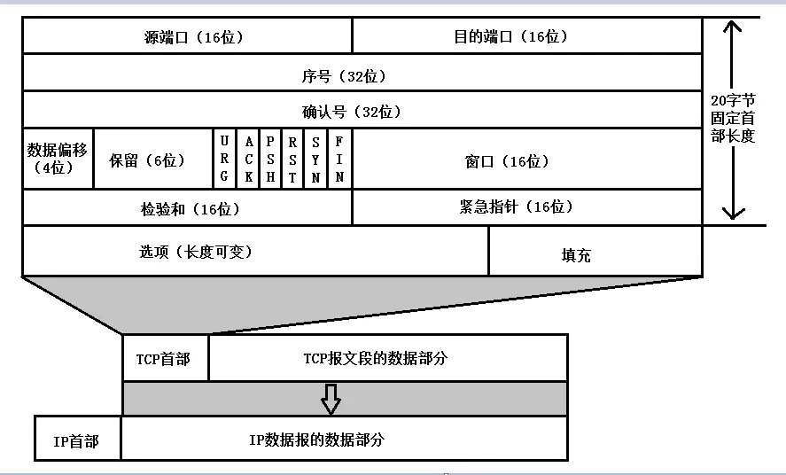

##### tcp报文格式

  

tcp报文头部的固定长度时20字节，各个字段的含义：

- 源端口和目的端口；表示发送和接收此报文的程序的占用的端口号。占16bits 端口范围为0~65535

- 序号；tcp是面向字节流进行传输的，传输的数据每一个字节都有一个编号。 表示此报文段的第一个字节的序号。占了32bits可以表示4GB的数据

- 确认号；  确认号是接收方对收到的数据的确认。

  确认号=N，表示N-1为止的数据都已经收到了，期望收到序号为N的数据。

  只有标志位的ACK=1， 确认号才会有效；

- 数据偏移； 表示了此数据报文的数据起始处*其实就是表明了tcp报文头的长度*， 占了4bits。该字段以4字节为单位。最小值为5因为tcp报文头部最小20字节。最大15。

- 保留位6bits

- **标志位**  共六个标志占6bits

  - URG。紧急指针，为1时表示紧急指针有效
  - ACK：确认序号标志，为1时表示确认号有效，为0表示报文中不含确认信息，忽略确认号字段。
  - PSH：push标志，为1表示是带有push标志的数据，指示接收方在接收到该报文段以后，应尽快将这个报文段交给应用程序，而不是在缓冲区排队。
  - RST：重置连接标志，用于重置由于主机崩溃或其他原因而出现错误的连接。或者用于拒绝非法的报文段和拒绝连接请求。
  - SYN：同步序号，用于建立连接过程，在连接请求中，SYN=1和ACK=0表示该数据段没有使用捎带的确认域，而连接应答捎带一个确认，**即SYN=1和ACK=1。**

- 窗口； 指接收端接收窗口的大小*也就是滑动窗口的大小*。 该字段只占了16bits，只能表示65535个字节，为了表示更大的数据量。使用了SYN包*建立连接过程中的*option部分中windows scales。如果为8就是放大$2^8$

- 检验和

- 紧急指针。当URG=1时有效，占16bit，以字节为单位用来指明紧急数据的长度。可以让紧急数据插队到接收缓存的最前面。

##### 拓展字段（可选部分）

