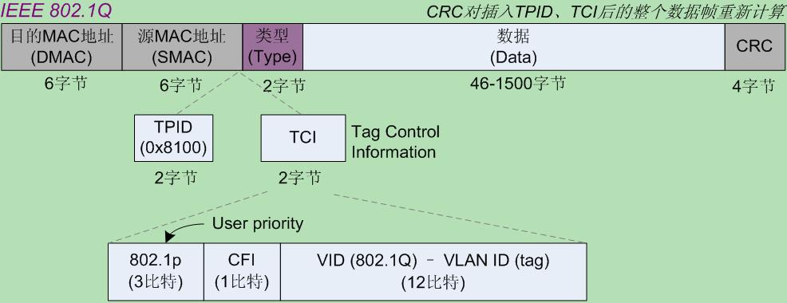
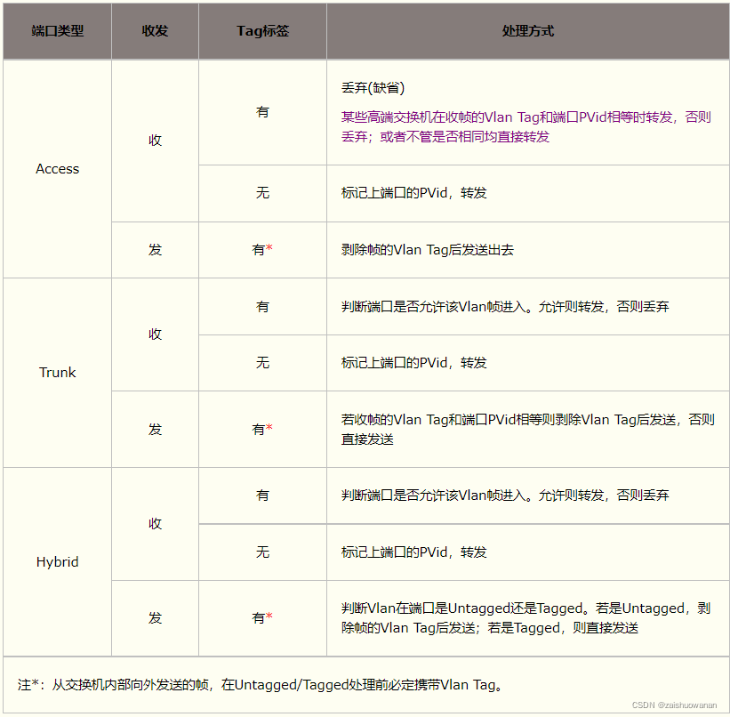

### VLAN

VLAN(virtual local area network)虚拟局域网， 是在交换机实现过程中概念， 由802.1Q标准所定义。 交换机是工作在数据链路层的工具， 连接在同一个交换机的终端同在一个广播域。 如果连接在同一个广播域的机器非常多， 任意造成广播通信的泛滥。 vlan主要是这个问题提出的解决方案： VLAN将同一网络划分为多个逻辑上的虚拟子网，并规定当收到广播报文时，仅仅在其所在VLAN中进行广播从而防止广播报文泛滥。VLAN技术在链路层的层次中实现了广播域的隔离。

VLAN标准设计的文献由有 ：rfc3069、rfc5517.

#### 标准

###### 传统以太帧格式 
[数据链路层](数据链路层.md)

###### 802.1Q标准以太帧格式

在源MCACC地址和类型之间加了4字节的 **802.1Qtag**

 

- **TPID**  typeid用来标识帧类型，长度2bytes， 802.1Q帧中的值固定为  0x8100， 如果不支持802.1Q的设备收到该帧， 则会直接丢弃。
- **PRI**     priority字段， 长度为3bit， 表示以太网帧的优先级， 取值范围0~7， 数值越大， 优先级越高。
- **CFI**     Canonical Format Indicator， 长度为1bit， 表示MAC地址格式是否为经典格式。为1表示为非经典格式。 该字段用于区分以太帧 FDDI帧和令牌环网帧。
- **VID**     VLAN ID， 长度为12bit， 取值范围是0~4095

#### vlan的3种访问模式

- **Access**  类型的端口只能属于1个VLAN， 一般用于连接计算机端口。

  access端口只属于一个vlan， 就是pvid， 可以不用设置pvid。

- **Trunk**   类型的端口允许多个VLAN通过， 可以接收和发送多个VLAN的报文， 一般用于交换机之间的端口；

  trunck属于多个vlan， 需要设置pvid。 

  - 当该端口收到包不带Tag标记， 给该帧打上Tag标记（就是设置的pvid），并转发至对应lan端口。 
  - 当收到数据帧带Tag标记， 如果Tag标记和自身pvid不一致 直接转发数据帧。 如果Tag标记和自身一致， 则剥除tag标记后转发。

- **Hybird**   类型的端口可以允许多个VLAN通过， 可以接受和发送多个VLAN的报文， 可以用于交换机之间的连接，也可以用于用于用户计算机的连接。

  Hybird也需要设置pvid， 同一个交换机中trunk端口和Hybird端口不能共存。

   Hybrid端口与Trunk端口在接收数据时处理方法相同，区别在于发送数据时：Hybrid端口允许多个Vlan的数据帧发送时不带标签，而Trunk端口只允许默认Vlan的数据帧发送时不带标签。

 

##### 单个交换机下vlan网络连接

.png) 

##### 多交换机vlan网络连接 

.png)   

#### vlan的分类

  

