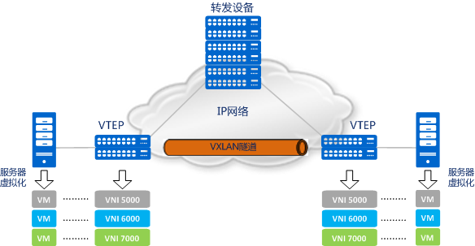

[huawei博客](https://forum.huawei.com/enterprise/zh/thread/580901140361527296)

### VXLAN

VXLAN(vitrtual extential lan) 虚拟可拓展网络。 随着大数据，云计算， 虚拟化技术的出现， vlan技术的弊端逐渐显现。 

#### 标准

VxLAN的实现由文档rfc7348详细定义。本质上VxLAN是一种隧道技术。 通过将虚拟网络中的数据帧封装在实际物理网络报文进行传输。 具体的实现方式为： 将**虚拟网络的数据帧**添加**Vxlan首部**后， 封装在物理网络的**UDP报文**中， 然后以传统的网路通信传递UDP包。 到达目的主机后， 去掉物理网络报文头部信息和VxLAN首部， 将虚拟网络报文交付给目的终端。 整个通信过程终端不会感知到物理网络的存在。

 

- **VTEP** (VXLAN Tunnel Endpoints): vxlan网络的比那元设备， 用来对报文进行处理（封包和捷解包）。 vtep可以是网络设备（如交换机）， 也可以是一台机器（如虚拟化集群中的宿主机）。
- **VNI**   (VXLAN Network Identifier): VNI是每个vxlan的标识， 共有24位（2^24）, 一般一个VNI对应一个租户。 也就是说使用VNI搭建的公有云理论上可以支撑千万级别的租户。
- **Tunnel**   隧道是一个逻辑上的概念， 在vxlan模型中并没有具体的物理实体对应。 整体来看， 每个vxlan网络像是位通信的虚拟机搭建了一个单独的通信通道，也就是隧道。

##### VxLAN数据帧结构

数据帧的封装格式

 

-  **外部ip首部**和**外部UDP首部** 用于用来实现在底层网络的传输， 也就是vtep之间通信。外部UDP包的端口值是4789， 该端口是VxLAN解析程序的默认端口， 外层IP包中源ip和目的ip则是填写通信双方的 VTEP的ip地址。 
- **VXLAN首部** vtep收到UDP包后，去掉udp包头，更具VXLAN首部处理相应逻辑， 主要是根据VNI发送到最终的虚拟机。
- **内部网络数据帧**就是内部虚拟机看到的数据包。

###### VxLAN首部详解

 

VxLAN首部由8个字节构成。

- 第一个字节中标志位 **I**， 设为1表示是一个合法的VxLAN。 其余各位保留 必须置为0
- 2~4字节为 保留字段
- 5~7字节为 VxLAN标识符 VxLAN Network Identifier(VNI), 用来表示一个唯一的一个逻辑网络。
- 第8个字段仍然为保留字段。

##### 通信过程

我们已知vxlan的大致实现是 将数据包再封一层， 通过ip可通的vtep传输再解包传递给内部的虚拟机。 但是还有一些细节问题有待解决， 一步一步分析一个vxlan数据帧的构建需要哪些信息

1. 内部数据帧需要用到通信双方的IP地址和MAC地址， 通信双方要么直接使用IP地址，要可以通过dns获取到对方的ip地址。 但是还需要知道**对方的MAC地址**， ==vxlan还需要一个机制来实现一个类似于传统网络的arp协议概念。==
2. vxlan头部 需要VNI， 一般是配置在vtep上或者根据内部数据包动态生成。 （暂不了解）
3. UDP头部  需要源端口和目的端口。 源端口由系统管理分配， 目的端口也是配置好的 **4789**.
4. IP头部  需要双方vtep的ip地址， ==对方的vtep的ip地址也需要某种方式来获取==
5. MAC头部  需要双方vtep的MAC地址， 由对方vtep的ip地址就可以通过arp协议来获取了

由此我们还需要解决两个问题， 如果VNI也是动态感知的， 那么就需要确定一个三元组  **< 内部虚拟机MAC, VNI, vtepIP >**   一般有两种实现方式 **多播** 和 **控制中心**。

##### 分布式控制中心的实现

#### vxlan网络的问题和优势

