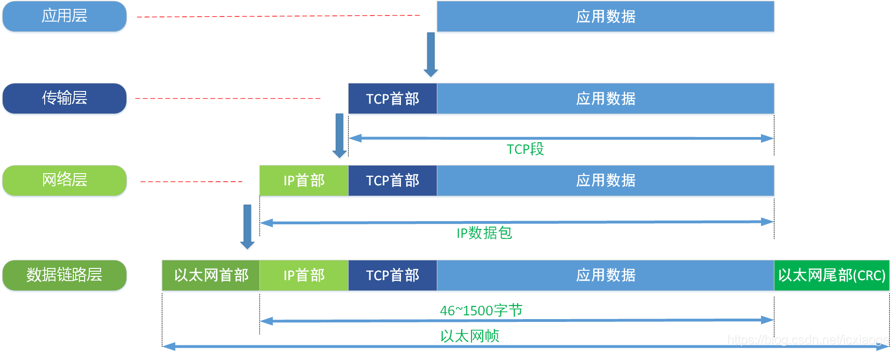
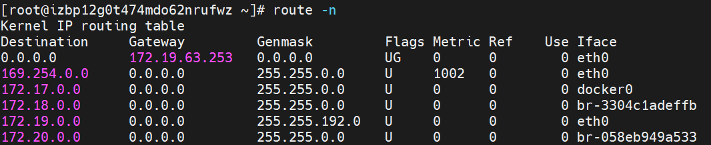
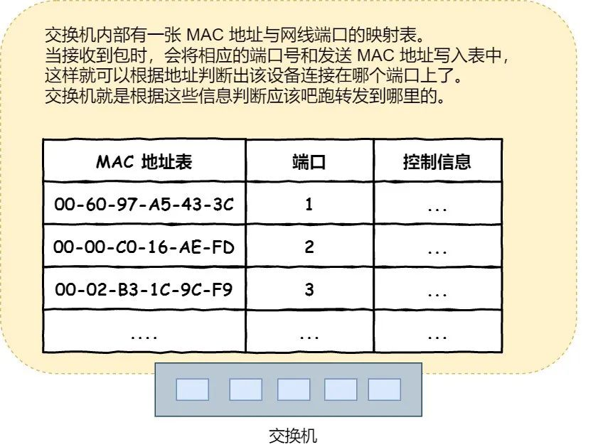

#### 二层转发原理

本文中对于三层转发设备统称为路由器，对于二层交换机统称为交换机， 以tcp/ip协议的数据报文为例。

对于同一网段内的两台计算机之间的数据交互可以认为是二层转发的过程。

1. 一个数据包经由协议栈层层封装后，在ip首部中写入了目的ip和源ip地址。（源ip地址是本机的ip，目的ip直接输入或者通过dns域名解析得到）

2. 计算机会查看本机的路由表信息。若两台计算机在同一网段（由一个交换机连接）则不需要经过路由器（二层转发和三层转发的区别）。

   

3. 达到数据链路层时需要封装以太帧信息包括目的MAC地址和源MAC地址。由于只知道目的ip，此时计算机会广播arp协议，arp协议中包含 源MAC，源ip，目的ip。交换机收到广播arp请求，会向网段内除我以外的所有的计算机转发，收到arp请求的计算机查看目的ip和自己的ip是否一致。不一致直接丢弃，如果一致则向我发送一个arp响应包，包含源ip，目的ip，源MAC，目的MAC。

4. 此时本机收到对方响应的arp包，就获得了所需要的目的MAC。当然为了防止每次发送请求时都进行一个arp广播，计算机会在本地维护一个arp缓存表，记录ip地址和MAC地址的关系（缓存表的内容会定时清理过期表项， 每次收到请求或响应都会刷新表项）。

5. 计算机将以太帧封装完成后通过武物理层发送到交换机，交换机维护一个端口和MAC地址的关系。交换机会根据数据包中的目的MAC确定将该数据包发送至哪一个端口。同时交换机会根据数据包中的源MAC地址来更新维护自己的MAC地址表。*如果MAC地址表中没有一个端口和目的MAC对应，那么交换机会对除发送该数据包外的所有端口转发该数据包（泛洪）*。

       

   对于同一网段内的两台计算机，其请求转发不需要经过路由器，只需要交由交换机直接转发。在这个过程中交换机只会将数据包解析到第二层获取目的MAC和源MAC即可（只需要在数据链路层上工作的转发），因此称其为二层转发。

#### 三层转发

对于不同网段的两台计算机，其数据交互需要经过路由器的转发可以认为是三层转发。

1. 若两台计算机在不同的网段,则需根据本地维护的路由表中的**目标地址**和**Genmask**做与`&`运算是否和表中的 **Destination**相同来判断下一跳的地址（需要在本地计算机正确的配置gateway地址）

2.  此时就获取到了下一跳的ip地址，计算机需要将路由器的MAC地址封装入以太帧发送出去（通过ip获取目标MAC地址参考二层转发中的arp协议过程）。此时发送的数据包中携带的是 目标ip，源ip，下一跳路由器的MAC地址和源MAC地址。

3. 交换机收到该数据包后根据下一跳的MAC地址将其转发到与其连接的路由器（下一跳）

4. 路由器也会管理一个**路由表**，根据路由表和ip包头中的目的ip进行包 的转发操作。如果网关为空，则 IP 头部中的接收方 IP 地址就是要转发到的目标地址，也是就终于找到 IP 包头里的目标地址了，说明**已抵达终点**。如果网关是一个 IP 地址，则这个IP 地址就是我们要转发到的目标地址，**还未抵达终点**，还需继续需要路由器转发。

   

#### 总结

##### 二层交换机和路由器的概念

- 因为**路由器**是基于 IP 设计的，俗称**三层**网络设备，路由器的各个端口都具有 MAC 地址和 IP 地址；路由器实际上和一个计算机非常相似，路由器也会管理一个**路由表**，根据路由表和ip包头中的目的ip进行包 的转发操作。
- 而**交换机**是基于以太网设计的，俗称**二层**网络设备，交换机的端口不具有 MAC 地址。交换机维护一个MAC地址表表示的是MAC地址和端口之间的关系

##### 数据包在三层转发过程中MAC地址会一直变化

可以发现的是在网络包传输的过程中，**源 IP 和目标 IP 始终是不会变的，一直变化的是 MAC 地址**，因为需要 MAC 地址在以太网内进行**两个设备**之间的包传输，所以目的MAC永远要表示下一个节点的地址。

**而源MAC地址在包转发过程中也会不断变化**，因为对于交换机来说其维护更新自己MAC地址表的方法就是检查发送端口和源MAC地址。因此三层网络设备在对数据包进行转发时需要将源MAC地址改为自己端口的MAC地址。