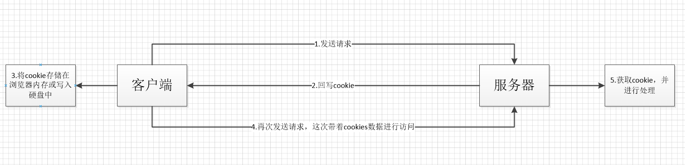
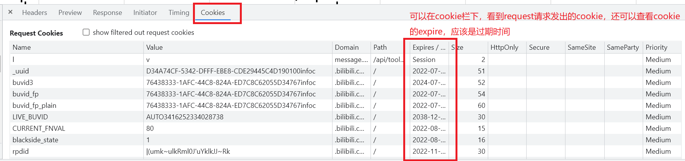

#### 实际使用
[[#利用sessionStorage保存用户的一些操作信息]]

#### html4中本地储存概念,  Cookies和Session

cookie和seesion的诞生就是为了解决HTTP请求无状态的问题，用于记录相关的一些状态。session保存在服务端，cookies也由服务端生成，并发送给客户端，由客户端保存。客户端发送请求时，会将cookies一起发送。



##### 使用的一些注意点

###### cookie机制：

如果没有设置cookie的过期时间，那他就只会被保存在内存里，浏览器关闭他也被清除。如果设置了过期时间，就会存储进硬盘空间，存储路径一般由浏览器决定，且我们不可修改。cookie过期后才会被清除。在浏览器环境中，只要浏览器中存储了该网站相关的cookie， 每次请求后会默认携带这个cookie

cookie 类似于HashMap集合,但是value只能保存字符串数据，单个cookie似乎不能超过 4KB

###### session机制：

首先会检查客户端请求中是否包含sessionid。如果有sessionid，服务器将根据该id返回对应session对象。如果客户端请求中没有sessionid，服务器会创建新的session对象，并把sessionid在本次响应中返回给客户端。通常使用cookie方式存储sessionid到客户端，在交互中浏览器按照规则将sessionid发送给服务器。如果用户禁用cookie，则要使用URL重写，可以通过response.encodeURL(url) 进行实现；API对encodeURL的结束为，当浏览器支持Cookie时，url不做任何处理；当浏览器不支持Cookie的时候，将会重写URL将SessionID拼接到访问地址后。

session 类似于 HashMap集合， 并没有存储上的限制。




#### HTML5中的本地存储的概念  WebStorage和本地数据库

##### WebStorage由分为由 sessionStorage和 localStorage

Web Storage存储机制是对HTML4中cookie存储机制的一个改善。由于cookie存储机制有很多缺点，HTML5不再使用它，转而使用改良后的Web Storage存储机制。本地数据库是HTML5中新增的一个功能，使用它可以在客户端本地建立一个数据库，原本必须保存在服务器端数据库中的内容现在可以直接保存在客户端本地了，这大大减轻了服务器端的负担，同时也加快了访问数据的速度。

###### WebStorage中的 sessionStorage

将数据保存在session对象中。所谓session，是指用户在浏览某个网站时，从进入网站到浏览器关闭所经过的这段时间。几个补充：

- sessionStorage的生命周期仅在当前会话有效，这里的会话引入了一个浏览器窗口概念。独立打开两个窗口去访问同一个网络应用，这两个窗口属于两个会话，他们的sessionStorage并不共享
- 浏览器窗口没有关闭，会话就不会结束。刷新页面不会导致sessionStorage数据丢失。

###### localStorage

localStorage是保存在本地硬盘的数据，生命周期是永久的。除非主动删除，否则数据不会失效。他的作用域自然是跨会话的

###### 总结：

二者存储空间更大，大概为5MB；

依然有被伪造的可能，但只要加密到位一般很难发生安全问题。

sessionStorage和localStorage提供了有效的API:  *他的value值和cookie一样只能保存字符串，可以使用JSON.parse和Stringfy来转化* 

- setItem (key, value) ——  保存数据，以键值对的方式储存信息。
- getItem (key) ——  获取数据，将键值传入，即可获取到对应的value值。
- removeItem (key) ——  删除单个数据，根据键值移除对应的信息。
- clear () ——  删除所有的数据

##### 本地数据库


#### 利用sessionStorage保存用户的一些操作信息

sessionStorage可以将用户进行的一些操作信息保存下来，在用户进行页面刷新后依然能共显示（页面会话被关闭则数据消失）。注意不要直接使用 `this.$data = `赋值操作。

```js
if (sessionStorage.getItem('register-p-page')) {
    Object.assign(this.$data, JSON.parse(sessionStorage.getItem('register-p-page')))
}
window.addEventListener("beforeunload",()=>{
    console.log('unload')
    sessionStorage.setItem("register-p-page",JSON.stringify(this.$data));
});
```


