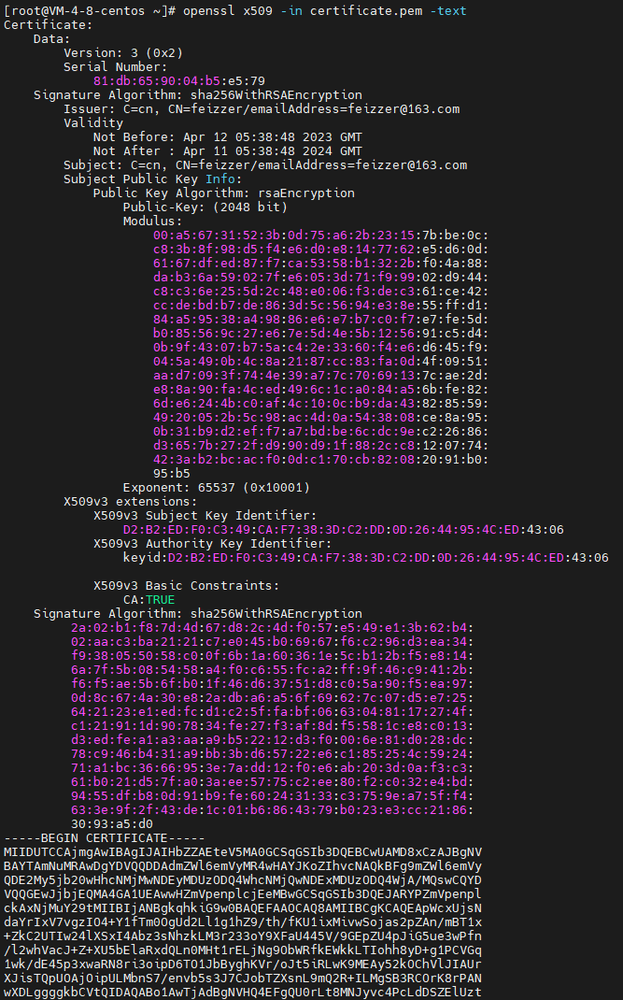

## 数字证书实现

### 非对称加密

##### 传统对称加密

在传统的对称加密算法中， 通信的双方会采用一个共享的密钥来对数据进行加密和解密。 消息发送方使用密钥对消息进行加密后发送，消息接收方收到信息后使用密钥解密获得信息。 但是在通信开始之前需要先交换加密解密使用的密钥，而交换的过程就会存在泄露的风险。

##### 非对称加密
[RSA加密原理](../base/RSA加密原理.md)
非对称加密算法有两个密钥 ：公开密钥和私有密钥。 公钥和私钥是成对使用，如果用公钥对数据进行加密，只有私钥才能解密。 使用私钥进行加密只能使用公钥进行解密。非对称加密的保密更好，因为它不需要通信加密的私钥。公钥是不需要保密的， 可以对外进行发布。 


但是非对称加密的效率一般比较低， 因此在通信过程中一般会结合对称加密和非对称加密来实现数据的加密传输。 首先通过非对称加密协商加换一个用于对对称加密的共享密钥， 后续在数据传输的过程中使用该密钥来进行加密解密。 SSL/TLS就采用了类似的加密传输机制。 


### 哈希函数

哈希函数是一个具有输入和输出的数学函数 H (X) = Y

- **H**:    哈希函数， 其输入的参数为X， 输出为Y
- **X**： 哈希方法的输入， 可以是任意长度的任意数据
- **Y**： 哈希方法的输出，是一段固定长度的二进制数据， 长度256， 284， 516.......,

用于加密的哈希函数具有一下的特征：

- 无法找到相同输出的输入。 从数学概率上来说书可以找到的，*（输入可以是任意的数据， 输出则是固定长度的数据）*。 但是好的哈希函数可以保证无法在可接受的时间内找到这个解。
- 无法通过输出反推输出。  对于输入值的范围很大的情况来说，这是没有问题的，如果输入值是一个有限的集合，则很容易通过遍历尝试每一个输入值来推断出一个输出对应的输入。在这种情况下，我们可以为输入X加上一个随机值R来隐藏输入值，即 H(R|X)=Y。由于攻击者不知道R的值，因此无法再通过遍历尝试每个输入的方法推断出Y对应的输入。这种做法被称为“加盐”，例如我们在存储密码时就会通过“加盐”的方法来避免彩虹表攻击。

可以认为一段数据的哈希值就是该数据的一个固定长度的特征。


### 数字签名原理

直觉上来说是使用公钥进行加密传输数据然后使用私钥进行解密获取信息。 但是前面说的， 也可以用私钥进行加密然后用公钥进行解密。 私钥的拥有者可以用私钥对一段数据加密， 然后公布**密文 原文 和 公钥**， 任何人都可以使用公钥对密文解密， 再和原文比对。 用这中方式可以确认发布消息中的密钥拥有者。  区块链中广泛使用该方法来验证用户身份。 对原文信息进行加密解密可能非常耗时，所以可以对原文的hash值进行加密后发布。 实现步骤：

1. 消息发布者生成私钥和公钥对， (pkey, skey) = generateKeys(keysize)
2. 消息发布者生成数字签名， signature = encrypt( hash(msg), skey ) ,  发布signature， msg， pkey
3. 消息接收者使用公钥解密信息，  isValid := isEqual(decrypt(pk, signature),hash(message))


### 数字证书
数字签名可以用来证明一个个人或组织拥有一个公钥所对应的私钥。 因此我们可以把公钥看作是一个身份标识， 只要有人可以发布**使用公钥对应私钥加密的数字签名**， 就可以证明他是这个数字身份标识的拥有者。 *在比特币的交易系统中， 就是用公钥作为你的钱包地址。*

#### 数字证书的结构

在使用openssl生成数字证书的时候， 还需要加入一些表明公钥拥有者身份的信息（比如姓名 单位 电子邮件）。将这些信息随着公钥一起发布， 这就是**数字证书**。 

**数字证书**可以理解为包含 **"公钥+个人/组织信息"** 的一段数据， 通过数字签名来证明证书在传输过程中信息没有被篡改。

[RFC5280](https://www.ietf.org/rfc/rfc5280.txt)定义了x.509公钥证书的标准格式


#### 使用openssl创建一个数字证书和私钥

[openssl使用](../lan/linux/openssl使用.md)

1. openssl生成私钥和数字证书

   ```shell
   openssl req -newkey rsa:2048 -nodes -keyout key.pem -x509 -days 365 -out certificate.pem
   ```

   证书创建时 会要求填入姓名 邮箱 地址等信息

2. openssl解析生成的数字证书

   ```shell
   openssl x509 -in certificate.pem -text
   ```

    

   命令行输出的前半部分是解码后的正式内容，"—–BEGIN CERTIFICATE—–“之后的部分则是采用PEM（Privacy Enhanced Mail）格式进行Base64编码的原始证书文件内容。 其中几个重点的内容：

   - **Issuer**     证书颁发机构
   - **Subject**  证书拥有者
   - **Subject Public Key Info** 证书拥有者的公钥
   - 


