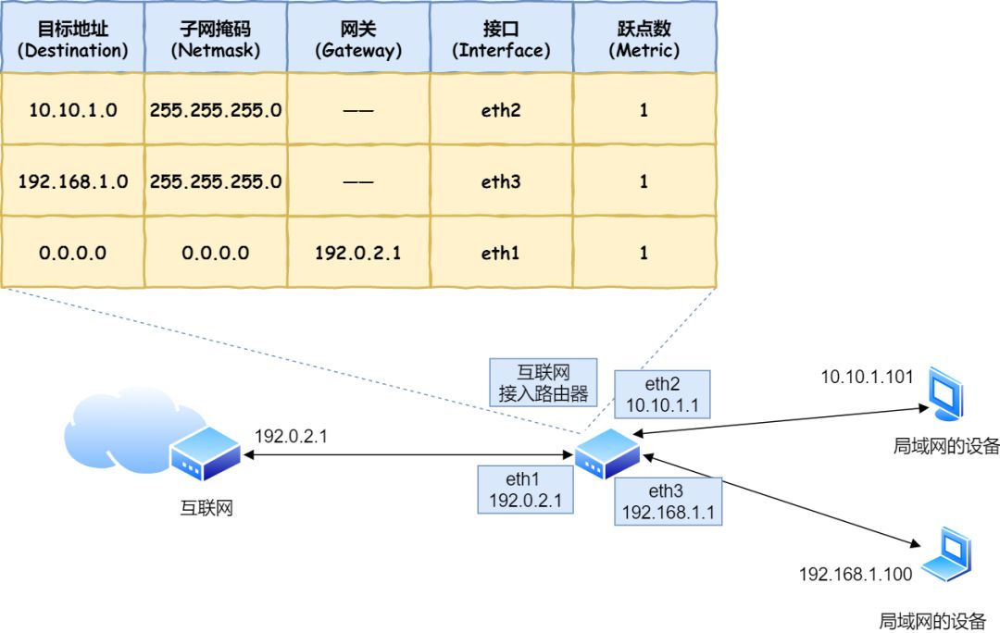

### 数据如何在物理层面传输

 

###### 添加ip包头的相关字段

在 IP 协议里面需要有**源地址 IP** 和 **目标地址 IP**：

- 源地址IP，即是客户端输出的 IP 地址；
- 目标地址，即通过 DNS 域名解析得到的 Web 服务器 IP。

数据经由协议栈层层封装后，会经由网卡驱动写入到网卡的缓冲区 由网卡发送出去*对网线中的信号执行发送和接收操作*（网卡驱动控制着网卡硬件的操作）

###### 当客户端有多张网卡时  需要根据==路由表==判断由哪张网卡发出该信息

在linux中可以使用命令 `route -n ` 查看当前系统的路由表

根据**目标地址**和**Genmask**做与`&`运算是否和表中的 **Destination**相同来判断是否应用该网卡规则。

*第三条目比较特殊，它目标地址和子网掩码都是 `0.0.0.0`，这表示**默认网关**，如果其他所有条目都无法匹配，就会自动匹配这一行。* 

##### 路由的选路原则

最长匹配原则 => 最小管理距离优先 => 度量值最小优先

1. 路由的掩码长度不一样时， 直接使用掩码长度进行选路。
2. 管理距离 越小越优先。在网络中有各种各样的路由协议，常用的有OSPF RIP ISIS BGP这些协议，每种路由协议有自己的管理距离（优先级）。而且每个厂家管理距离还不一样（因为是本地有效的不可传递的）。
3. 度量值，越小越优先。这时候同个路由协议进行度量值判断（这三种叫法都可以开销、cost、metric），不同的路径开销不太一样，当然开销越低越好。

##### 路由来源

#### 添加MAC头部 实现两点传输

MAC 头部是以太网使用的头部，它包含了接收方和发送方的 MAC 地址等信息。

 

在TCP/IP协议中 MAC包头中的协议类型一般为 `0800 `: IP协议    `0806`：ARP协议

- **发送方**的 MAC 地址获取比较简单了，MAC 地址是在网卡生产时写入到 ROM 里的，只要将这个值读取出来写入到 MAC 头部就可以了。

- **接收方**的 MAC 地址就有点复杂了。由于接收方可能远在天涯海角，我们手上只有对方的ip地址，无法直接获取到它的MAC地址。 但是我们可以通过**本地路由表**和**接收方ip**得知要跳转的**路由器ip**。

  这时可以通过 ARP 协议广播，询问此ip地址是谁的，该路由器收到以后返回它的MAC地址。*后续操作系统会把本次查询结果放到一块叫做 **ARP 缓存**的内存空间留着以后用，不过缓存的时间就几分钟*

  linux中可以通过命令 `arp -n/a `查看本机内的arp缓存。

  

  

###### 数据由网卡发出

IP 生成的网络包只是存放在内存中的一串二进制数字信息，没有办法直接发送给对方。因此，我们需要将**数字信息转换为电信号**，才能在网线上传输，也就是说，这才是真正的数据发送过程。

负责执行这一操作的是**网卡**，要控制网卡还需要靠**网卡驱动程序**。

网卡驱动从 IP 模块获取到包之后，会将其**复制**到网卡内的缓存区中，接着会其**开头加上报头和起始帧分界符，在末尾加上用于检测错误的帧校验序列**。最后网卡会将包转为电信号，通过网线发送出去。

 

- 起始帧分界符是一个用来表示包起始位置的标记
- 末尾的 `FCS`（帧校验序列）用来检查包传输过程是否有损坏

#### 交换机进行包转发

###### 交换机如何接受包

首先，电信号到达网线接口，交换机里的模块进行接收，接下来交换机里的模块将电信号转换为数字信号。

然后通过包末尾的 `FCS` 校验错误，如果没问题则放到缓冲区。这部分操作基本和计算机的网卡相同，但交换机的工作方式和网卡不同。

计算机的网卡本身具有 MAC 地址，并通过核对收到的包的接收方 MAC 地址判断是不是发给自己的，如果不是发给自己的则丢弃；相对地，交换机的端口不核对接收方 MAC 地址，而是直接接收所有的包并存放到缓冲区中。因此，和网卡不同，**交换机的端口不具有 MAC 地址**。将包存入缓冲区后，接下来需要查询一下这个包的接收方 MAC 地址是否已经在 MAC 地址表中有记录了。交换机的 MAC 地址表主要包含两个信息： 一个是设备的 MAC 地址，  另一个是该设备连接在交换机的哪个端口上。

 

所以，**交换机根据 MAC 地址表查找 MAC 地址，然后将信号发送到相应的端口**。

###### 当交换机找不到指定的MAC地址怎么办

地址表中找不到指定的 MAC 地址。这可能是因为具有该地址的设备还没有向交换机发送过包，或者这个设备一段时间没有工作导致地址被从地址表中删除了。

这种情况下，交换机无法判断应该把包转发到哪个端口，只能将包转发到除了源端口之外的所有端口上，无论该设备连接在哪个端口上都能收到这个包。

这样做不会产生什么问题，因为以太网的设计本来就是将包发送到整个网络的，然后**只有相应的接收者才接收包，而其他设备则会忽略这个包**。

#### 发送到接收方的局域网路由器

###### ==路由器与交换机的区别==

网络包经过交换机之后，现在到达了**路由器**，并在此被转发到下一个路由器或目标设备。

这一步转发的工作原理和交换机类似，也是通过查表判断包转发的目标。

不过在具体的操作过程上，路由器和交换机是有区别的。

- 因为**路由器**是基于 IP 设计的，俗称**三层**网络设备，路由器的各个端口都具有 MAC 地址和 IP 地址；
- 而**交换机**是基于以太网设计的，俗称**二层**网络设备，交换机的端口不具有 MAC 地址。

###### 路由器的接收包过程

首先，电信号到达网线接口部分，路由器中的模块会将电信号转成数字信号，然后通过包末尾的 `FCS` 进行错误校验。

如果没问题则检查 MAC 头部中的**接收方 MAC 地址**，看看是不是发给自己的包，如果是就放到接收缓冲区中，否则就丢弃这个包。

总的来说，路由器的端口都具有 MAC 地址，只接收与自身地址匹配的包，遇到不匹配的包则直接丢弃。

###### 路由器确定转发端口

前面说过 路由器实际上和一个计算机非常相似，路由器也会管理一个**路由表**，根据路由表和ip包头中的目的ip进行包 的转发操作。

 

- 如果网关是一个 IP 地址，则这个IP 地址就是我们要转发到的目标地址，**还未抵达终点**，还需继续需要路由器转发。
- 如果网关为空，则 IP 头部中的接收方 IP 地址就是要转发到的目标地址，也是就终于找到 IP 包头里的目标地址了，说明**已抵达终点**。

知道对方的 IP 地址之后，接下来需要通过 `ARP` 协议根据 IP 地址查询 MAC 地址，并将查询的结果作为接收方 MAC 地址。。。。

==可以预见的是在网络包传输的过程中，**源 IP 和目标 IP 始终是不会变的，一直变化的是 MAC 地址**，因为需要 MAC 地址在以太网内进行**两个设备**之间的包传输。==

