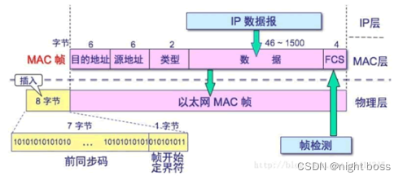

#### 数据链路层

数据链路层和物理层的工作，接收网络层发送的数据帧，封装成以太帧。之后将其转换为比特数据流通过传输媒介发送向互联网。接收物理层面的比特数据流，将其合成为帧后上传给网络层。

##### MAC数据帧/以太帧格式

 

- 前同步码：用来使接收端的适配器在接收 MAC 帧时能够迅速调整时钟频率，使它和发送端的频率相同。前同步码为 7 个字节，1 和 0 交替。
- 帧开始定界符：帧的起始符，为 1 个字节。前 6 位 1 和 0 交替，最后的两个连续的 1 表示告诉接收端适配器：“帧信息要来了，准备接收”。
- 目的MAC地址：接收帧的网络适配器的物理地址（MAC 地址），为 6 个字节（48 比特）。作用是当网卡接收到一个数据帧时，首先会检查该帧的目的地址，是否与当前适配器的物理地址相同，如果相同，就会进一步处理；如果不同，则直接丢弃。
- 源MAC地址：发送帧的网络适配器的物理地址（MAC 地址），为 6 个字节（48 比特）。
- 类型：上层协议的类型。由于上层协议众多，所以在处理数据的时候必须设置该字段，标识数据交付哪个协议处理。例如，字段为 0x0800 时，表示将数据交付给 IP 协议。
- 数据：也称为有效载荷，表示交付给上层的数据。以太网帧数据长度最小为 46 字节，最大为 1500 字节。如果不足 46 字节时，会填充到最小长度。最大值也叫最大传输单元（MTU）。
- 帧检验序列 FCS 检测该帧是否出现差错，占 4 个字节（32 比特）。发送方计算帧的循环冗余码校验（CRC）值，把这个值写到帧里。接收方计算机重新计算 CRC，与 FCS 字段的值进行比较。如果两个值不相同，则表示传输过程中发生了数据丢失或改变。这时，就需要重新传输这一帧。

