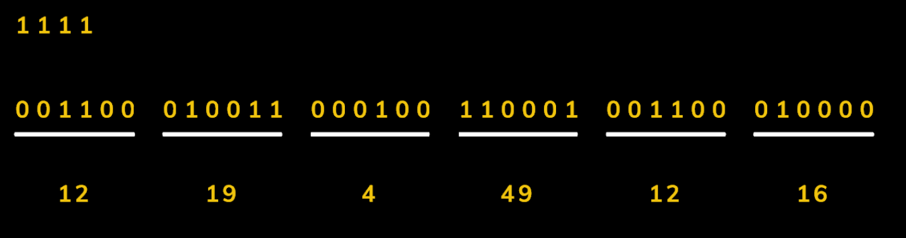

### Base64转码

[base64网页转码工具](https://www.qqxiuzi.cn/bianma/base64.htm)

Base64编码是使用64个可打印ASCII字符（A-Z、a-z、0-9、+、/）将任意字节序列数据编码成ASCII字符串，另有“=”符号用作后缀用途。其主要的定位是将一串复杂的字符，转化为只有ASCII字符的转码工具，Base64编码若无特别说明，通常约定非ASCII字符按照UTF-8字符集进行编码处理。 [[UTF-8编码]]

###### base64索引表

| 数值 | 字符 |      | 数值 | 字符 |      | 数值 | 字符 |      | 数值 | 字符 |
| ---- | ---- | ---- | ---- | ---- | ---- | ---- | ---- | ---- | ---- | ---- |
| 0    | A    |      | 16   | Q    |      | 32   | g    |      | 48   | w    |
| 1    | B    |      | 17   | R    |      | 33   | h    |      | 49   | x    |
| 2    | C    |      | 18   | S    |      | 34   | i    |      | 50   | y    |
| 3    | D    |      | 19   | T    |      | 35   | j    |      | 51   | z    |
| 4    | E    |      | 20   | U    |      | 36   | k    |      | 52   | 0    |
| 5    | F    |      | 21   | V    |      | 37   | l    |      | 53   | 1    |
| 6    | G    |      | 22   | W    |      | 38   | m    |      | 54   | 2    |
| 7    | H    |      | 23   | X    |      | 39   | n    |      | 55   | 3    |
| 8    | I    |      | 24   | Y    |      | 40   | o    |      | 56   | 4    |
| 9    | J    |      | 25   | Z    |      | 41   | p    |      | 57   | 5    |
| 10   | K    |      | 26   | a    |      | 42   | q    |      | 58   | 6    |
| 11   | L    |      | 27   | b    |      | 43   | r    |      | 59   | 7    |
| 12   | M    |      | 28   | c    |      | 44   | s    |      | 60   | 8    |
| 13   | N    |      | 29   | d    |      | 45   | t    |      | 61   | 9    |
| 14   | O    |      | 30   | e    |      | 46   | u    |      | 62   | +    |
| 15   | P    |      | 31   | f    |      | 47   | v    |      | 63   | /    |

##### 字符转base64符 转码规则

将字符用二进制表示，一般情况下每一个字符都有一个或多个字节表示，即最后二进制表示结果都为8的倍数。因为base64符一共只有64个值，将二进制流6个一组分割。最后一组不足6比特则用0补足。补两个0最后转码结果加一个=，补四个加 ==。（**只有这两种情况**）。

##### base64转码举例

utf-8字符 “111”。1的utf-8编码值为49，二进制就是 00110001。将 “111”字符的二进制表示 6个为一组分割得到：

**001100 **  **010011 **  **000100**   **110001** 对照上面的base64索引表可得 MTEx

再看 字符“1111”。同样的将 “1111”的二进制表示 6个一组分割 得到：

**001100 **  **010011 **  **000100**   **110001**  **001100 ** **010000**   最后一组二进制数字只有 01了，末尾补足了四个0，最后结果加上两个=标值。

MTExMQ==

